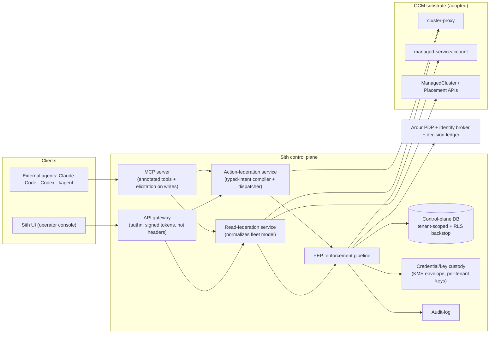
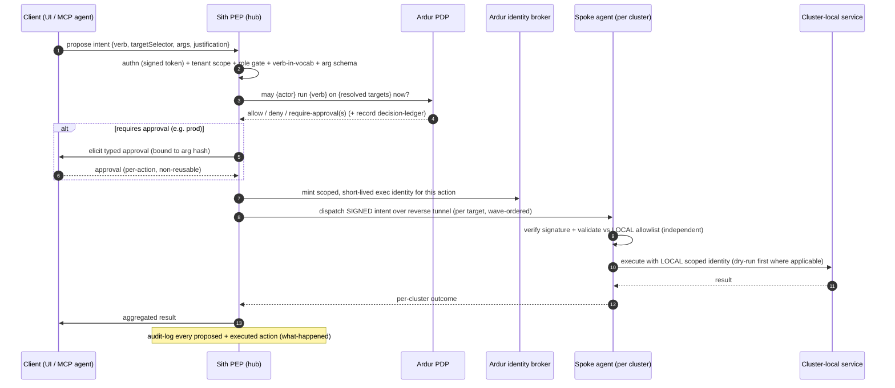
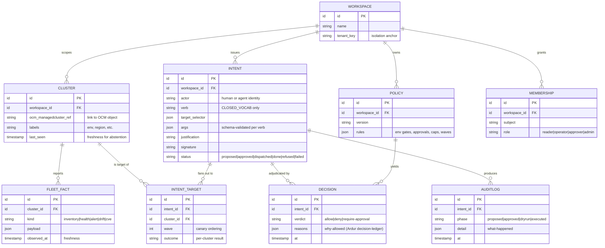

# Sith — Architecture

**Status:** planning · **Date:** 2026-07-08

This document describes the intended architecture. It is a *plan*, not an as-built. Where
a decision has a dedicated record, the ADR is linked and is authoritative.

---

## 1. One picture in words

A central **hub** (the Sith control plane) maintains a governed, tenant-scoped model of a
fleet of Kubernetes clusters (**spokes**). It never holds cluster-admin credentials and
never reaches *into* a spoke on its own initiative. Instead, each spoke runs an
**outbound-only** OCM agent that dials the hub; the hub reaches cluster-local services
*through that reverse tunnel* (`cluster-proxy`) using **scoped, short-lived spoke tokens**
projected to the hub (`managed-serviceaccount`).

On top of that OCM-brokered connectivity, Sith adds **three federations** — read, action,
policy — and exposes the whole thing as a **governed MCP server**. **Ardur** is the policy
decision point and identity broker for every action.

**One binary, three run modes.** The same Go binary is the whole product. `sith` (CLI +
k9s-style TUI) and `sith ui` (local web "fleet IDE" on `localhost`) are the **day-0 local
mode**: they read the user's own kubeconfig contexts directly (client-side fan-out into an
informer/watch cache), with no hub, no OCM, no account, no telemetry — credentials never leave
the machine. `sith serve --mcp` exposes the same fleet as a **governed MCP server**. `sith hub`
is the **day-N federated mode** described above (multi-user, OCM-brokered reach to NAT'd/VPC'd
clusters, `Workspace` isolation, the governance pipeline). The **fleet model and the
enforcement pipeline are source-abstract**: a fleet fact's source is either a local kubeconfig
context (local mode) or an OCM-brokered spoke (hub mode), and everything above the source is
one code path. The rest of this document describes the hub; local mode is the same components
with the kubeconfig-direct source and single-user defaults. See
[`research/USE-CASE-AND-SHAPE.md`](research/USE-CASE-AND-SHAPE.md).

## 2. Topology — outbound-only spokes, OCM-brokered reach

```mermaid
flowchart TB
    subgraph HUB["Sith Hub (control plane) — the crown jewel"]
        API["Sith API / gateway"]
        FM["Fleet model (read federation cache)"]
        PEP["Intent PEP (policy enforcement point)"]
        MCP["Governed MCP server"]
        AUD["Audit-log (what-happened)"]
        subgraph OCMHUB["OCM hub components"]
            CPS["cluster-proxy: proxy servers"]
            MSA["managed-serviceaccount: token store"]
        end
    end

    subgraph ARDUR["Ardur (PDP + identity broker + decision-ledger)"]
        PDP["Policy decision point"]
        IDB["Scoped-identity broker"]
        LEDG["Decision-ledger (why-allowed)"]
    end

    subgraph S1["Spoke cluster A (isolated VPC / behind NAT)"]
        A_AGENT["OCM klusterlet + cluster-proxy AGENT (outbound-only)"]
        A_SITH["Sith spoke agent (local allowlist + scoped identity)"]
        A_SVC["cluster-local services: Argo CD · Grafana · Rollouts"]
    end

    subgraph S2["Spoke cluster B (isolated VPC / behind NAT)"]
        B_AGENT["OCM klusterlet + cluster-proxy AGENT (outbound-only)"]
        B_SITH["Sith spoke agent (local allowlist + scoped identity)"]
        B_SVC["cluster-local services: Argo CD · Grafana · Rollouts"]
    end

    %% Outbound-only: tunnels are DIALED from spoke to hub
    A_AGENT -- "outbound reverse tunnel (dials hub)" --> CPS
    B_AGENT -- "outbound reverse tunnel (dials hub)" --> CPS

    %% Hub reaches spoke services THROUGH the established tunnel
    CPS -. "reach cluster-local svc via tunnel" .-> A_SVC
    CPS -. "reach cluster-local svc via tunnel" .-> B_SVC

    %% Scoped tokens projected spoke -> hub
    A_AGENT -- "projects scoped SA token" --> MSA
    B_AGENT -- "projects scoped SA token" --> MSA

    API --> FM
    FM -- "reads via cluster-proxy + MSA token" --> CPS
    API --> PEP
    MCP --> PEP
    PEP -- "may this intent run?" --> PDP
    PEP -- "mint scoped exec identity" --> IDB
    PDP --> LEDG
    PEP --> AUD

    %% Action federation: dispatch signed intent down the SAME reverse channel
    PEP -- "signed typed intent (via tunnel)" --> A_SITH
    PEP -- "signed typed intent (via tunnel)" --> B_SITH
    A_SITH -- "validate vs local allowlist, execute w/ local identity" --> A_SVC
    B_SITH -- "validate vs local allowlist, execute w/ local identity" --> B_SVC
```



**The load-bearing property:** every arrow *from* a spoke is **outbound** (the spoke dials
the hub). The hub never needs inbound network access to a spoke, so spokes can live in
isolated VPCs / behind NAT. This is exactly what OCM `cluster-proxy` provides — verified:
*"The network proxy establishes reverse proxy tunnels from the managed cluster to the hub
cluster … enabling clients from the hub network to access services in the managed
clusters' network even when all the clusters are isolated in different VPCs."*
([cluster-proxy](https://github.com/open-cluster-management-io/cluster-proxy), v0.10.0,
2026-02-02).

## 3. Component view — what the hub actually runs



Notes:
- **Authn is from signed tokens, never from spoofable request headers.** (This is a direct
  correction of a predecessor anti-pattern; see [ADR-0003](adr/0003-tenancy-isolation.md)
  and [`THREAT-MODEL.md`](THREAT-MODEL.md).)
- **The MCP server and the UI share one enforcement pipeline (the PEP).** There is no
  privileged back-door path; an external agent has *exactly* the governance a human does.
- **Read and action federation are separate services** with separate blast radii and
  separate rate limits. Reads never require the write path; writes are the most hardened
  surface in the system.

## 4. The three federations

### 4.1 Read federation

- **The read source is abstracted.** A fleet fact comes from either a **local kubeconfig
  context** (day-0 local mode, client-side) or an **OCM-brokered spoke** (day-N hub mode). The
  fleet model and everything above it are identical across both; only the source adapter
  differs. This is what makes the local client and the hub one product.
- Each Sith spoke agent (or the hub, via `cluster-proxy` + a `managed-serviceaccount`
  token — or, in local mode, the kubeconfig-direct source) reports **inventory, health,
  alerts, drift, image/CVE facts** for its cluster.
- The hub assembles a **tenant-scoped, cached, normalized fleet model**. Every record
  carries a **freshness timestamp** and **source cluster**.
- **Cross-cluster correlation is a first-class query primitive**: "all clusters where
  `payments` is Degraded", "clusters running image X with CVE Y", "fleet-wide drift vs
  Git". Single-cluster tools cannot answer these; the federation can.
- **Least privilege by construction:** reads are bounded to what spoke agents choose to
  report and to the scope of the projected `managed-serviceaccount` token — the hub cannot
  read arbitrary cluster state just because it is the hub.
- **Staleness is surfaced, never hidden** — it is an input to abstention (§4.3).

### 4.2 Action federation

The write path is an **intent**, not a command:

```
Intent = {
  id, tenant(workspace), actor, verb ∈ CLOSED_VOCAB,
  targetSelector,        # which clusters/objects — resolved against the fleet model
  args,                  # typed, schema-validated per verb
  justification, evidenceRefs,
  signature              # signed by the hub; verified by each spoke
}

CLOSED_VOCAB (initial):
  argocd.sync | argocd.rollback
  rollout.promote | rollout.abort
  deployment.scale | deployment.restart
  gitops.open-pr
  # PERMANENTLY EXCLUDED: exec, arbitrary apply, secret mutation, RBAC mutation
```

Flow (see also the enforcement pipeline, §6):



**Two independent blast-radius bounds:** the **closed verb vocabulary** at the hub *and*
the **spoke's own local allowlist + local RBAC**. A spoke **never blindly executes what
the hub sends** — it re-validates and uses its own identity. The safest first write is
`gitops.open-pr` (a proposal a human merges — zero new standing trust). See
[ADR-0004](adr/0004-typed-intent-action-model.md).

### 4.3 Policy federation (the novel hard part)

A single intent can touch N clusters, so per-action approval is not enough. The policy
layer (adjudicated by Ardur) reasons about **fan-out**:

- **Environment gates.** `prod` never auto-executes; prod requires N-person approval;
  a max-clusters-per-intent ceiling applies.
- **Wave / canary ordering.** Sith *plans* a rollout (dev → staging → 1 canary prod →
  health-gate → rest); each wave is a **separately gated** step. No wave proceeds without
  its own gate and a health check between waves.
- **Partial-failure semantics.** Stop-on-first-failure, auto-rollback of the failed wave,
  and **idempotency/dedupe** so a retry cannot double-apply.
- **Federation-specific abstention.** If the fleet view is incomplete or stale, Sith
  **refuses** fleet-wide action and says so honestly: *"37/40 clusters visible; 3 stale
  >10m — I will not issue a fleet sync until they report."* Explicit "I won't act" is a
  first-class, logged outcome, not an error.

## 5. Data model (sketch)

Not a schema — a conceptual model. `Workspace` is the tenancy anchor: all scoping is
"over clusters", not "one portal per cluster".



Design points:
- **`Workspace` is the scoped tenancy object** — every query is scoped to a workspace, and
  a **database-level backstop** (RLS) enforces it independently of application code (see
  [ADR-0003](adr/0003-tenancy-isolation.md)).
- **`DECISION` (why-allowed, Ardur) and `AUDITLOG` (what-happened, Sith) are separate**
  and together form a complete agent-action ledger.
- **`CLUSTER.last_seen` / `FLEET_FACT.observed_at`** are what abstention reads.

## 6. Enforcement pipeline (the PEP)

Every intent — from the UI *or* the MCP server — passes the **same** ordered gate. This is
the redesigned-clean descendant of the predecessor's action/exec broker pattern:

```
signed session/token   →  (authn; role/tenant from the signed claims, never headers)
  ↓
workspace membership   →  (is this actor a member of this workspace at all?)
  ↓
role gate              →  (reader | operator | approver | admin — least privilege)
  ↓
closed verb vocabulary →  (fail-safe allowlist: unknown verb = refuse, not execute)
  ↓
arg schema validation  →  (typed per verb; reject anything not schema-valid)
  ↓
tenant scope resolve   →  (targetSelector resolved ONLY within this workspace's clusters)
  ↓
Ardur PDP query        →  (allow / deny / require-approval(s), fan-out aware)
  ↓
elicited approval      →  (per-action, non-reusable, bound to a hash of resolved args)
  ↓
scoped identity mint   →  (Ardur brokers short-lived per-action identity; ceiling < human)
  ↓
caps / budgets         →  (max clusters/intent, rate limits, token/action budgets)
  ↓
signed dispatch        →  (per target, wave-ordered; spoke re-validates independently)
  ↓
audit + decision ledger→  (proposed + approved + dry-run + executed, always)
```

**Fail-safe, not fail-open:** anything not explicitly permitted is refused. A CI test
asserts that *every* handler reaching a write path is classified against the closed
vocabulary — a forgotten classification fails the build, not production. (This inverts the
predecessor's fail-open "denylist of one".)

## 7. MCP server surface

Sith is exposed as an **MCP server** so external agents inherit the same governance.

- **Read tools** carry `readOnlyHint: true` and hit the fleet model (no gate beyond
  tenant scope). Examples: `fleet.inventory`, `fleet.health`, `fleet.correlate`,
  `fleet.cve-search`.
- **Write tools** carry `destructiveHint: true` (and correct `idempotentHint`), map 1:1 to
  the closed verb vocabulary, and require **Elicitation-based approval** (2025-06-18 MCP
  primitive) bound to a hash of the resolved args. Examples: `intent.gitops-open-pr`
  (first), later `intent.argocd-sync`, `intent.rollout-promote`, `intent.deployment-scale`.
- **Annotations are hints, so enforcement is server-side** — the MCP layer is a thin
  client onto the same PEP (§6). Per the MCP guidance, hints are *not* trusted as
  guarantees; the server enforces.

See [ADR-0005](adr/0005-ai-mcp-ardur-pdp.md) for the reasoning and the "governed MCP
gateway to your whole fleet" positioning.

## 8. Where Ardur plugs in

[Ardur](https://github.com/ArdurAI/ardur) is ArdurAI's runtime-governance runtime. In
Sith it fills three roles, all at the PEP boundary:

| Role | What it does | Complements |
|---|---|---|
| **PDP** | Adjudicates every intent (allow/deny/require-approval), fan-out aware | Sith PEP is the thin enforcement point |
| **Identity broker** | Mints short-lived, per-action scoped execution identity so the AI/agent never holds a cluster credential and its ceiling is strictly below the human's | OCM `managed-serviceaccount` for spoke-side scoping |
| **Decision-ledger** | Records *why* each action was allowed | Sith `AUDITLOG` records *what happened* |

Sith is built with a **policy hook at the `executeIntent` boundary from day one** — even in
Phase 1 it returns "allow" for reads — so Ardur drops into that seam without re-architecture
when the write path arrives in Phase 2.

The Phase-1 hub read entry points (spoke snapshot refresh, persisted fleet source, and cross-cluster
correlation) construct only with the audited PEP and call one closed read verb before touching a
store, transport, or query dependency. Local kubeconfig reads remain outside this path: they are
the operator's own local-mode operations, not a hub-governed action surface.

## 9. Credential & key custody

- The hub **does not store cluster-admin kubeconfigs**. Spoke reach uses OCM
  `managed-serviceaccount` scoped tokens; action execution uses Ardur-brokered short-lived
  identities validated locally by the spoke.
- Any secret the hub *must* hold (e.g. Git credentials for `gitops.open-pr`) is protected
  with **envelope encryption via a KMS and per-tenant data keys** — never a single
  process-wide key. See [ADR-0006](adr/0006-credential-key-custody.md).

## 10. Explicit correction of predecessor anti-patterns

This architecture deliberately avoids the failure modes found in a prior control-plane
prototype (documented, vendor-neutral, in [`THREAT-MODEL.md`](THREAT-MODEL.md) §7):

- Authz from **signed claims**, never spoofable headers (no IDOR-by-header).
- A **real DB-level tenant backstop** (RLS) behind the app-layer scoping — not inert code.
- **Per-tenant key custody** via KMS envelope — not one env key that decrypts every tenant.
- **No shared admin cluster credential** in the center — scoped, local, per-action identity.
- **Fail-safe closed vocabulary** — not a fail-open denylist; **no shell, ever**.

## 11. Reshape additions — local mode, connectors, custody, supply chain

This section records the local-first dual-mode reshape (rationale in
[`research/USE-CASE-AND-SHAPE.md`](research/USE-CASE-AND-SHAPE.md)); the epics are E11–E13 in
[`EPICS.md`](EPICS.md).

- **Four-mode connection/identity model.** (1) **Local (direct):** reads the user's kubeconfig
  contexts on the machine; exec plugins run locally as kubectl does; any secret goes in the OS
  keychain; nothing is uploaded. (2) **Federated (minion):** OCM klusterlet + cluster-proxy,
  outbound-only; scoped `managed-serviceaccount` token; no admin kubeconfig in the hub. (3)
  **Cloud IAM:** a thin per-cloud adapter enumerates clusters and mints **short-lived** tokens
  (EKS get-token, AKS Entra+kubelogin, GKE plugin, ACK/CCE/TKE); no long-lived cloud keys at
  rest. (4) **API key / JWT / OIDC:** for tool integrations and machine callers. One rule across
  all four: authn from **signed token claims, never spoofable headers**; the agent identity
  ceiling is strictly below the human's. Detail:
  [`research/identity-connections-security.md`](research/identity-connections-security.md).
- **Connector framework (E12).** Out-of-process gRPC, SDK-first, **one canonical connector per
  tool**, minor-additive versioning (the Grafana/Terraform pattern; the anti-pattern is
  Backstage's in-process unversioned sprawl). Exactly **three connector kinds**: *read adapter*
  (pull normalized facts), *brokered read-through* (deep-link to the tool's own UI — never
  re-skin), *typed-action adapter* (map a closed verb to the tool's API). Day-1 six: Argo CD,
  Flux, Helm, Prometheus, Loki, GitHub.
- **Cost read-overlay (E13).** Deploy/read OpenCost per cluster; aggregate at the hub into
  per-workspace/team fleet rollups with GPU columns where DCGM exists. A read integration, not a
  metering engine.
- **Supply chain + custody.** Releases are **cosign-signed** with **SLSA L2 provenance** and an
  **SBOM** from the first tag (now cheap; scorecards weigh these before humans read code).
  **SPIFFE IDs / mTLS are supported** as the identity model, but Sith does **not** require users
  to run **SPIRE** (operationally heavy). Images are **multi-arch** (`amd64`+`arm64`) and
  **registry-relocatable** for air-gap/China from day one (E9).
