# Sith — Implementation Epics

**Status:** planning · **Date:** 2026-07-08 · **License:** Apache-2.0

This document turns the Sith plan into a build order. It is a design artifact, not code —
the owner reviews it before any product code is written. It is downstream of, and
consistent with, the charter, architecture, scope, roadmap, threat model, competitive
analysis, and ADRs 0001–0006. Where those documents and this one seem to disagree, those
documents win and this one is wrong.

Everything here respects the sequencing discipline the roadmap fixed and never violates:
**read before write · PR before mutation · exec never · prod never auto.**

---

## 1. Overview

**The one-sentence job:** give an operator one governed place to see and safely act across
many Kubernetes clusters, while deep cluster access stays local to each cluster.

**Local-first dual mode (the reshape).** The same single Go binary is the product in two faces:
a **day-0 local client** (`sith` CLI/TUI + `sith ui` local web "fleet IDE") that federates the
user's own kubeconfig contexts with no hub, OCM, account, or telemetry — the **adoption
wedge** — and a **day-N hub** (`sith hub`) that adds OCM-brokered reach, tenancy, and governance
— the **durable moat**. They share one **source-abstract** fleet model and one enforcement
pipeline. New epics **E11** (local client), **E12** (connector framework), **E13** (cost
overlay) carry the reshape; rationale in
[`research/USE-CASE-AND-SHAPE.md`](research/USE-CASE-AND-SHAPE.md).

Sith is a governed, multi-tenant, cross-cluster operations *federation* control plane for
generic Kubernetes fleets. It is **built on Open Cluster Management (OCM)** — it does not
re-implement cross-cluster transport, because `cluster-proxy` and `managed-serviceaccount`
already ship that, hardened and maintained. Sith is the governance, federation, and AI/MCP
layer on top.

**Non-goals** (unchanged from `SCOPE.md`; if Sith drifts into any of these it has lost its
reason to exist):

- Not a developer portal / IDP / service catalog (Backstage, Port, Cortex, OpsLevel).
- Not a GitOps controller / desired-state reconciler — Sith *opens PRs*, it does not
  reconcile (Argo CD, Flux).
- Not a multi-cluster scheduler / workload-placement engine (Karmada, OCM Placement).
- Not a telemetry lake / metrics-logs backend — Sith *reads* health, it does not store
  series (Prometheus, Grafana, Loki, Datadog).
- Not a bespoke cross-cluster tunnel — that is commodity plumbing, adopted from OCM.

**The three federations** are what Sith owns, all built on OCM-brokered connectivity:

1. **Read federation** — a tenant-scoped, normalized fleet model with cross-cluster
   correlation as a first-class query.
2. **Action federation** — the only writes are typed intents from a closed verb
   vocabulary, signed, re-validated locally by each spoke, executed with the spoke's own
   scoped identity. No shell, no free-form apply, no secret/RBAC mutation.
3. **Policy federation** — fan-out reasoning: environment gates, wave/canary ordering with
   a gate per wave, partial-failure and auto-rollback, idempotency, and
   federation-specific abstention.

[Ardur](https://github.com/ArdurAI/ardur) is the policy decision point (PDP), the broker
of scoped execution identity, and the decision-ledger (*why-allowed*) that complements
Sith's audit-log (*what-happened*). Sith is also exposed as a governed MCP server, so
external agents (Claude Code, Codex, kagent) become clients that inherit the same
governance.

**Status of this doc.** All eleven epics below are planned; none are built. The headline
gate still stands: nothing in E1 onward is funded until E0 — the OCM falsification test —
returns yes.

### Epic index

| Epic | Name | Phase | Depends on |
|---|---|---|---|
| E0 | OCM substrate & falsification | M0 | — |
| E1 | Tenancy & identity | P1 | E0 |
| E2 | Read federation | P1 | E0, E1 |
| E3 | Credential & key custody | P1 → P2 | E1 |
| E4 | Action federation | P2 → P3 | E1, E2, E3, E5 |
| E5 | Policy federation & governance | P1 seam → P2 → P3 | E1, E2 (co-develops with E4) |
| E6 | Audit & decision ledger | P1 seam → P2 | E1, E5 |
| E7 | Governed MCP server | Phase L (read) → P2/P3 (write) | E2, E4, E5, E6 |
| E8 | Operator console / UI | Phase L → P3 | E2, E5, E6 |
| E9 | Deployment & packaging | Phase L → P3 | E0 |
| E10 | Observability & SRE for Sith itself | P1 → P3 | E9 |
| E11 | Local fleet client (adoption wedge) | **Phase L (day 0)** | E2 (shares the fleet model) |
| E12 | Connector framework | fast-follow (P2 → P3) | E2, E4 |
| E13 | Cost read-overlay | fast-follow (P3) | E2 |

---

## 2. How to read this

### The shape of each epic

Every epic has an ID and name, a one-line goal, its roadmap phase, its dependencies, and a
list of features. Features are numbered `F<epic>.<n>` (for example `F4.3` is the third
feature of epic E4). Each feature is written the same way, with these labelled parts:

- **What it is** — one or two plain sentences.
- **How it works** — concrete, numbered steps describing the runtime behaviour, followed by
  a Mermaid diagram: a `sequenceDiagram` when the point is who-calls-whom over time, a
  `flowchart` when the point is branching logic and gates.
- **Acceptance criteria** — how we know the feature is done and correct.
- **Key risk / guardrail** — the one thing most likely to go wrong, and the control that
  stops it.

Each epic closes with epic-level exit criteria — the bar the whole epic clears before the
phase it belongs to is considered met.

### Flowchart conventions

- The hub components appear as `PEP`, `RF` (read federation), `AF` (action federation),
  `FM` (fleet model), `MCP`, `AUD` (audit-log). Ardur appears as `PDP`, `IDB` (identity
  broker), `LEDG` (decision-ledger). A spoke appears as `SP` (Sith spoke agent) and `SVC`
  (cluster-local service such as Argo CD / Rollouts / Grafana).
- A decision node (`{ ... }`) with a `refuse` / `deny` / `abstain` branch is drawn on
  almost every write path on purpose. Fail-safe is the default: the un-drawn "happy path"
  is never the only path.
- Arrows *from* a spoke are always outbound (the spoke dials the hub). No diagram ever
  shows the hub opening an inbound connection into a spoke — that property is load-bearing
  and is preserved visually.

### The closed action-verb vocabulary

Writes are the only dangerous surface, so the set of things Sith can *do* is small, closed,
and reviewed. Every write in this document is one of these verbs and nothing else:

| Verb | What it does | Idempotent | First shipped |
|---|---|---|---|
| `gitops.open-pr` | Opens a pull request against a target repo — a proposal a human merges | yes (dedupe by content) | P2 (first write) |
| `argocd.sync` | Triggers an Argo CD application sync to already-committed desired state | yes | P3 |
| `argocd.rollback` | Rolls an Argo CD application back to a previous synced revision | no | P3 |
| `rollout.promote` | Promotes an Argo Rollouts canary/blue-green to the next step | no | P3 |
| `rollout.abort` | Aborts an in-progress rollout and returns to stable | yes | P3 |
| `deployment.scale` | Sets replica count on a Deployment via the scale subresource | yes | P3 |
| `deployment.restart` | Triggers a rolling restart of a Deployment | no | P3 |

**Permanently excluded, at every phase, by every actor including AI:** `exec` / shell into
a pod or node; free-form `kubectl apply` of arbitrary manifests; Secret
create / mutate / read-through; RBAC object mutation. These are not "not yet" — they are
not expressible in the model. Adding *any* new verb is an ADR-level decision
(`ADR-0004`); it is never a routine change.

### The guardrails (the anti-drift contract, restated so every epic inherits it)

1. If a capability ships as a maintained OCM addon or upstream project, adopt it rather
   than build it.
2. If a feature belongs to "portal", "GitOps controller", "scheduler", or "telemetry
   lake", it is out of scope — full stop.
3. The write path may only grow typed verbs in the reviewed closed vocabulary. `exec` and
   free-form `apply` are permanently excluded.
4. Multi-tenant isolation, signed intents, per-spoke local enforcement, and scoped
   identity are day-one requirements, not later hardening.
5. Fail-safe, never fail-open: anything not explicitly permitted is refused. Unknown verb,
   unschema'd args, unresolved target, stale fleet view, or missing approval → refuse.
6. `prod` never auto-acts. Abstention ("I won't act, and here's why") is a first-class,
   logged outcome, not an error.
7. The AI is a client of the governance, never a bypass of it. Its identity ceiling is
   strictly below the human's; it never holds a cluster credential; it never gets a shell.

## 3. Epics

---

## E0 — OCM substrate and falsification

**Status:** ✅ **Passed** on the required hub-plus-two-spoke topology (2026-07-11). See the
[executable evidence and runbook](experiments/M0-ocm-falsification.md). The bespoke transport
scope is deleted; Phase 1 may proceed.

**Goal:** prove, in a lab, that OCM's `cluster-proxy` + `managed-serviceaccount` deliver
outbound-only, cross-network, reach-cluster-local-services connectivity with scoped tokens —
so the whole "build a transport/agent" scope can be deleted.

**Phase:** M0 · **Depends on:** nothing · **Nature:** a spike, not product code. The only
artifacts are a documented yes/no verdict and a reproducible runbook. No Sith product code is
written until this passes.

**Features:** F0.1 hub + spoke lab provisioning · F0.2 OCM addon enablement · F0.3 reach a
spoke-local service through the tunnel · F0.4 scoped token projection · F0.5 outbound-only
verification · F0.6 falsification verdict and runbook.

This epic exists to be able to fail cheaply. If any step cannot be made to work in about a day,
ADR-0001 moves to Rejected and the premise is re-examined before a line of product code exists.

### F0.1 — Hub + spoke lab provisioning

**What it is.** A local OCM environment — one hub cluster and two spokes (`spoke-a`,
`spoke-b`) on `kind` or `k3d` — with both spokes registered and healthy on the hub.

**How it works.**
1. Create three local clusters. Keep all scratch state on `/Volumes/EXTENDED` (the system disk
   is small).
2. Run `clusteradm init` on the hub to install the OCM hub control plane.
3. On each spoke, run the join command the hub emits; this installs the klusterlet and starts
   an outbound registration request.
4. Accept each spoke's CSR on the hub (`clusteradm accept`).
5. Confirm two `ManagedCluster` objects report `Available`.
6. Capture every command and version into a gitignored runbook.

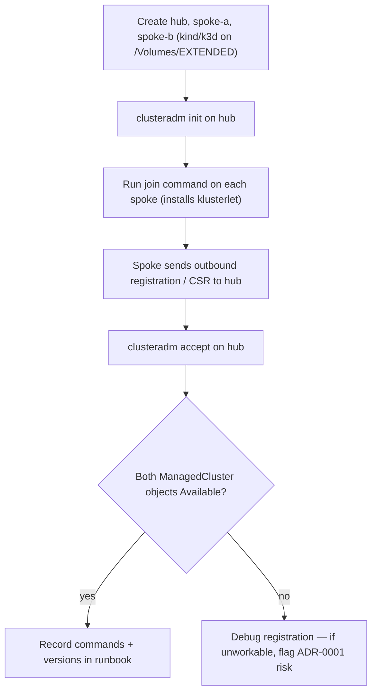
```mermaid
flowchart TD
    A["Create hub, spoke-a, spoke-b (kind/k3d on /Volumes/EXTENDED)"] --> B["clusteradm init on hub"]
    B --> C["Run join command on each spoke (installs klusterlet)"]
    C --> D["Spoke sends outbound registration / CSR to hub"]
    D --> E["clusteradm accept on hub"]
    E --> F{"Both ManagedCluster objects Available?"}
    F -- "yes" --> G["Record commands + versions in runbook"]
    F -- "no" --> H["Debug registration — if unworkable, flag ADR-0001 risk"]
```

**Acceptance criteria.**
- Two spokes are registered and show `Available` on the hub.
- A gitignored runbook reproduces the setup from scratch, with pinned versions.

**Key risk / guardrail.** Registration friction (CSR, networking) can eat the time budget.
Guardrail: this is exactly the cheap place to hit it — time-box it and treat difficulty here as
a signal about OCM's operational cost, recorded in the runbook.

### F0.2 — OCM addon enablement (`cluster-proxy` + `managed-serviceaccount`, pinned v0.10.0)

**What it is.** The two OCM addons Sith depends on, enabled on the hub and both spokes, at
pinned versions verified for July 2026: `cluster-proxy` v0.10.0 and `managed-serviceaccount`
v0.10.0.

**How it works.**
1. Enable the `cluster-proxy` addon; the hub runs proxy servers, each spoke runs a proxy agent
   that dials out to the hub.
2. Enable the `managed-serviceaccount` addon on both spokes.
3. Wait for both addons to report `Available` on each spoke via their `ManagedClusterAddOn`
   status.
4. Pin the versions in the runbook so the experiment and any later environment match.

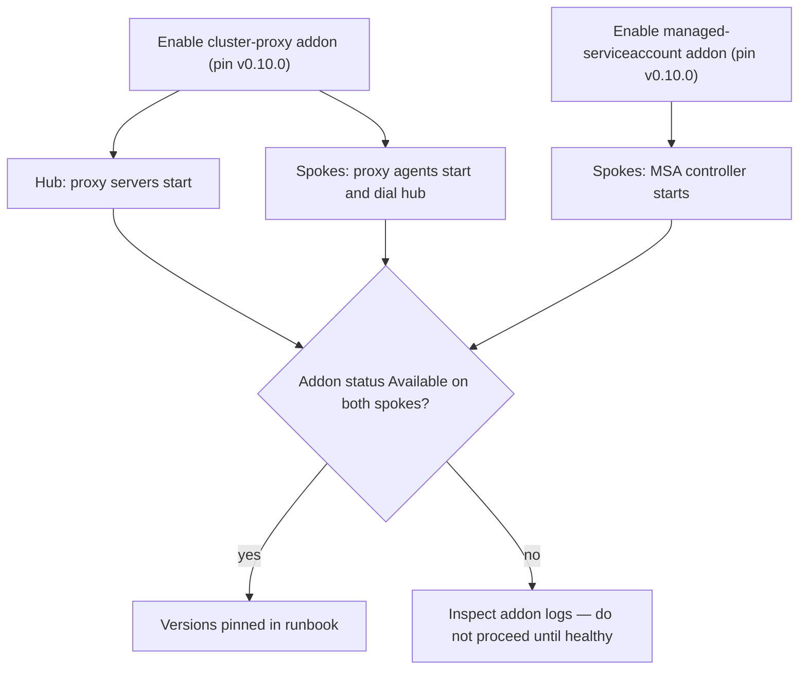
```mermaid
flowchart TD
    A["Enable cluster-proxy addon (pin v0.10.0)"] --> B["Hub: proxy servers start"]
    A --> C["Spokes: proxy agents start and dial hub"]
    D["Enable managed-serviceaccount addon (pin v0.10.0)"] --> E["Spokes: MSA controller starts"]
    B --> F{"Addon status Available on both spokes?"}
    C --> F
    E --> F
    F -- "yes" --> G["Versions pinned in runbook"]
    F -- "no" --> H["Inspect addon logs — do not proceed until healthy"]
```

**Acceptance criteria.**
- Both addons report `Available` on `spoke-a` and `spoke-b`.
- Versions are pinned and recorded.

**Key risk / guardrail.** A version drift or a pre-release addon could behave differently from
the plan's assumptions. Guardrail: versions are pinned and any bump is an ADR-gated decision
(ADR-0001 update policy), not a silent upgrade.

### F0.3 — Reach a spoke-local service through the `cluster-proxy` tunnel

**What it is.** The deciding step: from the hub, reach an in-cluster service on a spoke (Grafana
or Argo CD, or a trivial stand-in) through the `cluster-proxy` reverse tunnel.

**How it works.**
1. Deploy a small in-cluster service on each spoke (a plain HTTP service is enough; Grafana or
   Argo CD makes the demo concrete).
2. From the hub, issue a request addressed through the `cluster-proxy` proxy service to the
   spoke-local service.
3. The request travels the tunnel the spoke agent dialed; the response returns the same way.
4. Repeat for the second spoke to show it generalizes.
5. Time the whole end-to-end setup from F0.1 to here.

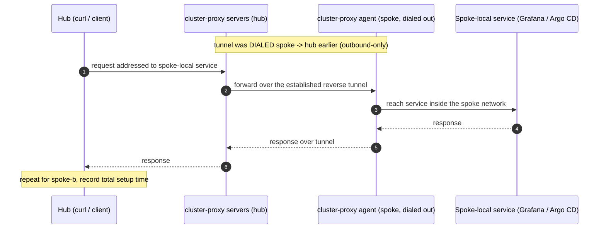
```mermaid
sequenceDiagram
    autonumber
    participant HUB as Hub (curl / client)
    participant CPS as cluster-proxy servers (hub)
    participant AG as cluster-proxy agent (spoke, dialed out)
    participant SVC as Spoke-local service (Grafana / Argo CD)
    Note over AG,CPS: tunnel was DIALED spoke -> hub earlier (outbound-only)
    HUB->>CPS: request addressed to spoke-local service
    CPS->>AG: forward over the established reverse tunnel
    AG->>SVC: reach service inside the spoke network
    SVC-->>AG: response
    AG-->>CPS: response over tunnel
    CPS-->>HUB: response
    Note over HUB: repeat for spoke-b, record total setup time
```

**Acceptance criteria.**
- The hub gets a valid response from an in-cluster service on both spokes, over the tunnel.
- The total setup time is measured and recorded.

**Key risk / guardrail.** If reach requires opening an inbound path to the spoke, the core
premise fails. Guardrail: the reach must use only the tunnel the spoke dialed; any need for
inbound access is a falsification failure, recorded as such.

### F0.4 — Scoped token projection (`managed-serviceaccount`)

**What it is.** Authenticating that spoke-local reach with a short-lived, scoped
`managed-serviceaccount` token projected to the hub — never a cluster-admin kubeconfig.

**How it works.**
1. Create a `ManagedServiceAccount` on each spoke scoped to only what the read demo needs.
2. The MSA addon provisions the ServiceAccount on the spoke and projects its token back to the
   hub as a secret, with a chosen audience.
3. The hub uses that projected token to authenticate the F0.3 request to the spoke-local
   service.
4. Confirm the token is scoped (not cluster-admin) and rotates.

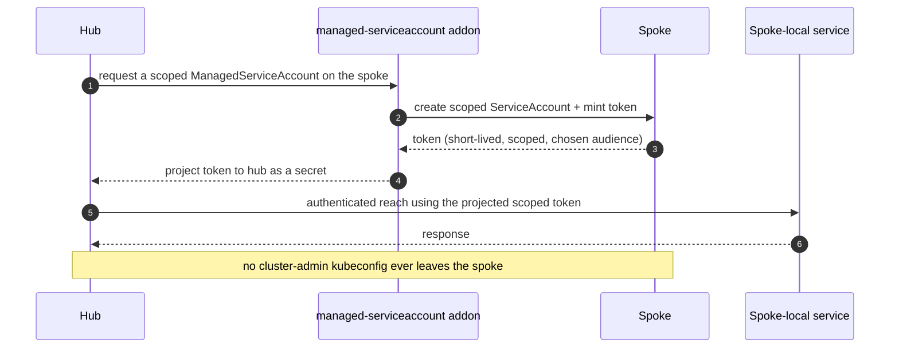
```mermaid
sequenceDiagram
    autonumber
    participant HUB as Hub
    participant MSA as managed-serviceaccount addon
    participant SP as Spoke
    participant SVC as Spoke-local service
    HUB->>MSA: request a scoped ManagedServiceAccount on the spoke
    MSA->>SP: create scoped ServiceAccount + mint token
    SP-->>MSA: token (short-lived, scoped, chosen audience)
    MSA-->>HUB: project token to hub as a secret
    HUB->>SVC: authenticated reach using the projected scoped token
    SVC-->>HUB: response
    Note over HUB,SP: no cluster-admin kubeconfig ever leaves the spoke
```

**Acceptance criteria.**
- Reach in F0.3 is authenticated with a projected, scoped MSA token.
- No cluster-admin kubeconfig is used anywhere in the flow; the token is scoped and rotatable.

**Key risk / guardrail.** A too-broad token would quietly reintroduce the god-credential
anti-pattern. Guardrail: the MSA is scoped to the minimum the demo needs, and "no admin
kubeconfig in the center" is verified as an explicit check, not assumed.

### F0.5 — Outbound-only verification

**What it is.** Evidence that the spoke only ever makes outbound connections to the hub — the
property that lets spokes live in isolated VPCs or behind NAT.

**How it works.**
1. With the tunnel established and reach working, inspect the spoke's live connections with
   `ss` / `netstat`, and optionally `tcpdump`.
2. Confirm every hub-directed connection is outbound (dialed by the spoke).
3. Confirm no inbound hub → spoke port is required for reach to work.
4. Record the observation as evidence for ADR-0001.

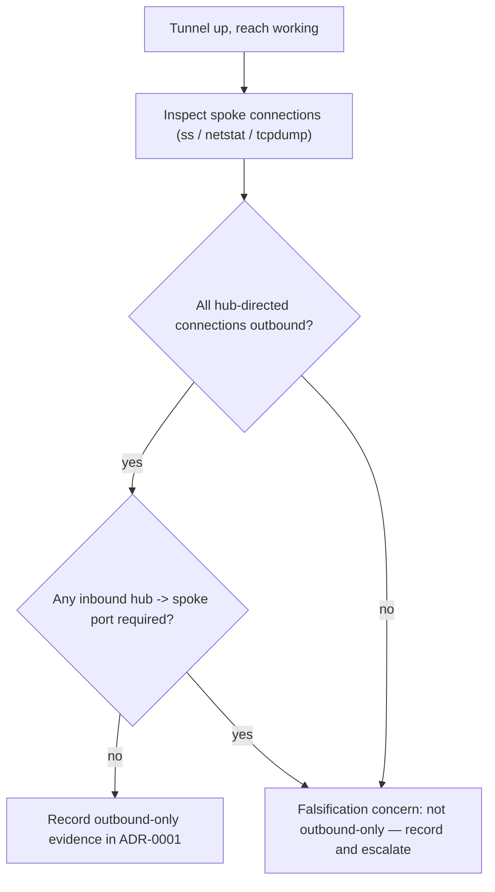
```mermaid
flowchart TD
    A["Tunnel up, reach working"] --> B["Inspect spoke connections (ss / netstat / tcpdump)"]
    B --> C{"All hub-directed connections outbound?"}
    C -- "yes" --> D{"Any inbound hub -> spoke port required?"}
    C -- "no" --> X["Falsification concern: not outbound-only — record and escalate"]
    D -- "no" --> E["Record outbound-only evidence in ADR-0001"]
    D -- "yes" --> X
```

**Acceptance criteria.**
- Documented evidence that spoke → hub traffic is outbound-only and no inbound port is needed.

**Key risk / guardrail.** A hidden inbound dependency would undermine the isolated-VPC claim.
Guardrail: the check is explicit and adversarial (look for inbound requirements, do not just
confirm the happy path), and a negative result is a real finding.

### F0.6 — Falsification verdict and runbook

**What it is.** Turning the experiment into a durable decision: fill ADR-0001's falsification
section, move its status, and commit a reproducible runbook plus a short demo capture.

**How it works.**
1. Record the result, the setup time, and notes in ADR-0001's "Falsification evidence" section.
2. If reachable within about a day, move ADR-0001 to Accepted and delete the transport-build
   scope; proceed to Phase 1. If not, move it to Rejected and stop for re-evaluation.
3. Commit the redacted runbook (no secrets) so the experiment is reproducible.
4. Record a short terminal capture: hub reaching a spoke-local service through `cluster-proxy`
   with an MSA token, and the outbound-only evidence.

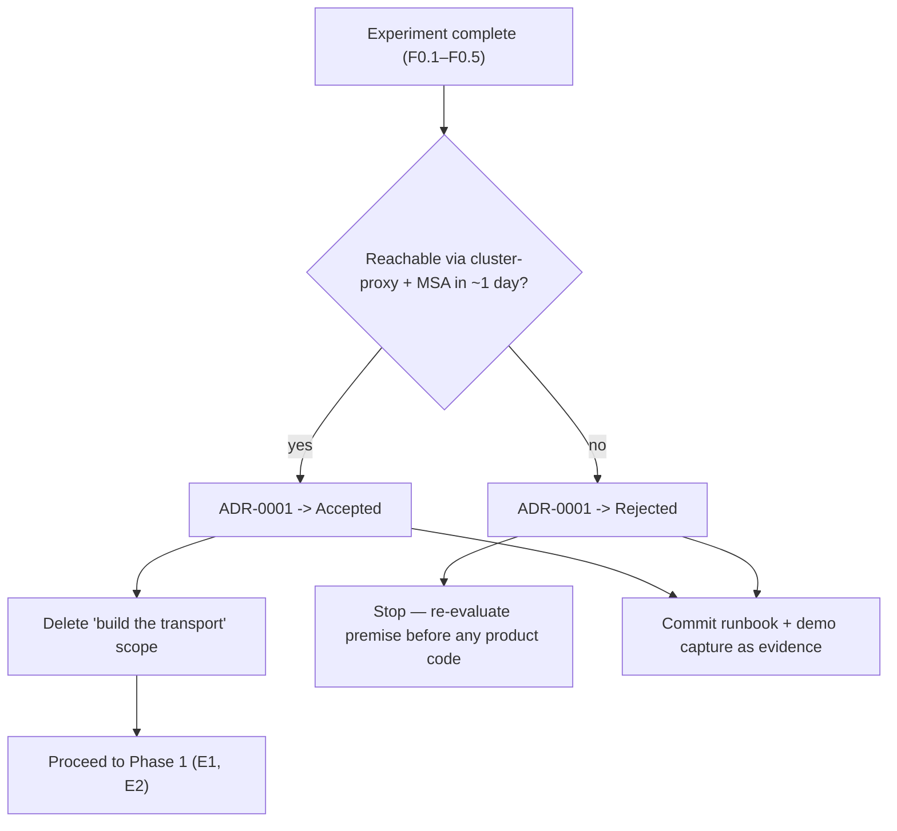
```mermaid
flowchart TD
    A["Experiment complete (F0.1–F0.5)"] --> B{"Reachable via cluster-proxy + MSA in ~1 day?"}
    B -- "yes" --> C["ADR-0001 -> Accepted"]
    C --> D["Delete 'build the transport' scope"]
    D --> E["Proceed to Phase 1 (E1, E2)"]
    B -- "no" --> F["ADR-0001 -> Rejected"]
    F --> G["Stop — re-evaluate premise before any product code"]
    C --> H["Commit runbook + demo capture as evidence"]
    F --> H
```

**Acceptance criteria.**
- ADR-0001 carries a real verdict (Accepted or Rejected), a setup time, and a link to the
  runbook.
- The go/no-go decision for Phase 1 is explicit and recorded.

**Key risk / guardrail.** The temptation after a "no" is to build the transport anyway.
Guardrail: a "no" verdict is a hard stop for re-evaluation, by design — the whole point of M0 is
that this is the cheapest place to abandon or pivot the premise.

### E0 exit criteria

- OCM hub + 2 spokes stand up, both `Available`; both addons healthy at pinned v0.10.0.
- The hub reaches a spoke-local service through the `cluster-proxy` tunnel using a scoped MSA
  token, on both spokes, with no cluster-admin kubeconfig anywhere.
- Spoke → hub traffic is verified outbound-only with no inbound port required.
- ADR-0001 records the verdict and setup time; a redacted runbook and a demo capture exist.
- The transport-build scope is deleted (on "yes"), or work stops for re-evaluation (on "no").

## E1 — Tenancy and identity

**Goal:** make "a workspace over many clusters" the single tenancy anchor, with authorization
from signed token claims (never headers), least-privilege RBAC roles, and a real database-level
row-level-security backstop behind app-layer scoping.

**Phase:** P1 · **Depends on:** E0 (accepted). Isolation is the product here; a control plane
that can see and act across many tenants' fleets must never leak or act across the tenant
boundary. This epic implements the three-layer defense of ADR-0003 from day one.

**Features:** F1.1 workspace + membership model · F1.2 signed-token authentication · F1.3 RBAC
role gate · F1.4 application-layer tenant scoping · F1.5 database-level RLS backstop · F1.6
tenant-isolation test suite.

### F1.1 — Workspace + membership model

**What it is.** The tenancy data model. A `Workspace` is the scoped tenancy object; every
cluster, policy, intent, decision, audit entry, and fleet fact belongs to exactly one workspace.
A `Membership` grants a subject a role within a workspace.

**How it works.**
1. `Workspace` carries a `tenant_key` that is the isolation anchor used by every scoping layer.
2. Clusters are explicitly associated with a workspace (tenancy is a workspace over clusters,
   never one deployment per cluster).
3. `Membership` maps a subject to a role in a workspace: `reader`, `operator`, `approver`, or
   `admin`.
4. Every workspace-scoped table carries a `workspace_id` foreign key so all three isolation
   layers have a column to enforce on.

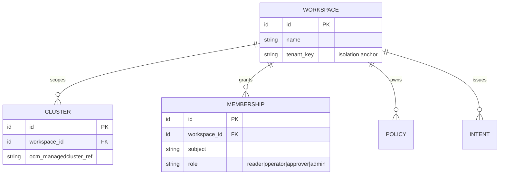
```mermaid
erDiagram
    WORKSPACE ||--o{ CLUSTER : "scopes"
    WORKSPACE ||--o{ MEMBERSHIP : "grants"
    WORKSPACE ||--o{ POLICY : "owns"
    WORKSPACE ||--o{ INTENT : "issues"
    WORKSPACE {
        id id PK
        string name
        string tenant_key "isolation anchor"
    }
    MEMBERSHIP {
        id id PK
        id workspace_id FK
        string subject
        string role "reader|operator|approver|admin"
    }
    CLUSTER {
        id id PK
        id workspace_id FK
        string ocm_managedcluster_ref
    }
```

**Acceptance criteria.**
- Every workspace-scoped entity carries a `workspace_id`; a cluster belongs to exactly one
  workspace.
- A subject's role in a workspace is expressed only through `Membership`.

**Key risk / guardrail.** A new workspace-scoped table added later without a `workspace_id`
would be a silent leak path. Guardrail: a CI guard (F1.4) forbids workspace-scoped tables that
are not wired into scoping, so an omission fails the build.

### F1.2 — Signed-token authentication (no header trust)

**What it is.** Identity, tenant, and role come only from a cryptographically verified token.
Request headers are never trusted for identity — a direct fix for the predecessor's
header-trust IDOR.

**How it works.**
1. The gateway verifies the session/token signature before anything else; an invalid or absent
   token is rejected.
2. Tenant and role are read from the token's `memberships[workspace] → role` claim.
3. Any inbound `x-*-role` / `x-*-tenant` headers are stripped or ignored; they have no effect on
   authorization.
4. The verified claims flow downstream as the only source of who-and-where.

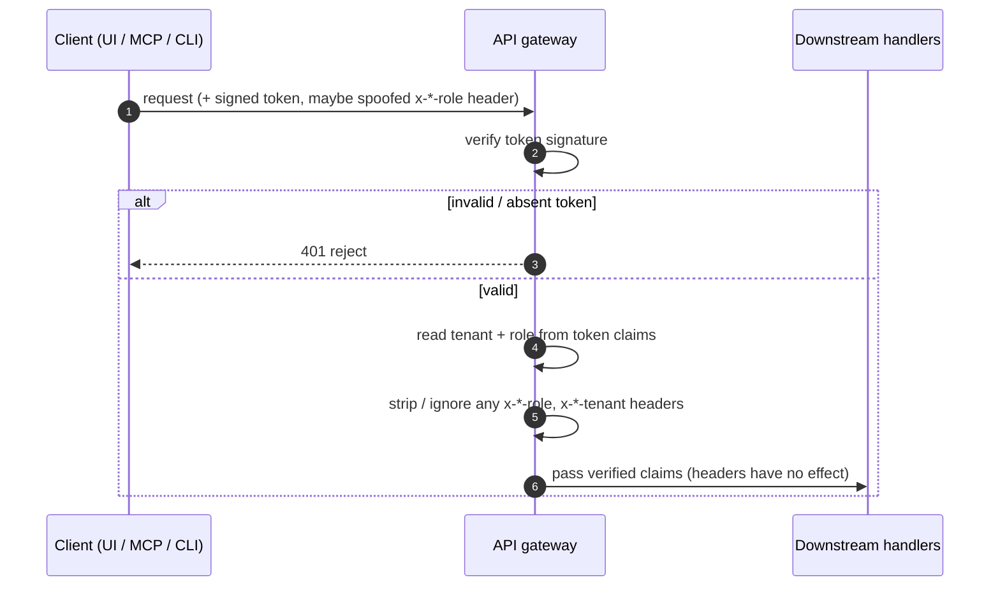
```mermaid
sequenceDiagram
    autonumber
    participant C as Client (UI / MCP / CLI)
    participant GW as API gateway
    participant H as Downstream handlers
    C->>GW: request (+ signed token, maybe spoofed x-*-role header)
    GW->>GW: verify token signature
    alt invalid / absent token
        GW-->>C: 401 reject
    else valid
        GW->>GW: read tenant + role from token claims
        GW->>GW: strip / ignore any x-*-role, x-*-tenant headers
        GW->>H: pass verified claims (headers have no effect)
    end
```

**Acceptance criteria.**
- A header-injected role has no effect; identity and tenant come only from the signed token.
- A forged or absent token is rejected.

**Key risk / guardrail.** A single handler reading a header for authorization would reopen the
IDOR. Guardrail: headers are stripped at the gateway and the isolation test suite (F1.6) asserts
a header-injected role changes nothing.

### F1.3 — RBAC role gate (least privilege)

**What it is.** A gate that maps the actor's workspace role to the classes of action they may
take, applied before any read or write proceeds.

**How it works.**
1. `reader` may run reads and correlation queries only.
2. `operator` may additionally propose intents.
3. `approver` may approve gated intents (and read), but the proposer and approver must be
   distinct for multi-approver gates.
4. `admin` manages workspace membership and policy bindings, within the workspace only.
5. The gate is fail-safe: a role that does not explicitly permit an action is refused.

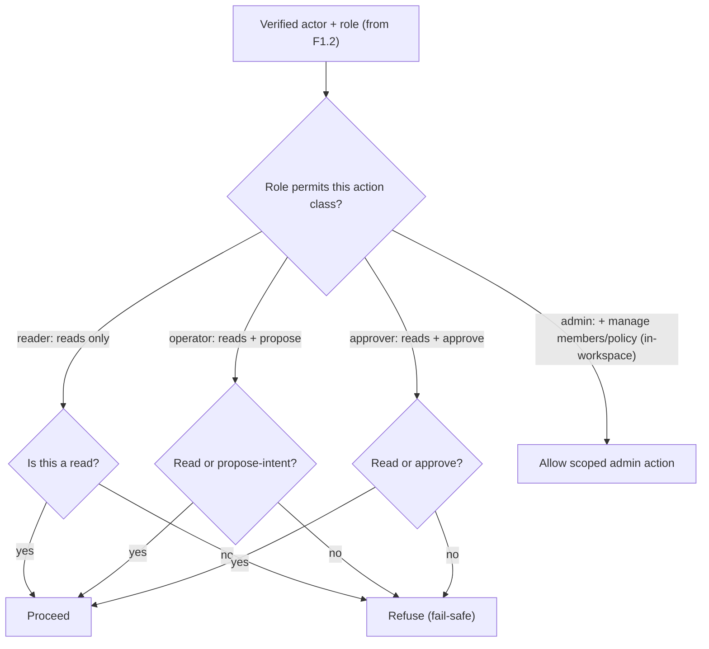
```mermaid
flowchart TD
    A["Verified actor + role (from F1.2)"] --> B{"Role permits this action class?"}
    B -- "reader: reads only" --> R{"Is this a read?"}
    B -- "operator: reads + propose" --> P{"Read or propose-intent?"}
    B -- "approver: reads + approve" --> V{"Read or approve?"}
    B -- "admin: + manage members/policy (in-workspace)" --> M["Allow scoped admin action"]
    R -- "yes" --> OK["Proceed"]
    R -- "no" --> DENY["Refuse (fail-safe)"]
    P -- "yes" --> OK
    P -- "no" --> DENY
    V -- "yes" --> OK
    V -- "no" --> DENY
```

**Acceptance criteria.**
- Each role can do exactly its permitted action classes and no more.
- An action a role does not permit is refused, not best-effort.

**Key risk / guardrail.** Role creep (an operator quietly gaining approval power) collapses
separation of duties. Guardrail: proposer and approver identities are checked distinct for
multi-approver gates, and the role gate is fail-safe.

### F1.4 — Application-layer tenant scoping

**What it is.** A tenant-aware data access layer that injects the current workspace scope into
every query against a workspace-scoped table and hard-fails on any mismatch — covering all such
models, not a subset.

**How it works.**
1. Every request runs with a resolved workspace context (from F1.2).
2. The data access layer injects `workspace_id = <current>` into reads and writes on
   workspace-scoped tables.
3. If a query returns or targets a row from another workspace, the layer hard-fails rather than
   returning it.
4. A CI guard scans for direct access to workspace-scoped tables that bypasses the scoped layer
   and fails the build.

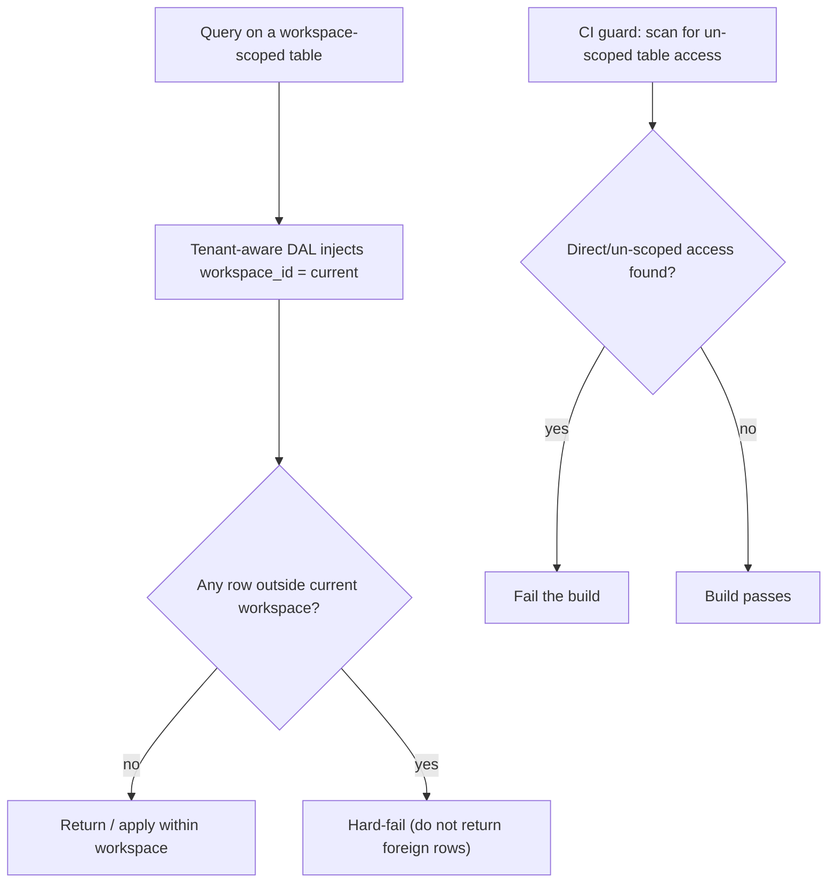
```mermaid
flowchart TD
    A["Query on a workspace-scoped table"] --> B["Tenant-aware DAL injects workspace_id = current"]
    B --> C{"Any row outside current workspace?"}
    C -- "no" --> D["Return / apply within workspace"]
    C -- "yes" --> E["Hard-fail (do not return foreign rows)"]
    F["CI guard: scan for un-scoped table access"] --> G{"Direct/un-scoped access found?"}
    G -- "yes" --> H["Fail the build"]
    G -- "no" --> I["Build passes"]
```

**Acceptance criteria.**
- All workspace-scoped models are accessed only through the scoped layer.
- A cross-workspace access attempt hard-fails at the app layer; the CI guard blocks un-scoped
  access.

**Key risk / guardrail.** A forgotten filter on one model was the predecessor's silent-leak bug.
Guardrail: the CI guard makes an un-scoped access a build failure, and F1.5 is the independent
backstop if the app layer is ever wrong anyway.

### F1.5 — Database-level RLS backstop (non-owner role, FORCE RLS, per-request scope)

**What it is.** PostgreSQL row-level security that is actually enforced, independent of
application code — the backstop the predecessor advertised but left inert.

**How it works.**
1. The application connects as a non-owner DB role (table owners bypass RLS, so the app must not
   be the owner).
2. Every workspace-scoped table has `ENABLE` and `FORCE ROW LEVEL SECURITY`.
3. At the start of each request's transaction, the current workspace is set with
   `set_config('sith.workspace_id', <id>, true)`.
4. Each table's RLS policy checks `workspace_id = current_setting('sith.workspace_id')`, so the
   database filters foreign rows even if the app layer is bypassed.

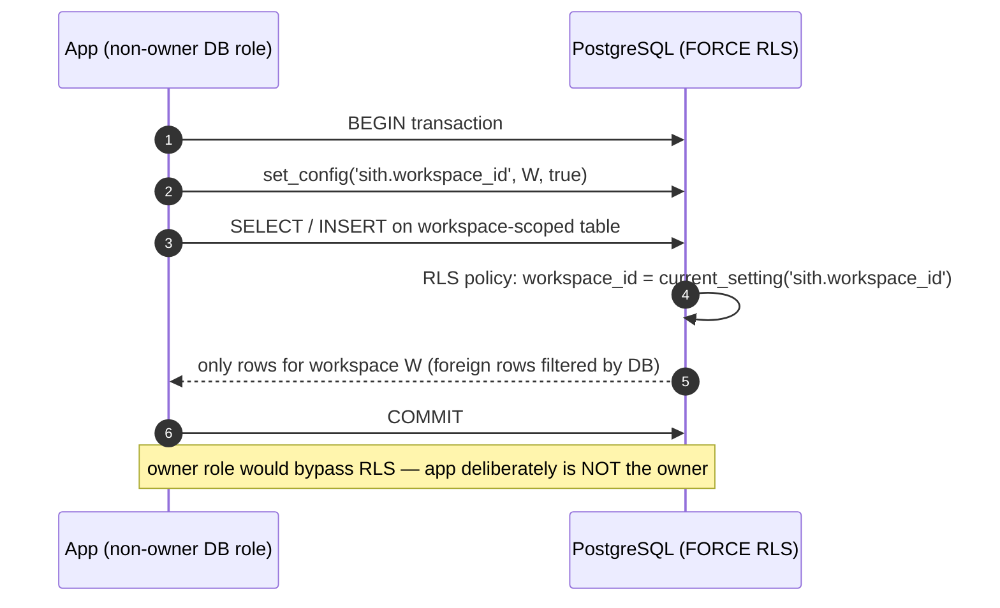
```mermaid
sequenceDiagram
    autonumber
    participant APP as App (non-owner DB role)
    participant DB as PostgreSQL (FORCE RLS)
    APP->>DB: BEGIN transaction
    APP->>DB: set_config('sith.workspace_id', W, true)
    APP->>DB: SELECT / INSERT on workspace-scoped table
    DB->>DB: RLS policy: workspace_id = current_setting('sith.workspace_id')
    DB-->>APP: only rows for workspace W (foreign rows filtered by DB)
    APP->>DB: COMMIT
    Note over APP,DB: owner role would bypass RLS — app deliberately is NOT the owner
```

**Acceptance criteria.**
- The app connects as a non-owner role; every workspace-scoped table has `FORCE ROW LEVEL
  SECURITY`.
- A query with the app-layer scope deliberately removed still returns only the current
  workspace's rows.

**Key risk / guardrail.** RLS that is enabled but not forced, or an app connecting as owner,
would make the backstop inert again. Guardrail: F1.6 includes a test that removing an RLS policy
makes a DB-layer isolation test fail — proving the backstop is live, not decorative.

### F1.6 — Tenant-isolation test suite

**What it is.** The test suite that treats isolation as a primary, first-class property, proving
cross-workspace access is impossible at multiple independent layers.

**How it works.**
1. A cross-workspace read/write is attempted with the app-layer scope deliberately bypassed; the
   DB RLS layer must deny it.
2. A forged or absent token is rejected; a header-injected role is shown to have no effect.
3. `targetSelector` and queries are fuzzed with foreign cluster IDs and must always resolve to
   empty within-workspace.
4. A negative control: a removed RLS policy makes the DB-layer test fail, proving the backstop is
   real.

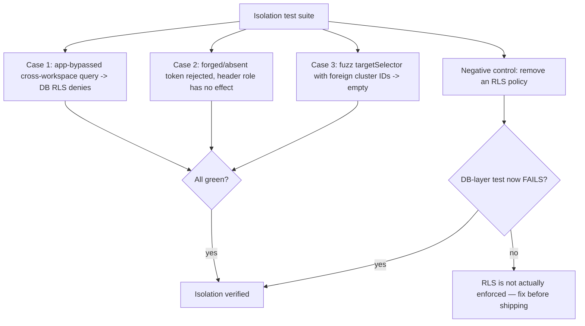
```mermaid
flowchart TD
    A["Isolation test suite"] --> B["Case 1: app-bypassed cross-workspace query -> DB RLS denies"]
    A --> C["Case 2: forged/absent token rejected, header role has no effect"]
    A --> D["Case 3: fuzz targetSelector with foreign cluster IDs -> empty"]
    A --> E["Negative control: remove an RLS policy"]
    B --> F{"All green?"}
    C --> F
    D --> F
    E --> G{"DB-layer test now FAILS?"}
    F -- "yes" --> PASS["Isolation verified"]
    G -- "yes" --> PASS
    G -- "no" --> FAIL["RLS is not actually enforced — fix before shipping"]
```

**Acceptance criteria.**
- All isolation cases pass; a removed RLS policy makes the DB-layer test fail.
- Header-injected roles and forged tokens are proven ineffective.

**Key risk / guardrail.** A green suite that does not actually exercise the DB layer would give
false confidence. Guardrail: the negative control (remove-a-policy-and-watch-it-fail) is part of
the suite, so "green" means the backstop is genuinely enforcing.

### E1 exit criteria

- `Workspace` is the single tenancy anchor; every scoped entity carries `workspace_id`.
- Authorization derives only from signed token claims; header-injected roles have no effect.
- RBAC roles (reader/operator/approver/admin) gate action classes fail-safe.
- App-layer scoping covers all workspace-scoped models with a CI guard; DB-level RLS is forced,
  per-request, and connects as a non-owner role.
- The isolation suite is green, including the negative control proving RLS is live.

## E2 — Read federation

**Goal:** assemble a tenant-scoped, normalized fleet model from OCM-brokered reads and make
cross-cluster correlation a first-class query — answering fleet-wide questions single-cluster
tools structurally cannot. The read source is **abstracted**: facts come from a **local
kubeconfig context** (day-0 local mode, E11) *or* an **OCM-brokered spoke** (day-N hub mode),
behind one common source interface — so the local client and the hub are one code path above
the source. F2.1 defines both source adapters.

**Phase:** P1 · **Depends on:** E0 (connectivity), E1 (tenancy). Reads never require the write
path and have their own blast radius and rate limits. Least privilege is by construction: the
hub reads only what spoke agents report and only within the scope of the projected MSA token.

**Features:** F2.1 spoke read collection and normalization · F2.2 fleet model store with
freshness and source stamping · F2.3 cross-cluster correlation query · F2.4 image/CVE fact
ingestion and fleet-wide CVE search · F2.5 staleness surfacing and abstention inputs.

### F2.1 — Spoke read collection and normalization

**What it is.** The read path that pulls inventory (deployments, pods, rollouts) and
health/alerts from each spoke through `cluster-proxy` using a scoped MSA token, and normalizes
it into a common shape.

**How it works.**
1. For each spoke, the read-federation service authenticates with the spoke's projected MSA
   token and reaches the spoke's Kubernetes API / cluster-local services through
   `cluster-proxy`.
2. It collects inventory (workload objects and their status) and health/alert signals.
3. It maps heterogeneous source shapes into Sith's normalized fleet-fact model (kind =
   inventory | health | alert | drift | cve).
4. Reads are bounded to what the MSA token scope and the spoke report allow — the hub cannot
   read arbitrary cluster state just because it is the hub.

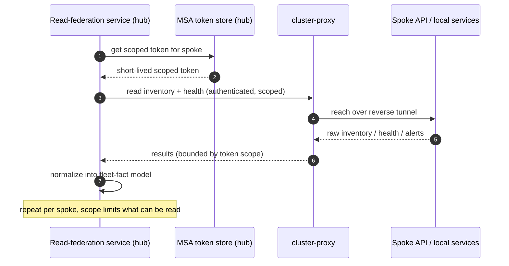
```mermaid
sequenceDiagram
    autonumber
    participant RF as Read-federation service (hub)
    participant MSA as MSA token store (hub)
    participant CP as cluster-proxy
    participant SVC as Spoke API / local services
    RF->>MSA: get scoped token for spoke
    MSA-->>RF: short-lived scoped token
    RF->>CP: read inventory + health (authenticated, scoped)
    CP->>SVC: reach over reverse tunnel
    SVC-->>CP: raw inventory / health / alerts
    CP-->>RF: results (bounded by token scope)
    RF->>RF: normalize into fleet-fact model
    Note over RF: repeat per spoke, scope limits what can be read
```

**Acceptance criteria.**
- Inventory and health are collected from ≥ 2 spokes over `cluster-proxy` with scoped tokens.
- Heterogeneous sources are normalized into one fleet-fact shape.

**Key risk / guardrail.** A broad token would let the hub over-read a spoke. Guardrail: reads
are bounded by the MSA token scope and by what the spoke agent chooses to report; the hub holds
no admin path.

### F2.2 — Fleet model store with freshness and source stamping

**What it is.** The tenant-scoped, cached, normalized fleet model where every record carries the
time it was observed and the cluster it came from.

**How it works.**
1. Each normalized fact is written to the fleet model with `observed_at` and `source cluster`.
2. Every fact is scoped to its cluster's workspace, so the model inherits E1's isolation
   (app-layer scope + DB RLS).
3. The model is a cache of observed state, refreshed on a cadence — it is not a metrics store and
   keeps no long time series.
4. `CLUSTER.last_seen` is maintained so a cluster that stops reporting is detectable.

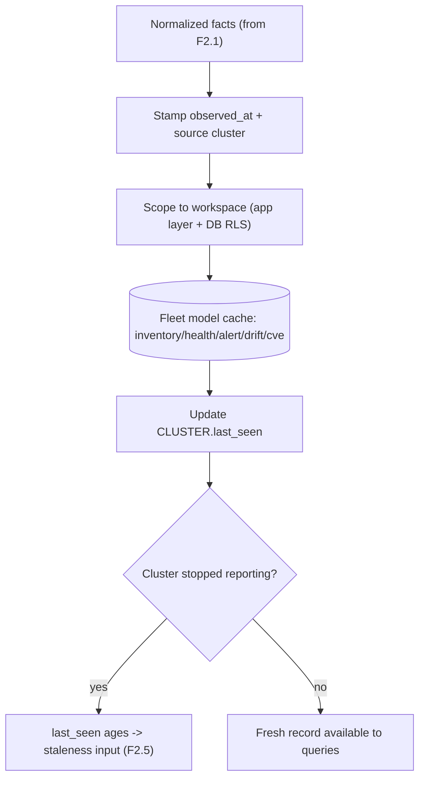
```mermaid
flowchart TD
    A["Normalized facts (from F2.1)"] --> B["Stamp observed_at + source cluster"]
    B --> C["Scope to workspace (app layer + DB RLS)"]
    C --> D[("Fleet model cache: inventory/health/alert/drift/cve")]
    D --> E["Update CLUSTER.last_seen"]
    E --> F{"Cluster stopped reporting?"}
    F -- "yes" --> G["last_seen ages -> staleness input (F2.5)"]
    F -- "no" --> H["Fresh record available to queries"]
```

**Acceptance criteria.**
- The fleet model is populated from ≥ 2 spokes, tenant-scoped, each record stamped with freshness
  and source.
- The store holds current observed state only — no long-term series.

**Key risk / guardrail.** Drifting toward storing metrics history would turn Sith into a
telemetry lake (out of scope). Guardrail: the model is a bounded cache of current facts;
retention is deliberately short and history is not a feature.

### F2.3 — Cross-cluster correlation query

**What it is.** The differentiator: a query that spans all clusters in a workspace and answers a
question a single-cluster tool cannot, such as "every cluster where deployment `X` is unhealthy".

**How it works.**
1. A query names a condition (for example, deployment `X` in a Degraded/unhealthy state).
2. The query engine evaluates it against the workspace's fleet model across every cluster at
   once — no per-console fan-out by the operator.
3. Results are aggregated into one answer listing the matching clusters.
4. Any cluster whose data is stale is flagged in the result, so the answer is honest about
   coverage.

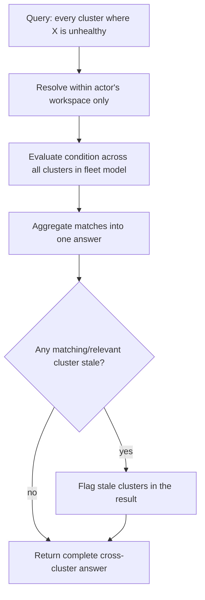
```mermaid
flowchart TD
    A["Query: every cluster where X is unhealthy"] --> B["Resolve within actor's workspace only"]
    B --> C["Evaluate condition across all clusters in fleet model"]
    C --> D["Aggregate matches into one answer"]
    D --> E{"Any matching/relevant cluster stale?"}
    E -- "yes" --> F["Flag stale clusters in the result"]
    E -- "no" --> G["Return complete cross-cluster answer"]
    F --> G
```

**Acceptance criteria.**
- One query returns a correct, tenant-scoped answer spanning ≥ 2 spokes.
- Stale clusters are flagged in the result rather than silently dropped.

**Key risk / guardrail.** A query that silently omits a stale or dark cluster would give a
false-complete answer. Guardrail: staleness is surfaced in every result (F2.5), and completeness
of coverage is explicit.

### F2.4 — Image/CVE fact ingestion and fleet-wide CVE search

**What it is.** Ingestion of image and CVE facts per cluster, enabling a fleet-wide search such
as "which clusters run image X with CVE Y".

**How it works.**
1. Each spoke reports the images running in its cluster (and, where available, associated CVE
   findings) as `cve`/`inventory` fleet facts.
2. The hub normalizes and stores these with the same freshness/source stamping.
3. A CVE-search query filters across the workspace's clusters by image or CVE identifier.
4. Results list the matching clusters and workloads, with staleness flagged.

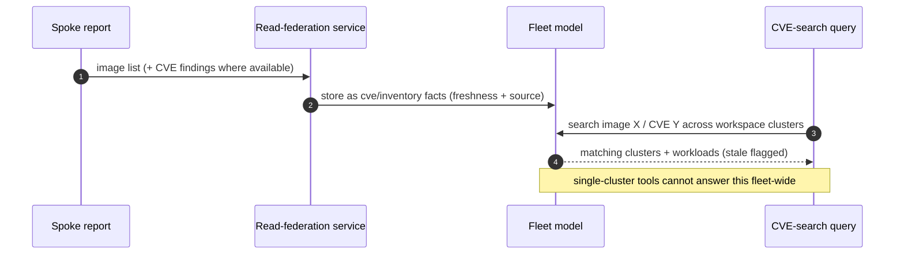
```mermaid
sequenceDiagram
    autonumber
    participant SP as Spoke report
    participant RF as Read-federation service
    participant FM as Fleet model
    participant Q as CVE-search query
    SP->>RF: image list (+ CVE findings where available)
    RF->>FM: store as cve/inventory facts (freshness + source)
    Q->>FM: search image X / CVE Y across workspace clusters
    FM-->>Q: matching clusters + workloads (stale flagged)
    Note over Q,FM: single-cluster tools cannot answer this fleet-wide
```

**Acceptance criteria.**
- A fleet-wide search by image or CVE returns the matching clusters across the workspace.
- Results carry freshness and source; stale clusters are flagged.

**Key risk / guardrail.** Treating a stale image inventory as authoritative could hide a
vulnerable cluster. Guardrail: CVE results inherit freshness stamping, and a stale cluster is
flagged rather than assumed clean.

### F2.5 — Staleness surfacing and abstention inputs

**What it is.** The mechanism that turns per-record freshness into a per-cluster staleness signal
and feeds it to correlation results and, later, to action-side abstention.

**How it works.**
1. Each cluster's freshness is derived from `last_seen` / `observed_at` versus a configured
   threshold.
2. A cluster past the threshold is marked stale; the degree of staleness (for example, ">10m")
   is available.
3. Query results carry per-cluster staleness so operators see coverage gaps.
4. The same signal is exported for the policy layer, where an incomplete or stale targeted set
   drives abstention (E5).

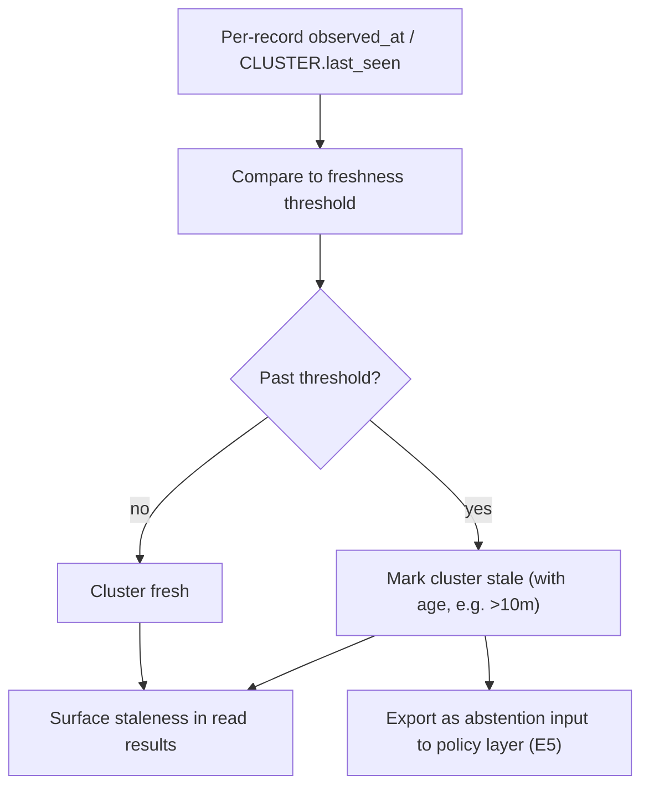
```mermaid
flowchart TD
    A["Per-record observed_at / CLUSTER.last_seen"] --> B["Compare to freshness threshold"]
    B --> C{"Past threshold?"}
    C -- "yes" --> D["Mark cluster stale (with age, e.g. >10m)"]
    C -- "no" --> E["Cluster fresh"]
    D --> F["Surface staleness in read results"]
    D --> G["Export as abstention input to policy layer (E5)"]
    E --> F
```

**Acceptance criteria.**
- Per-cluster staleness is computed and visible in read results.
- The staleness signal is available to the policy layer as an abstention input.

**Key risk / guardrail.** Hidden staleness is the most dangerous failure of a federated read
model. Guardrail: staleness is never hidden — it is surfaced in results and is a first-class
input to abstention, so a partial view cannot masquerade as a complete one.

### E2 exit criteria

- A normalized, tenant-scoped fleet model is populated from ≥ 2 spokes, every record stamped with
  freshness and source.
- A single cross-cluster correlation query returns a correct answer over ≥ 2 spokes with stale
  clusters flagged.
- Fleet-wide image/CVE search works across the workspace.
- Per-cluster staleness is surfaced in results and exported as an abstention input.
- Reads never touch the write path and are bounded by MSA token scope.

## E3 — Credential and key custody

**Goal:** hold as few secrets as possible, and protect the ones that remain with envelope
encryption and per-tenant keys so no single leak decrypts every tenant — and with no god
credential in the center.

**Phase:** the *principles* are day-one (P1); the concrete custody surfaces land when the first
held secret arrives with the write path (P2 — Git credentials and the intent signing key).
**Depends on:** E1 (workspaces are the key-scoping unit). This epic makes the predecessor's
single-env-key blast radius structurally impossible (ADR-0006).

**Features:** F3.1 no-central-admin-credential posture · F3.2 KMS envelope encryption with
per-tenant data keys · F3.3 intent signing-key custody · F3.4 key rotation and key-ring · F3.5
boot-time custody checks · F3.6 secret leak prevention.

### F3.1 — No-central-admin-credential posture

**What it is.** The structural stance that the hub stores no per-cluster admin kubeconfigs at
all; reach uses scoped MSA tokens and action uses short-lived brokered identity, verified and
executed locally by the spoke.

**How it works.**
1. Cluster reach = OCM `managed-serviceaccount` scoped tokens (E0/E2), not stored admin
   kubeconfigs.
2. Cluster action = Ardur-brokered, short-lived, per-action identity (E5), re-validated and
   executed by the spoke with its own local identity.
3. The hub therefore never holds a credential whose compromise means cluster-admin everywhere.
4. Any secret the hub genuinely must hold (Git credential, signing key, integration token) is a
   named, bounded exception handled by F3.2–F3.3.

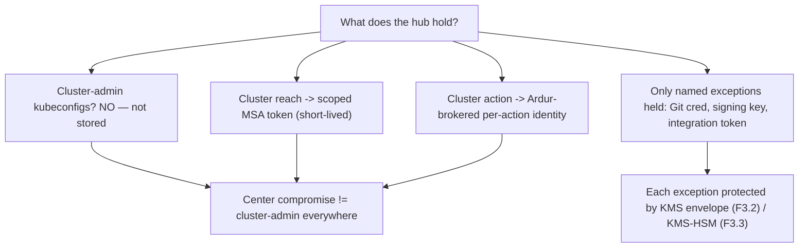
```mermaid
flowchart TD
    A["What does the hub hold?"] --> B["Cluster-admin kubeconfigs? NO — not stored"]
    A --> C["Cluster reach -> scoped MSA token (short-lived)"]
    A --> D["Cluster action -> Ardur-brokered per-action identity"]
    A --> E["Only named exceptions held: Git cred, signing key, integration token"]
    E --> F["Each exception protected by KMS envelope (F3.2) / KMS-HSM (F3.3)"]
    B --> G["Center compromise != cluster-admin everywhere"]
    C --> G
    D --> G
```

**Acceptance criteria.**
- No per-cluster admin kubeconfig is stored in the hub.
- Every secret the hub does hold is an enumerated exception with a defined custody control.

**Key risk / guardrail.** A convenience shortcut ("just store the kubeconfig") would reintroduce
the confused-deputy blast radius. Guardrail: storing cluster-admin credentials centrally is
rejected outright by ADR-0001/ADR-0006; reach and action use scoped, brokered, locally
re-validated identity only.

### F3.2 — KMS envelope encryption with per-tenant data keys

**What it is.** Any secret the hub holds is encrypted with a per-workspace data key, which is
itself wrapped by a KMS/HSM master key. There is no single process-wide key.

**How it works.**
1. Each workspace has its own data key (DEK). To store a secret, the DEK encrypts the plaintext
   (AES-256-GCM).
2. The DEK is never stored in the clear — it is wrapped (encrypted) by the KMS master key, which
   never leaves the KMS.
3. Stored form is the ciphertext plus the wrapped DEK; to read, the KMS unwraps the DEK, which
   then decrypts the secret.
4. Compromising one tenant's DEK exposes only that tenant; the KMS master key is never present
   in process memory in the clear.

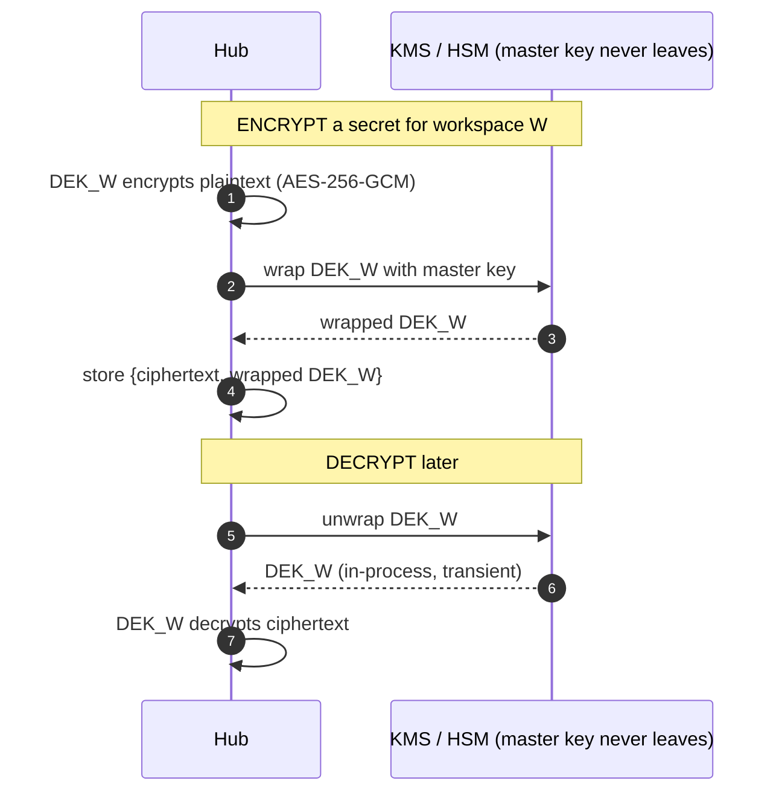
```mermaid
sequenceDiagram
    autonumber
    participant APP as Hub
    participant KMS as KMS / HSM (master key never leaves)
    Note over APP,KMS: ENCRYPT a secret for workspace W
    APP->>APP: DEK_W encrypts plaintext (AES-256-GCM)
    APP->>KMS: wrap DEK_W with master key
    KMS-->>APP: wrapped DEK_W
    APP->>APP: store {ciphertext, wrapped DEK_W}
    Note over APP,KMS: DECRYPT later
    APP->>KMS: unwrap DEK_W
    KMS-->>APP: DEK_W (in-process, transient)
    APP->>APP: DEK_W decrypts ciphertext
```

**Acceptance criteria.**
- Every hub-held secret is encrypted with a per-workspace DEK wrapped by a KMS master key.
- No single process-wide key exists; one tenant's DEK compromise does not expose others.

**Key risk / guardrail.** A per-tenant key kept in the DB unwrapped would recreate a single point
of compromise. Guardrail: DEKs are always KMS-wrapped at rest; the master key never leaves the
KMS, so the key store alone is not sufficient to decrypt anything.

### F3.3 — Intent signing-key custody

**What it is.** The key the hub uses to sign every dispatched intent (E4), held in a KMS/HSM,
treated as the single most sensitive secret in the system.

**How it works.**
1. The signing key lives in a KMS/HSM; signing is a KMS operation, so the private key never
   enters application memory in the clear.
2. Each intent is signed by calling the KMS to produce a signature; each spoke verifies it.
3. The key is rotatable (F3.4); spoke-side local allowlists are the compensating control if the
   key is ever compromised.
4. Access to the signing operation is tightly scoped and audited.

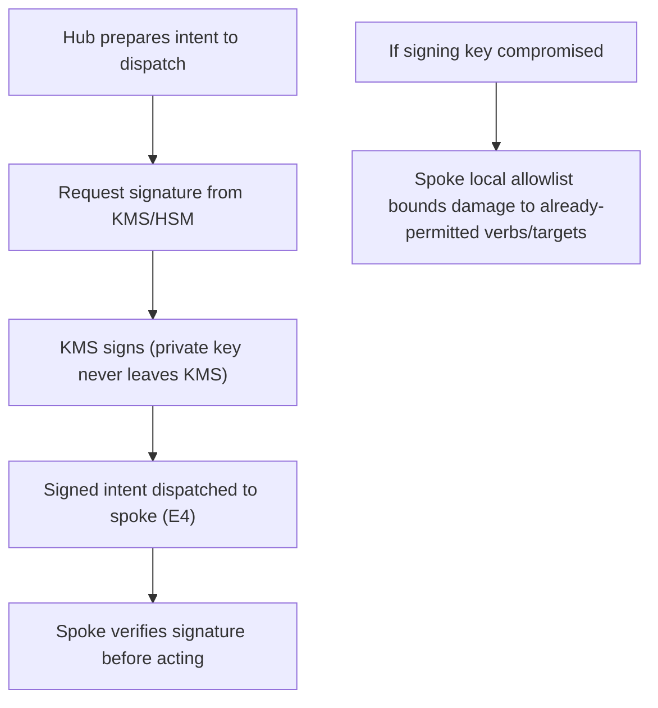
```mermaid
flowchart TD
    A["Hub prepares intent to dispatch"] --> B["Request signature from KMS/HSM"]
    B --> C["KMS signs (private key never leaves KMS)"]
    C --> D["Signed intent dispatched to spoke (E4)"]
    D --> E["Spoke verifies signature before acting"]
    F["If signing key compromised"] --> G["Spoke local allowlist bounds damage to already-permitted verbs/targets"]
```

**Acceptance criteria.**
- Intents are signed via a KMS/HSM operation; the private key never leaves the KMS.
- The signing key is rotatable and its use is audited.

**Key risk / guardrail.** The signing key is the highest-value secret — its leak lets an attacker
forge intents. Guardrail: it lives in KMS/HSM, rotates, and the spoke's independent local
allowlist (E4) bounds the damage of any forged intent to already-permitted verbs and targets.

### F3.4 — Key rotation and key-ring

**What it is.** First-class rotation for data keys and the signing key, with a key-ring that can
decrypt with an old key while encrypting with a new one during rotation.

**How it works.**
1. Keys carry versions; a key-ring holds the current and recent versions.
2. On a schedule or on demand, a new key version is created and becomes the encrypt/sign key.
3. Existing ciphertext/signatures are still verifiable/decryptable with the older version until
   re-wrapped/re-signed.
4. Rotation is a primary test target, since a rotation bug can lock out data or break signature
   verification.

```mermaid
flowchart TD
    A["Rotation trigger (schedule or on-demand)"] --> B["Create new key version v(n+1)"]
    B --> C["Encrypt / sign new data with v(n+1)"]
    B --> D["Keep v(n) in key-ring for decrypt/verify of old data"]
    C --> E["Background re-wrap / re-sign old data to v(n+1)"]
    D --> E
    E --> F{"All migrated to v(n+1)?"}
    F -- "yes" --> G["Retire v(n)"]
    F -- "no" --> D
```

**Acceptance criteria.**
- Data keys and the signing key rotate on schedule and on demand without data loss or broken
  verification.
- Old versions remain usable for decrypt/verify until migration completes.

**Key risk / guardrail.** A rotation that drops an old key before re-encryption would strand data
or break verification. Guardrail: the key-ring keeps old versions until migration completes, and
rotation is exercised explicitly in tests.

### F3.5 — Boot-time custody checks

**What it is.** Startup checks that refuse to run if key material is missing, weak, a
placeholder, or if the KMS is unreachable.

**How it works.**
1. On boot, the hub verifies required key material is present and above an entropy floor.
2. It rejects any placeholder or well-known default value (no "changeme" ever accepted).
3. It verifies KMS reachability so envelope operations will work.
4. If any check fails, the process refuses to start rather than running in a degraded, unsafe
   state.

```mermaid
flowchart TD
    A["Process start"] --> B{"Key material present?"}
    B -- "no" --> X["Refuse to start"]
    B -- "yes" --> C{"Above entropy floor and not a placeholder?"}
    C -- "no" --> X
    C -- "yes" --> D{"KMS reachable?"}
    D -- "no" --> X
    D -- "yes" --> E["Start normally"]
```

**Acceptance criteria.**
- The hub refuses to start on missing, weak, or placeholder key material, or an unreachable KMS.
- A known-weak or placeholder value is rejected.

**Key risk / guardrail.** Silently starting with a weak key is how the predecessor accepted bad
key material. Guardrail: boot checks are fail-closed — an unsafe custody state prevents startup
rather than degrading quietly.

### F3.6 — Secret leak prevention

**What it is.** The controls that keep secrets out of logs, errors, git, and Helm output — this
is a public repository, so nothing sensitive is ever committed.

**How it works.**
1. An error sanitizer strips tokens, keys, and sensitive identifiers before anything is logged or
   returned.
2. Secrets are never rendered into log lines or into Helm output that lands in git.
3. `.gitignore` pre-empts common secret files; scratch/lab state stays out of the repo.
4. This applies uniformly across control plane, spoke agent, and tooling.

```mermaid
flowchart TD
    A["Log line / error / rendered output"] --> B["Error sanitizer: strip tokens/keys/sensitive IDs"]
    B --> C{"Any secret material remaining?"}
    C -- "yes" --> D["Redact before emit"]
    C -- "no" --> E["Emit safe output"]
    F["Repo hygiene: .gitignore + no secrets in Helm output"] --> G["Public repo: nothing sensitive committed"]
```

**Acceptance criteria.**
- Logs, errors, and rendered output never contain secret material.
- No secret files are committed; the public repo stays clean.

**Key risk / guardrail.** A single unsanitized error path can leak a token (the SSRF-reads-env
class of bug). Guardrail: sanitization is centralized and applied to all emit paths, and repo
hygiene is enforced so a leak cannot reach git.

### E3 exit criteria

- The hub stores no cluster-admin kubeconfigs; reach and action use scoped/brokered identity.
- Every hub-held secret is envelope-encrypted with a per-tenant DEK wrapped by a KMS master key.
- The intent signing key lives in KMS/HSM and is rotatable; rotation works via a key-ring with no
  data loss.
- Boot-time custody checks fail closed; secrets never reach logs, errors, or git.

## E4 — Action federation

**Goal:** make the only writes Sith performs be typed intents from a closed verb vocabulary —
signed by the hub, re-validated independently by each spoke, executed with the spoke's own scoped
identity — with `gitops.open-pr` as the first and safest write and no shell ever.

**Phase:** P2 (the `gitops.open-pr` path) → P3 (live-mutation verbs behind full policy).
**Depends on:** E1 (identity/tenancy), E2 (target resolution against the fleet model), E3 (Git
credential + signing key custody), and E5 (every intent rides the PEP pipeline — E4 and E5
co-develop). This epic implements ADR-0004.

**Features:** F4.1 typed intent model and closed vocabulary · F4.2 per-verb arg schema
validation · F4.3 `gitops.open-pr` (first write) · F4.4 signed intent dispatch · F4.5 per-spoke
local allowlist re-validation and local execution · F4.6 dry-run-first execution · F4.7
live-mutation verbs.

### F4.1 — Typed intent model and closed vocabulary (fail-safe allowlist)

**What it is.** The intent as the unit of the write path — an object with a verb drawn from a
closed vocabulary — enforced by a fail-safe allowlist rather than a fail-open denylist.

**How it works.**
1. An intent carries `{id, workspace, actor, verb, targetSelector, args, justification,
   evidenceRefs, signature}`.
2. `verb` must be in the closed vocabulary and have a registered, schema-validated handler; an
   unknown verb is refused, not executed.
3. A CI test asserts every handler that reaches a write path is classified against the closed
   vocabulary — a forgotten classification fails the build.
4. Adding any verb is an ADR-level change, never a routine edit.

```mermaid
flowchart TD
    A["Proposed intent {verb, targetSelector, args, ...}"] --> B{"verb in CLOSED_VOCAB?"}
    B -- "no" --> R["Refuse (fail-safe)"]
    B -- "yes" --> C{"registered, schema-validated handler exists?"}
    C -- "no" --> R
    C -- "yes" --> D["Enter PEP pipeline (E5)"]
    E["CI: every write-path handler classified vs vocabulary?"] --> F{"any unclassified?"}
    F -- "yes" --> G["Fail the build (not production)"]
    F -- "no" --> H["Build passes"]
```

**Acceptance criteria.**
- Only vocabulary verbs with registered handlers can execute; unknown verbs are refused.
- The CI classification test fails the build if any write-path handler is unclassified.

**Key risk / guardrail.** The predecessor's fail-open "denylist of one" made a forgotten
classification auto-executable. Guardrail: the model is a fail-safe allowlist and the CI test
proves nothing reaches a write path unclassified.

### F4.2 — Per-verb arg schema validation

**What it is.** Every verb's arguments are validated against a per-verb JSON schema, and
execution is structured API calls — never string interpolation, because there is no shell.

**How it works.**
1. Each verb registers a JSON schema for its args (for example, `deployment.scale` requires a
   valid replica count and a resolved target).
2. Args that fail the schema are refused before any execution.
3. Valid args are passed to a typed handler that makes structured API calls (Argo CD API,
   Rollouts API, the scale subresource, a Git PR).
4. No argument is ever concatenated into a command string; the shell path does not exist.

```mermaid
flowchart TD
    A["Intent args for verb V"] --> B{"Args valid against V's JSON schema?"}
    B -- "no" --> R["Refuse"]
    B -- "yes" --> C["Typed handler for V"]
    C --> D["Structured API call (Argo CD / Rollouts / scale subresource / Git PR)"]
    D --> E["No string interpolation, no shell — ever"]
```

**Acceptance criteria.**
- Args are validated per-verb; invalid args are refused before execution.
- Execution is structured API calls with no shell and no string interpolation.

**Key risk / guardrail.** String interpolation into a command was the predecessor's RCE path.
Guardrail: verbs map to typed API calls only; there is no shell to inject into, and schema
validation rejects malformed args up front.

### F4.3 — `gitops.open-pr` (the first and safest write)

**What it is.** The first write Sith ships: opening a pull request on a target repo — a proposal
a human merges, requiring zero new standing trust and no cluster mutation.

**How it works.**
1. An operator (or MCP client) proposes `gitops.open-pr` with a target repo/branch and the change
   (for example, bump replicas for `web`).
2. The intent passes the full PEP pipeline (E5) and, on allow, the hub uses a Git credential held
   via KMS envelope (E3) with the narrowest scope that can open a PR — no direct-push credential.
3. The change is opened as a PR; nothing is applied to any cluster.
4. A human reviews and merges; the merge (via GitOps) is what eventually changes state, keeping
   Sith out of the reconcile loop.

```mermaid
sequenceDiagram
    autonumber
    participant C as Client (UI / MCP)
    participant PEP as PEP pipeline (E5)
    participant V as KMS-envelope Git credential (E3)
    participant REPO as Target repo
    participant H as Human reviewer
    C->>PEP: propose gitops.open-pr {repo, branch, change, justification}
    PEP->>PEP: authn -> tenant -> role -> verb -> args -> scope -> PDP -> audit
    PEP->>V: get narrow-scope Git credential (open-PR only)
    V-->>PEP: short-scoped credential
    PEP->>REPO: open pull request (no cluster mutation)
    REPO-->>PEP: PR URL
    PEP-->>C: PR opened (proposal)
    H->>REPO: review + merge (GitOps applies later)
    Note over PEP: proposed + executed both audited + decision-ledgered
```

**Acceptance criteria.**
- A `gitops.open-pr` intent flows end-to-end and opens a real PR.
- Zero cluster credentials reach the center or any AI at any point; the Git credential is
  narrow-scope and KMS-protected.

**Key risk / guardrail.** A broad Git credential (direct push) would let Sith change state
without human review. Guardrail: the credential can only open a PR, not push to protected
branches; the human merge is the change gate, consistent with GitOps orthodoxy.

### F4.4 — Signed intent dispatch

**What it is.** The hub signs every dispatched intent and sends it per target, wave-ordered, down
the same reverse tunnel — so each spoke can verify integrity before acting.

**How it works.**
1. After the PEP allows an intent, the hub requests a signature from the KMS/HSM signing key
   (E3).
2. The signed intent is dispatched to each target spoke over the `cluster-proxy` tunnel.
3. Dispatch is per target and wave-ordered (E5): later waves wait for earlier ones and their
   gates.
4. Each spoke receives a signed intent it can independently verify (F4.5).

```mermaid
sequenceDiagram
    autonumber
    participant PEP as PEP (hub)
    participant KMS as KMS/HSM signing key
    participant SPa as Spoke agent A
    participant SPb as Spoke agent B
    PEP->>KMS: sign intent
    KMS-->>PEP: signature
    Note over PEP,SPb: dispatch is wave-ordered (E5), per target, over the reverse tunnel
    PEP->>SPa: signed intent (wave 1)
    SPa-->>PEP: outcome
    PEP->>SPb: signed intent (wave 2, after wave-1 gate)
    SPb-->>PEP: outcome
```

**Acceptance criteria.**
- Every dispatched intent is signed by the hub; dispatch is per target and wave-ordered.
- A spoke receives a verifiable signed intent, not a raw command.

**Key risk / guardrail.** An unsigned or replayable dispatch could be forged or replayed.
Guardrail: intents are signed (integrity anchor) and carry an id for idempotency/dedupe (E5), so
a spoke rejects an unverifiable or duplicate dispatch.

### F4.5 — Per-spoke local allowlist re-validation and local execution

**What it is.** A spoke never blindly executes what the hub sends. It verifies the signature,
re-validates the intent against its own local allowlist, and executes with its own scoped local
identity — the second of two independent blast-radius bounds.

**How it works.**
1. The spoke agent verifies the intent signature against the hub's public key.
2. It re-validates the verb and target against its own local allowlist and local RBAC —
   independent of the hub's vocabulary.
3. If both pass, it executes using its own scoped local identity (not a hub-supplied
   credential), doing a dry-run first where applicable (F4.6).
4. It returns a per-cluster outcome to the hub; a failed check is a local refusal.

```mermaid
sequenceDiagram
    autonumber
    participant PEP as Hub (dispatch)
    participant SP as Sith spoke agent
    participant SVC as Cluster-local service
    PEP->>SP: signed intent
    SP->>SP: verify signature
    alt signature invalid
        SP-->>PEP: refuse (bad signature)
    else valid
        SP->>SP: re-validate vs LOCAL allowlist + local RBAC
        alt not locally allowed
            SP-->>PEP: refuse (local allowlist)
        else allowed
            SP->>SVC: execute with SP's OWN scoped identity (dry-run first)
            SVC-->>SP: result
            SP-->>PEP: per-cluster outcome
        end
    end
```

**Acceptance criteria.**
- A spoke executes only after verifying the signature and passing its own local allowlist.
- Execution uses the spoke's own scoped identity, never a hub-held credential.

**Key risk / guardrail.** If the spoke trusted the hub blindly, a hub compromise would be
"execute anything everywhere". Guardrail: the spoke's independent signature check plus local
allowlist plus local RBAC bound the damage of a forged or compromised dispatch to what that spoke
already permits.

### F4.6 — Dry-run-first execution

**What it is.** For every verb that supports it, a dry-run runs first and surfaces the plan/diff;
executing is a separate, explicit step.

**How it works.**
1. On an allowed intent, the handler performs a dry-run against the target and produces a
   plan/diff.
2. The plan/diff is surfaced to the proposer (and to any approval step).
3. Execution proceeds only on a separate explicit action, not automatically from the dry-run.
4. Verbs that cannot dry-run declare that, so the operator knows the plan is not previewable.

```mermaid
flowchart TD
    A["Allowed intent"] --> B{"Verb supports dry-run?"}
    B -- "yes" --> C["Dry-run -> produce plan/diff"]
    C --> D["Surface plan/diff to proposer / approver"]
    D --> E{"Explicit execute step taken?"}
    E -- "no" --> F["Stop (no change)"]
    E -- "yes" --> G["Execute"]
    B -- "no" --> H["Declare non-previewable, require explicit execute"]
    H --> E
```

**Acceptance criteria.**
- Every dry-run-capable verb previews a plan/diff before any change.
- Execution requires a separate explicit step; a dry-run never auto-executes.

**Key risk / guardrail.** Auto-executing from a plan removes the human's last look. Guardrail:
execute is always a distinct, explicit step separated from the dry-run.

### F4.7 — Live-mutation verbs (behind full policy)

**What it is.** The verbs that change cluster state — `argocd.sync|rollback`,
`rollout.promote|abort`, `deployment.scale|restart` — enabled per workspace only after the PR
path is proven, and only behind the full policy layer.

**How it works.**
1. Live verbs stay disabled until `gitops.open-pr` is proven end-to-end for a workspace.
2. When enabled, each still passes the complete PEP pipeline, is signed, re-validated locally, and
   dry-run-first.
3. Fan-out for these verbs is governed by E5 (env gates, wave ordering, partial-failure/rollback,
   abstention).
4. `exec` and free-form `apply` remain permanently excluded — live mutation never means arbitrary
   mutation.

```mermaid
flowchart TD
    A["Request a live-mutation verb (argocd.sync, rollout.promote, deployment.scale, ...)"] --> B{"PR path proven for this workspace?"}
    B -- "no" --> R["Refuse (not yet enabled)"]
    B -- "yes" --> C["Full PEP pipeline (E5) + signed dispatch (F4.4)"]
    C --> D["Spoke re-validate + dry-run + execute (F4.5/F4.6)"]
    D --> E["Fan-out governed: waves, gates, rollback, abstention (E5)"]
    F["exec / free-form apply / secret / RBAC mutation"] --> G["Permanently excluded — not expressible"]
```

**Acceptance criteria.**
- Live verbs are enabled per workspace only after the PR path is proven, and always ride the full
  policy layer.
- `exec` and free-form `apply` remain impossible at every phase.

**Key risk / guardrail.** Enabling live mutation broadly and early would expose real blast radius
before governance is proven. Guardrail: PR-first per workspace, full policy on every live verb,
and the permanent exclusions hold regardless of phase.

### E4 exit criteria

- The write path accepts only closed-vocabulary verbs with registered, schema-validated handlers;
  the CI classification test is green.
- `gitops.open-pr` flows end-to-end and opens a real PR with zero cluster credentials in the
  center or the AI.
- Every dispatched intent is signed; each spoke independently verifies and re-validates against
  its own allowlist and executes with its own identity.
- Dry-run precedes execution for every capable verb; live-mutation verbs are gated behind the PR
  proof and the full policy layer.
- No shell, no free-form apply, no secret/RBAC mutation exists anywhere in the path.

## E5 — Policy federation and governance

**Goal:** govern the fan-out of a single intent to N clusters — one ordered enforcement pipeline,
Ardur as the policy decision point and identity broker, environment gates and multi-approver
flows, wave/canary ordering with a gate per wave, partial-failure and auto-rollback, idempotency,
and honest abstention when the fleet view is incomplete.

**Phase:** P1 (the policy-hook seam and pipeline shape, allowing reads) → P2 (Ardur PDP + identity
broker on the first write) → P3 (the full fan-out reasoning). **Depends on:** E1 (identity), E2
(fleet model and staleness), and co-develops with E4 (every intent rides this pipeline). This is
the genuinely novel, hard part of Sith and implements ADR-0004/ADR-0005.

**Features:** F5.1 PEP enforcement pipeline · F5.2 policy-hook seam · F5.3 Ardur PDP integration ·
F5.4 Ardur scoped-identity broker · F5.5 environment gates and multi-approver · F5.6 wave/canary
ordering with a gate per wave · F5.7 partial-failure semantics and auto-rollback · F5.8
federation-specific abstention · F5.9 elicited per-action approval bound to an arg-hash.

### F5.1 — PEP enforcement pipeline

**What it is.** The single ordered gate every intent passes — from the UI or the MCP server
alike — with no privileged back-door path. Fail-safe: anything not explicitly permitted is
refused.

**How it works.** The pipeline runs in this order, and any step can refuse:
1. authn from the signed token (never headers);
2. workspace membership;
3. role gate;
4. closed verb vocabulary;
5. arg schema validation;
6. tenant-scoped target resolution (only within the actor's workspace);
7. Ardur PDP query (fan-out aware);
8. elicited approval (per-action, arg-hash bound);
9. scoped identity mint (ceiling below the human);
10. caps/budgets (max clusters per intent, rate limits);
11. signed, wave-ordered dispatch (spoke re-validates independently);
12. audit + decision ledger, always.

```mermaid
flowchart TD
    A["Intent (UI or MCP — same path)"] --> B["authn: signed token, not headers"]
    B --> C["workspace membership"]
    C --> D["role gate"]
    D --> E["closed verb vocabulary"]
    E --> F["arg schema validation"]
    F --> G["tenant-scoped target resolution"]
    G --> H["Ardur PDP query (fan-out aware)"]
    H --> I["elicited approval (arg-hash bound)"]
    I --> J["scoped identity mint (ceiling < human)"]
    J --> K["caps / budgets"]
    K --> L["signed, wave-ordered dispatch"]
    L --> M["audit + decision ledger"]
    B -. "any step may refuse" .-> R["Refuse (fail-safe) + audit"]
    H -. "deny" .-> R
    I -. "missing" .-> R
```

**Acceptance criteria.**
- Every intent, from UI or MCP, passes the same ordered pipeline; there is no privileged path.
- Any step can refuse; a refusal is fail-safe and audited.

**Key risk / guardrail.** A back-door path (an agent route that skips a gate) would collapse the
whole model. Guardrail: the MCP server and UI are both thin clients onto this one pipeline;
tests assert no write path bypasses it.

### F5.2 — Policy-hook seam (built early)

**What it is.** The policy hook at the `executeIntent` boundary, present from Phase 1 returning
"allow" for reads, shaped so Ardur drops in for Phase 2 writes without re-architecture.

**How it works.**
1. In P1, reads flow through the PEP and the policy hook, which returns allow, and are audited.
2. The hook's interface is shaped for a real PDP from the start: it can return allow, deny, or
   require-approval(s).
3. In P2, the hook is wired to Ardur; the surrounding pipeline does not change.
4. This makes the seam a stable boundary rather than a later rewrite.

```mermaid
flowchart TD
    A["Read (P1) or intent (P2+)"] --> B["PEP reaches executeIntent boundary"]
    B --> C["Policy hook"]
    C --> D{"Phase?"}
    D -- "P1 (reads)" --> E["Return allow, audit"]
    D -- "P2+ (writes)" --> F["Delegate to Ardur PDP (F5.3)"]
    F --> G["allow / deny / require-approval"]
    E --> H["Continue pipeline"]
    G --> H
```

**Acceptance criteria.**
- In P1, every read flows through the PEP and policy hook and is audited.
- The hook interface supports allow/deny/require-approval and accepts Ardur without pipeline
  changes.

**Key risk / guardrail.** Building the write pipeline first and retrofitting policy later invites
an ungoverned interim. Guardrail: the seam exists from day one so the enforcement shape is fixed
before any write is possible.

### F5.3 — Ardur PDP integration

**What it is.** At the `executeIntent` boundary, the PEP asks Ardur, for every intent, whether
this actor may issue this verb on these resolved targets in this workspace right now — and gets
back allow, deny, or require-approval(s), fan-out aware.

**How it works.**
1. The PEP sends Ardur the actor, verb, resolved targets, and workspace.
2. Ardur evaluates versioned, per-tenant, fan-out-aware policy (env gates, multi-approver, caps).
3. It returns allow / deny / require-approval(s) and records the reasons in its decision-ledger
   (E6).
4. The PEP acts on the verdict; a deny is a fail-safe refusal.

```mermaid
sequenceDiagram
    autonumber
    participant PEP as Sith PEP
    participant PDP as Ardur PDP
    participant LEDG as Decision-ledger (E6)
    PEP->>PDP: may {actor} run {verb} on {resolved targets} in {workspace} now?
    PDP->>PDP: evaluate versioned, per-tenant, fan-out-aware policy
    PDP->>LEDG: record reasons (why-allowed / why-denied)
    PDP-->>PEP: allow / deny / require-approval(s)
    alt deny
        PEP->>PEP: refuse (fail-safe) + audit
    else allow or require-approval
        PEP->>PEP: continue pipeline (approval if required)
    end
```

**Acceptance criteria.**
- Every intent is adjudicated by Ardur with a real verdict; the reasons land in the
  decision-ledger.
- A deny results in a fail-safe refusal.

**Key risk / guardrail.** Hardcoding "which verbs need approval" in Sith would drift from policy
and be unauditable. Guardrail: the decision is Ardur's versioned per-tenant policy, recorded with
reasons, so the "why" is external, explicit, and reviewable.

### F5.4 — Ardur scoped-identity broker

**What it is.** Ardur mints the short-lived, per-action, scoped execution identity for each
allowed action, so the AI/agent never holds a cluster credential and its ceiling is strictly
below the human's.

**How it works.**
1. On allow, the PEP asks Ardur to mint an execution identity for this specific action.
2. The identity is short-lived and scoped to exactly the verb's needs — and capped below the
   human actor's own privileges.
3. This complements OCM `managed-serviceaccount` on the spoke side: brokered identity governs the
   action; the spoke still executes with its own local identity (E4).
4. The identity expires after the action; nothing long-lived is issued to an agent.

```mermaid
sequenceDiagram
    autonumber
    participant PEP as Sith PEP
    participant IDB as Ardur identity broker
    participant SP as Spoke agent
    PEP->>IDB: mint scoped, short-lived identity for THIS action
    IDB-->>PEP: per-action identity (ceiling below human, expires)
    PEP->>SP: dispatch (identity governs the action)
    SP->>SP: execute with SP's OWN local identity (re-validated)
    Note over PEP,SP: agent never holds a cluster credential, identity is per-action and expiring
```

**Acceptance criteria.**
- Each allowed action uses a short-lived, per-action identity scoped below the human actor.
- No agent ever holds a standing cluster credential.

**Key risk / guardrail.** A long-lived or over-scoped brokered identity would leak standing power
to an agent. Guardrail: identities are per-action, expiring, and ceiling-capped below the human;
the spoke additionally executes with its own local identity.

### F5.5 — Environment gates and multi-approver

**What it is.** Environment-aware gates: `prod` never auto-executes, prod requires N-person
approval, multi-cluster prod fan-out requires multiple approvers, and a max-clusters-per-intent
ceiling applies.

**How it works.**
1. The resolved targets' environment labels (from the fleet model) determine the gate.
2. Any prod target forces approval; a single approver is never enough for multi-cluster prod
   fan-out.
3. A max-clusters-per-intent ceiling caps blast radius regardless of environment.
4. Approvers must be distinct from the proposer (separation of duties, F1.3).

```mermaid
flowchart TD
    A["Resolved targets + env labels"] --> B{"Any prod target?"}
    B -- "no" --> C{"Cluster count <= ceiling?"}
    B -- "yes" --> D["Require approval (never auto)"]
    D --> E{"Multi-cluster prod fan-out?"}
    E -- "yes" --> F["Require multiple distinct approvers"]
    E -- "no" --> G["Require one approver (distinct from proposer)"]
    C -- "yes" --> H["Proceed (subject to PDP)"]
    C -- "no" --> R["Refuse: exceeds max-clusters-per-intent"]
    F --> C
    G --> C
```

**Acceptance criteria.**
- No prod target ever auto-executes; multi-cluster prod requires multiple distinct approvers.
- An intent exceeding the max-clusters ceiling is refused.

**Key risk / guardrail.** A mislabeled environment could route a prod cluster through a
non-prod gate. Guardrail: gates read env labels from the tenant-scoped fleet model, the ceiling
applies regardless of labels, and prod-without-approval is impossible by construction.

### F5.6 — Wave/canary ordering with a gate per wave

**What it is.** Sith plans a fan-out as ordered waves (for example dev → staging → one canary prod
→ health-gate → the rest), where each wave is separately gated and a health check runs between
waves.

**How it works.**
1. The action-federation service plans the target set into ordered waves.
2. Each wave has its own gate; no wave proceeds without passing its gate.
3. Between waves, a health check evaluates the just-completed wave before the next begins.
4. A failed health check or gate stops progression (and triggers F5.7).

```mermaid
flowchart TD
    A["Plan target set into ordered waves"] --> B["Wave 1: dev"]
    B --> C{"Wave gate + health check pass?"}
    C -- "no" --> S["Stop (invoke partial-failure handling F5.7)"]
    C -- "yes" --> D["Wave 2: staging"]
    D --> E{"Wave gate + health check pass?"}
    E -- "no" --> S
    E -- "yes" --> F["Wave 3: one canary prod"]
    F --> G{"Canary healthy?"}
    G -- "no" --> S
    G -- "yes" --> H["Wave 4: remaining prod"]
```

**Acceptance criteria.**
- A fan-out runs as ordered waves; each wave has its own gate and a health check between waves.
- No wave proceeds without passing its gate; a failed gate stops progression.

**Key risk / guardrail.** Fanning out to everything at once is the largest self-inflicted blast
radius. Guardrail: waves with per-wave gates and inter-wave health checks bound how much can
change before a problem is caught.

### F5.7 — Partial-failure semantics and auto-rollback

**What it is.** Stop-on-first-failure with auto-rollback of the failed wave, plus
idempotency/dedupe so a retry cannot double-apply.

**How it works.**
1. If a target in a wave fails, progression stops — later waves do not run.
2. The failed wave is automatically rolled back (using the paired verb where applicable, for
   example `rollout.abort` / `argocd.rollback`).
3. Each intent and target carries an idempotency key; a retry with the same key is deduped rather
   than re-applied.
4. The outcome (stopped, rolled back, per-cluster results) is recorded.

```mermaid
flowchart TD
    A["Executing a wave"] --> B{"Any target failed?"}
    B -- "no" --> C["Wave succeeded -> next wave (F5.6)"]
    B -- "yes" --> D["Stop: do not run later waves"]
    D --> E["Auto-rollback the failed wave (paired verb)"]
    E --> F["Record per-cluster outcomes"]
    G["Retry with same idempotency key"] --> H{"Already applied?"}
    H -- "yes" --> I["Dedupe: no double-apply"]
    H -- "no" --> A
```

**Acceptance criteria.**
- A forced mid-rollout failure stops progression and auto-rolls-back that wave.
- A retry with the same idempotency key does not double-apply.

**Key risk / guardrail.** A retry after a partial failure could double-apply and compound damage.
Guardrail: idempotency keys dedupe retries, and stop-on-failure plus auto-rollback bound a partial
failure to the failed wave.

### F5.8 — Federation-specific abstention

**What it is.** When the targeted fleet set is incomplete or stale, Sith refuses fleet-wide action
and says so honestly — a first-class, logged outcome unique to a federated world.

**How it works.**
1. Before a fan-out, Sith checks the freshness/coverage of the targeted set (from E2/F2.5).
2. If any targeted cluster is stale beyond threshold or not visible, it abstains rather than
   acting on a partial view.
3. It returns an honest message naming the gap (for example, "37/40 clusters visible; 3 stale
   >10m — I will not issue a fleet sync until they report").
4. The abstention is logged as a first-class outcome, not an error.

```mermaid
flowchart TD
    A["Fleet-wide intent over targeted set"] --> B["Check coverage + freshness of targeted set (F2.5)"]
    B --> C{"All targeted clusters visible and fresh?"}
    C -- "yes" --> D["Proceed to fan-out (F5.6)"]
    C -- "no" --> E["Abstain: refuse fleet-wide action"]
    E --> F["Return honest message: N/M visible, K stale >threshold"]
    F --> G["Log abstention as a first-class outcome"]
```

**Acceptance criteria.**
- With one spoke made stale, a fleet-wide intent abstains with a correct, honest message.
- The abstention is logged as a first-class outcome, not an error.

**Key risk / guardrail.** Acting on a partial view (guessing about dark clusters) is more
dangerous than not acting. Guardrail: abstention is mandatory on incomplete/stale coverage and is
logged, so "I won't act" is visible and defensible rather than silent best-effort.

### F5.9 — Elicited per-action approval bound to an arg-hash

**What it is.** A required approval that is per-action, non-reusable, and bound to a hash of the
resolved args — so an actor (human or agent) cannot approve one thing and then swap the
arguments.

**How it works.**
1. When the PDP requires approval, the PEP computes a hash of the fully resolved args and target
   set.
2. The approval request is presented (elicited) bound to that hash.
3. The approver approves the specific hashed action; the approval is single-use.
4. Before dispatch, the PEP re-checks that the args still match the approved hash; any mismatch
   refuses.

```mermaid
sequenceDiagram
    autonumber
    participant PEP as PEP
    participant AP as Approver (human)
    PEP->>PEP: compute hash of resolved args + targets
    PEP->>AP: elicit approval bound to arg-hash
    AP-->>PEP: approval (single-use, for this hash)
    PEP->>PEP: before dispatch, re-check args hash == approved hash
    alt hash mismatch (args changed)
        PEP->>PEP: refuse (approve-then-swap blocked)
    else match
        PEP->>PEP: dispatch (F4.4)
    end
```

**Acceptance criteria.**
- Approvals are per-action, single-use, and bound to the resolved-args hash.
- Changing the args after approval invalidates it (approve-then-swap is blocked).

**Implementation status (F5.9a, 2026-07-18).** The durable server-side core persists a
same-workspace, distinct-approver grant bound to the existing immutable resolved proposal digest.
The non-owner application role can insert the forced-RLS row and atomically set only
`consumed_at`; it cannot rewrite or delete the intent, identities, or digest. Missing, foreign,
mismatched, and replayed grants share one fail-closed refusal, and a real PostgreSQL concurrency
test proves exactly one consumer wins.

**Implementation status (F5.9b, 2026-07-21).** Every new grant has one immutable 10-minute
absolute lifetime minted from PostgreSQL statement time. Consumption checks the half-open
`approved_at <= consumed_at < expires_at` interval in the same conditional update that spends the
grant. Expiry is bound into versioned lifecycle evidence; legacy grants are retained but fail
closed, and format-1/2 audit records remain independently verifiable beside format 3. MCP
elicitation transport, Ardur PDP policy, multi-approver counting, credential minting, and dispatch
remain later slices; this status does not claim F5.9 complete.

**Key risk / guardrail.** Approve-then-swap (approve a benign action, then change args) is the
classic agent bypass. Guardrail: the approval is bound to an arg-hash re-checked at dispatch, so a
valid signature and a valid approval are both necessary but neither is sufficient if the args
changed.

### E5 exit criteria

- Every intent, UI or MCP, passes one ordered PEP pipeline with no privileged path; the policy
  seam exists from P1.
- Ardur returns real allow/deny/require-approval verdicts, records reasons, and mints per-action
  scoped identities below the human ceiling.
- Prod never auto-acts; multi-cluster prod needs multiple distinct approvers; a max-clusters
  ceiling holds.
- A wave-ordered fan-out runs with a gate per wave and inter-wave health checks; a mid-rollout
  failure stops and auto-rolls-back that wave; retries dedupe.
- A stale targeted set produces a correct, logged abstention; approvals are arg-hash-bound and
  single-use.

## E6 — Audit and decision ledger

**Goal:** keep a complete, tamper-evident record of what happened (Sith's audit-log) and why it
was allowed (Ardur's decision-ledger), together forming one agent-action record for humans and
agents alike.

**Phase:** P1 (reads are audited through the seam) → P2 (the full ledger is populated when the
first write flows). **Depends on:** E1 (tenancy), E5 (the PEP is where entries are produced). The
two records are deliberately separate and complementary (ARCHITECTURE §5, §8).

**Features:** F6.1 audit-log (what-happened) · F6.2 decision-ledger (why-allowed) · F6.3
tamper-evidence and append-only storage · F6.4 unified action record with query/export.

### F6.1 — Audit-log (what-happened)

**What it is.** Sith's record of every phase of every action — proposed, approved, dry-run,
executed — for reads and writes, always.

**How it works.**
1. As an intent moves through the pipeline, each phase writes an audit entry (proposed → approved
   → dry-run → executed, plus refused/abstained where they occur).
2. Each entry carries the intent id, phase, workspace, actor, and a what-happened detail.
3. Reads are audited too (through the P1 seam), so the log covers the whole governed surface.
4. Entries are written on the same path as enforcement, so there is no unlogged action.

```mermaid
flowchart TD
    A["Intent / read moves through PEP"] --> B["Phase: proposed -> audit entry"]
    B --> C["Phase: approved -> audit entry"]
    C --> D["Phase: dry-run -> audit entry"]
    D --> E["Phase: executed -> audit entry"]
    A --> F["Refused / abstained -> audit entry"]
    B --> G[("Audit-log: intent_id, phase, actor, workspace, detail, at")]
    C --> G
    D --> G
    E --> G
    F --> G
```

**Acceptance criteria.**
- Every phase of every action (and every read) produces an audit entry.
- No action reaches a spoke without a corresponding audit trail.

**Key risk / guardrail.** An action path that skips logging would create a blind spot in exactly
the highest-risk surface. Guardrail: audit writes are on the enforcement path itself, so an
un-audited action is not reachable.

### F6.2 — Decision-ledger (why-allowed)

**What it is.** Ardur's record of why each intent was allowed, denied, or sent to approval —
complementing the audit-log's what-happened with the reasons behind the verdict.

**How it works.**
1. When Ardur adjudicates an intent (F5.3), it records the verdict and the reasons
   (which policy, which gate, which approvers required).
2. The decision is keyed to the same intent id as the audit-log.
3. The allow decision is bound to the hash of the resolved args (F5.9), so the "why" is tied to
   the exact action approved.
4. Together, the audit-log and decision-ledger reconstruct both what happened and why it was
   permitted.

```mermaid
sequenceDiagram
    autonumber
    participant PDP as Ardur PDP (F5.3)
    participant LEDG as Decision-ledger
    participant AUD as Audit-log (F6.1)
    PDP->>LEDG: record verdict + reasons (why-allowed / why-denied), arg-hash bound
    PDP-->>AUD: same intent_id links the two records
    Note over LEDG,AUD: why-allowed (Ardur) + what-happened (Sith) = complete action record
```

**Acceptance criteria.**
- Every verdict records its reasons in the decision-ledger, keyed to the intent id.
- The allow decision is bound to the resolved-args hash.

**Key risk / guardrail.** A verdict without recorded reasons is unauditable ("it said yes, but
why?"). Guardrail: reasons are recorded with each verdict and bound to the arg-hash, so the "why"
is specific and reviewable.

### F6.3 — Tamper-evidence and append-only storage

**What it is.** Both records are append-only and tamper-evident, so an attacker who reaches the
store cannot silently rewrite history to hide an action.

**How it works.**
1. Entries are append-only — no in-place update or delete on the enforcement path.
2. Each entry is chained to the prior entry's hash, so any later edit breaks the chain.
3. An integrity verification can walk the chain and detect any altered or removed entry.
4. This makes the audit-log and decision-ledger forensic assets even under partial compromise.

```mermaid
flowchart TD
    A["New audit / decision entry"] --> B["Compute hash over entry + previous entry's hash"]
    B --> C[("Append-only store (chained hashes)")]
    C --> D["Integrity check walks the chain"]
    D --> E{"Any entry altered or missing?"}
    E -- "yes" --> F["Tampering detected (chain broken)"]
    E -- "no" --> G["History intact"]
```

**Acceptance criteria.**
- Entries are append-only and hash-chained; an altered or removed entry breaks verification.
- An integrity check can detect tampering after the fact.

**Key risk / guardrail.** Tampering hides an attack (S-class: forensics destroyed). Guardrail: the
hash chain makes any edit detectable, so even a store-level compromise cannot silently rewrite
what happened.

### F6.4 — Unified action record with query/export

**What it is.** The ability to correlate the audit-log and decision-ledger by intent id into one
view, and to export it for compliance and incident review — tenant-scoped.

**How it works.**
1. A query joins audit entries and decision entries on intent id to show the full lifecycle of an
   action.
2. Queries and exports are tenant-scoped (E1), so one workspace never sees another's records.
3. An export produces a portable record (what happened, when, who, why allowed) for compliance
   owners.
4. This answers the security/compliance question: prove what operators — human and agent — were
   allowed to do and did do across the fleet.

```mermaid
flowchart TD
    A["Query by intent_id (tenant-scoped)"] --> B["Join audit-log (what) + decision-ledger (why)"]
    B --> C["Unified lifecycle: proposed -> approved -> executed + reasons"]
    C --> D{"Export requested?"}
    D -- "yes" --> E["Portable compliance record (workspace-scoped)"]
    D -- "no" --> F["Show in console / API"]
```

**Acceptance criteria.**
- Audit and decision records correlate by intent id into one lifecycle view.
- Query/export is tenant-scoped and produces a portable compliance record.

**Key risk / guardrail.** A cross-tenant leak in an export would be a serious confidentiality
breach. Guardrail: query and export inherit E1's tenant scoping and DB RLS, so a record is only
ever visible within its own workspace.

**Implemented F6.4 boundary (2026-07-18).** F6.4a and F6.4b expose and offline-verify one complete
privacy-minimized Sith policy/approval chain of at most 512 entries. F6.4c adds a distinct paged
export for larger retained chains without changing that complete-document route. The first page is
bound to the current head after its own admin-only `audit.export` decision is durably appended;
each later request is independently authenticated, authorized, and audited, while those later
audit rows remain outside the fixed snapshot. A versioned fixed-size canonical base64url
continuation carries a domain-separated workspace binding, snapshot head, next sequence, and prior
hash. It grants no authority and is revalidated against forced-RLS head and boundary rows in a
Repeatable Read transaction before at most 512 consecutive entries are returned. Every transaction
commits before encoding. `sith audit verify-pages` reads bounded stable files one at a time and
succeeds only for an ordered same-workspace, same-snapshot genesis-to-head sequence. This remains
an internal-continuity proof, not external authenticity, WORM retention, asynchronous export, the
Ardur decision ledger, the full action lifecycle, or E6 completion.

### E6 exit criteria

- Every phase of every action and read produces an audit entry; no unlogged action reaches a
  spoke.
- Every verdict records its reasons in the decision-ledger, keyed to intent id and bound to the
  arg-hash.
- Both records are append-only and hash-chained; tampering is detectable.
- Audit and decision correlate into one tenant-scoped lifecycle view with a portable export.

## E7 — Governed MCP server

> **Reshape note:** the MCP **read** tools (F7.1) ship early, in **Phase L** with the local
> client (E11) — the shadow-MCP lesson makes the sanctioned read path a day-0 requirement. The
> **write** tools (F7.2–F7.5) stay gated behind the governed write path (P2 `gitops.open-pr`,
> then P3 fan-out). Everything still rides the same PEP; nothing about the enforcement changes.

**Goal:** expose the federated read and action surface as an MCP server so external agents
(Claude Code, Codex, kagent) become clients that inherit exactly the governance a human has — the
same PEP, the same PDP, the same closed vocabulary, the same audit — a governed MCP gateway to the
whole fleet.

**Phase:** P3 · **Depends on:** E2 (reads), E4 (write vocabulary), E5 (PEP/PDP), E6 (audit +
ledger). MCP tool annotations shipped in the 2025-03-26 spec and are hints, not guarantees, so
enforcement is server-side; Elicitation shipped in the 2025-06-18 spec as the native primitive
for human-in-the-loop approval. Implements ADR-0005.

**Features:** F7.1 MCP read tools · F7.2 MCP write tools mapped 1:1 to the closed vocabulary ·
F7.3 elicitation-based approval on writes · F7.4 external agent as governed client · F7.5 AI
safety rules.

### F7.1 — MCP read tools

**What it is.** Read tools (`fleet.inventory`, `fleet.health`, `fleet.correlate`,
`fleet.cve-search`) carrying `readOnlyHint: true`, hitting the fleet model, scoped to the caller's
workspace.

**How it works.**
1. An external agent calls a read tool over MCP.
2. The MCP layer is a thin client onto the same PEP; the read is tenant-scoped to the caller's
   workspace.
3. The fleet model (E2) answers, including cross-cluster correlation and CVE search.
4. The read is audited like any other (E6); no gate beyond tenant scope is needed for reads.

```mermaid
sequenceDiagram
    autonumber
    participant AG as External agent (MCP client)
    participant MCP as Sith MCP server
    participant PEP as PEP (tenant scope)
    participant FM as Fleet model (E2)
    AG->>MCP: call fleet.correlate (readOnlyHint: true)
    MCP->>PEP: same path as UI — resolve workspace scope
    PEP->>FM: query within caller's workspace
    FM-->>PEP: cross-cluster answer (stale flagged)
    PEP-->>MCP: result (audited)
    MCP-->>AG: result
```

**Acceptance criteria.**
- Read tools return workspace-scoped fleet answers, including correlation and CVE search.
- Reads are audited and carry `readOnlyHint`.

**Key risk / guardrail.** A read tool that ignored tenant scope would leak cross-tenant fleet
data. Guardrail: MCP reads go through the same PEP tenant scoping and DB RLS as the UI — the MCP
layer has no privileged data path.

### F7.2 — MCP write tools mapped 1:1 to the closed vocabulary

**What it is.** Write tools that map one-to-one to the closed verb vocabulary, carry
`destructiveHint: true` and correct `idempotentHint`, and are enforced server-side because
annotations are only hints.

**How it works.**
1. Each write tool (`intent.gitops-open-pr` first, later `intent.argocd-sync`,
   `intent.rollout-promote`, `intent.deployment-scale`) corresponds to exactly one vocabulary
   verb.
2. The tool declares annotations for client UX, but the server does not trust them — it runs the
   full PEP pipeline (E5) regardless.
3. There is no write tool outside the closed vocabulary; there is no generic "apply" or "exec"
   tool to call.
4. `intent.gitops-open-pr` is the only write enabled first; others follow per-workspace after the
   PR path is proven.

```mermaid
flowchart TD
    A["MCP write tool call (e.g. intent.gitops-open-pr)"] --> B["Annotations (destructiveHint/idempotentHint) = client UX hints only"]
    B --> C["Server does NOT trust annotations"]
    C --> D["Run full PEP pipeline (E5) — same as UI"]
    D --> E{"1:1 with a closed-vocabulary verb?"}
    E -- "no" --> R["No such tool / refuse"]
    E -- "yes" --> F["Proceed under governance (approval, dispatch, audit)"]
```

**Acceptance criteria.**
- Write tools map 1:1 to closed-vocabulary verbs; there is no generic apply/exec tool.
- Enforcement is server-side; annotations are treated as hints only.

**Key risk / guardrail.** A malicious or buggy client could mislabel a destructive tool as
read-only to dodge a confirmation. Guardrail: the server enforces at the PEP regardless of
annotations — the spec is explicit that annotations are not guarantees.

### F7.3 — Elicitation-based approval on writes

**What it is.** Write tools require Elicitation-based approval (the 2025-06-18 MCP primitive)
bound to a hash of the resolved args, and elicitation is never used to request secrets.

**How it works.**
1. When a write needs approval, the server issues an `elicitation/create` request with a JSON
   schema describing the approval, bound to the resolved-args hash (F5.9).
2. The client presents it to the user, who approves the specific action.
3. The approval is single-use; before dispatch the server re-checks the args hash.
4. Elicitation requests structured approval only — never credentials or other sensitive data, per
   the spec's constraint.

```mermaid
sequenceDiagram
    autonumber
    participant AG as MCP client (agent)
    participant MCP as Sith MCP server
    participant U as User
    MCP->>MCP: compute resolved-args hash (F5.9)
    MCP->>AG: elicitation/create {schema, bound to arg-hash} (never requests secrets)
    AG->>U: present approval request
    U-->>AG: approve (single-use, this hash)
    AG-->>MCP: approval
    MCP->>MCP: re-check args hash == approved hash
    alt mismatch
        MCP-->>AG: refuse (approve-then-swap blocked)
    else match
        MCP->>MCP: dispatch under governance
    end
```

**Acceptance criteria.**
- Writes require single-use elicited approval bound to the resolved-args hash.
- Elicitation never requests credentials or sensitive data.

**Key risk / guardrail.** Eliciting sensitive data, or a reusable approval, would create a leak or
a bypass. Guardrail: approvals are arg-hash-bound and single-use, and elicitation is limited to
structured approval — never a vehicle for secrets.

### F7.4 — External agent as governed client

**What it is.** Any external agent — Claude Code, Codex, kagent — is a client of the same
governance, with no privileged path: it gets exactly the governance a human does.

**How it works.**
1. The agent connects as an MCP client and can call read and write tools.
2. Every call runs the same PEP pipeline and Ardur PDP as the UI; the agent identity ceiling is
   strictly below the human's (F5.4).
3. Writes require the same elicited, arg-hash-bound approval; the agent never holds a cluster
   credential.
4. Everything the agent does is audited and decision-ledgered identically to a human action.

```mermaid
sequenceDiagram
    autonumber
    participant EXT as Claude Code / Codex / kagent
    participant MCP as Sith MCP server
    participant PEP as PEP + Ardur PDP
    participant AUD as Audit + decision ledger
    EXT->>MCP: read or write tool call
    MCP->>PEP: SAME pipeline as UI (no privileged path)
    PEP->>PEP: role/scope/verb/args/PDP/approval (ceiling below human)
    PEP->>AUD: audit + decision-ledger (identical to human)
    PEP-->>MCP: result / refusal
    MCP-->>EXT: result / refusal
```

**Acceptance criteria.**
- An external MCP client issuing a read and a write is subject to identical governance (scope,
  approval, audit).
- The agent holds no cluster credential and its ceiling is below the human's.

**Key risk / guardrail.** An agent path that bypassed the PEP would be the shortest route from a
prompt to a fleet action. Guardrail: the MCP server is a thin client onto the one PEP; there is no
agent-only route, and the agent inherits every gate a human faces.

### F7.5 — AI safety rules

**What it is.** The behavioral rules baked into the agent surface: ground-or-abstain, evidence
before a write proposal, per-actor token/action budgets, and write proposals rate-limited
separately from reads.

**How it works.**
1. Any statement about live state must be backed by a tool result or flagged as general knowledge
   (ground-or-abstain).
2. A write may be proposed only from an evidence-citing chain; low confidence yields "here's what
   I'd check", not a write.
3. Per-tenant/per-actor token and action budgets bound how much an agent can do.
4. Write proposals are rate-limited separately from (and more tightly than) reads.

```mermaid
flowchart TD
    A["Agent wants to act / assert"] --> B{"Claim backed by a tool result?"}
    B -- "no" --> C["Flag as general knowledge or abstain"]
    B -- "yes" --> D{"Evidence sufficient for a write?"}
    D -- "no" --> E["Propose checks, not a write"]
    D -- "yes" --> F{"Within token/action budget + write rate-limit?"}
    F -- "no" --> G["Refuse / defer (budget/limit)"]
    F -- "yes" --> H["Propose write (still gated by PEP + approval)"]
```

**Acceptance criteria.**
- Live-state claims are grounded in tool results or flagged; low-confidence never yields a write
  proposal.
- Per-actor budgets and separate write rate-limits are enforced.

**Key risk / guardrail.** An ungrounded or runaway agent could flood the write surface with
plausible-but-wrong proposals. Guardrail: ground-or-abstain plus separate, tighter write
rate-limits and budgets bound both the quality and the volume of what an agent can propose — and
every proposal still faces the full PEP.

### E7 exit criteria

- Read tools return workspace-scoped answers with `readOnlyHint`; write tools map 1:1 to the
  closed vocabulary with server-side enforcement.
- Writes require single-use, arg-hash-bound elicited approval; elicitation never requests secrets.
- An external MCP client is governed identically to a human (same PEP/PDP, ceiling below human, no
  credential, fully audited).
- AI safety rules (ground-or-abstain, evidence-gated writes, budgets, separate write rate-limits)
  are enforced.

## E8 — Operator console (UI)

> **Reshape note:** the console is **one web frontend** served by both `sith ui` (local,
> single-user, kubeconfig-direct — the day-0 "fleet IDE") and `sith hub` (multi-user, governed).
> The local fleet view (E11) and this hub console render the same source-abstract fleet model.

**Goal:** a thin, unprivileged operator console — fleet view, a workspace/cluster/service picker,
intent proposal with plan preview, multi-approver approval, and run/wave status — that is a
client of the governed API with no privileged path.

**Phase:** P1 (a thin read view) → P3 (proposal, approval, and wave status). **Depends on:** E2
(reads), E5 (proposal/approval flows), E6 (status and history). Per ADR-0002 the UI is
deliberately minimal; the product's value is the governed API, and the UI has exactly the
governance the MCP surface does.

**Features:** F8.1 fleet view · F8.2 workspace/cluster/service picker · F8.3 intent proposal UX ·
F8.4 multi-approver approval UX · F8.5 run/wave status view.

### F8.1 — Fleet view

**What it is.** A view of inventory and health across the workspace's clusters, with freshness
badges so coverage gaps are visible.

**How it works.**
1. The view calls the read API (E2), which is tenant-scoped, and renders inventory and health per
   cluster.
2. Each cluster and record shows a freshness badge; stale clusters are marked (F2.5).
3. Cross-cluster correlation results (for example "clusters where `payments` is Degraded") render
   as a single fleet-wide answer.
4. The view is read-only and holds no privileged path — it only shows what the API returns for the
   actor's workspace.

The first Hub rendering slice (#218) deliberately starts at the bounded `FleetResult` altitude:
cluster reachability, observation time, and honest coverage gaps. It uses its own cookie/session +
CSRF adapter over the existing PEP read and cannot mount local operations or trigger collection.
#220 adds the next F8.1 slice: an explicit exact-resource, fixed-not-Healthy query through the
existing tenant-scoped PEP correlator. The browser receives only cluster scope, resource identity,
normalized health, observation time, stale state, and coverage assessment; raw fact payloads and
provenance remain server-side. A 257-row sentinel makes over-bound results unavailable rather than
silently partial, and a separate session/workspace/purpose proof prevents fleet-proof reuse.
Inventory records and the service picker remain later read-only slices.

```mermaid
flowchart TD
    A["Operator opens fleet view"] --> B["Call read API (tenant-scoped, E2)"]
    B --> C["Render inventory + health per cluster"]
    C --> D["Freshness badge per cluster (stale flagged, F2.5)"]
    C --> E["Cross-cluster correlation shown as one answer"]
    D --> F["Coverage gaps visible, not hidden"]
```

**Acceptance criteria.**
- The fleet view renders tenant-scoped inventory/health with per-cluster freshness badges.
- Stale clusters are visibly flagged.

**Key risk / guardrail.** A UI that hid staleness would present a false-complete picture.
Guardrail: freshness badges surface staleness in the view, mirroring the API's honesty about
coverage.

### F8.2 — Workspace/cluster/service picker

**What it is.** Tenant-scoped navigation to pick a workspace, then a cluster, then a service —
showing only what the actor is a member of.

**How it works.**
1. The picker lists only the workspaces the actor is a member of (from signed-token claims, E1).
2. Selecting a workspace scopes everything downstream to it.
3. Within a workspace, the operator narrows to a cluster and then a service.
4. There is no way to select a workspace or cluster outside the actor's membership.

```mermaid
flowchart TD
    A["Picker opens"] --> B["List workspaces from actor's membership claims (E1)"]
    B --> C["Select workspace -> scope everything to it"]
    C --> D["Select cluster (within workspace)"]
    D --> E["Select service (within cluster)"]
    B --> F{"Workspace outside membership?"}
    F -- "not shown / not selectable" --> B
```

**Acceptance criteria.**
- The picker shows only workspaces the actor belongs to; selection scopes all downstream views.
- No out-of-membership workspace or cluster is selectable.

**Key risk / guardrail.** Exposing non-member workspaces in the picker would leak their existence.
Guardrail: the list derives from membership claims and is tenant-scoped server-side; the picker
cannot reach beyond it.

### F8.3 — Intent proposal UX

**What it is.** The flow where an operator proposes an intent — choosing a verb, a target
selector, and reviewing the dry-run plan/diff — submitted to the same governed API.

**How it works.**
1. The operator picks a verb from the closed vocabulary and a target selector (resolved within the
   workspace).
2. The UI requests a dry-run (F4.6) and shows the plan/diff before anything executes.
3. On submit, the proposal goes through the full PEP pipeline (E5) — the UI adds no privileged
   path.
4. If the proposal requires approval, the UI reflects that it is pending, bound to the resolved
   args.

```mermaid
sequenceDiagram
    autonumber
    participant OP as Operator (UI)
    participant API as Governed API
    participant PEP as PEP pipeline (E5)
    OP->>API: choose verb + target selector
    API->>PEP: resolve target within workspace, dry-run (F4.6)
    PEP-->>API: plan / diff
    API-->>OP: show plan / diff before execute
    OP->>API: submit proposal
    API->>PEP: full pipeline (verb/args/scope/PDP/approval)
    PEP-->>API: allowed / pending-approval / refused
    API-->>OP: reflect status (bound to resolved args)
```

**Acceptance criteria.**
- An operator can propose a closed-vocabulary verb with a workspace-scoped target and preview the
  plan/diff.
- Submission runs the full pipeline; the UI adds no privileged path.

**Key risk / guardrail.** A UI that executed without a plan preview or that bypassed the pipeline
would undercut the safety model. Guardrail: dry-run precedes execute in the UI, and submission
goes through the same PEP as every other client.

### F8.4 — Multi-approver approval UX

**What it is.** The approval experience: an approver sees a pending action bound to its
resolved-args hash and approves it, with proposer and approver required distinct for gated
actions.

**How it works.**
1. A gated intent appears in an approver's queue with its resolved args and the plan.
2. The approval is bound to the arg-hash (F5.9); the approver approves that specific action.
3. For multi-cluster prod, multiple distinct approvers are required (F5.5); the proposer cannot
   self-approve.
4. On sufficient approvals, the action proceeds; the approval is single-use.

```mermaid
sequenceDiagram
    autonumber
    participant AP as Approver (UI)
    participant API as Governed API
    participant PEP as PEP
    API->>AP: show pending action + resolved args (arg-hash bound)
    AP->>API: approve (must differ from proposer)
    API->>PEP: register approval (single-use, this hash)
    PEP->>PEP: enough distinct approvers? (multi-cluster prod)
    alt sufficient
        PEP->>PEP: proceed to dispatch
    else insufficient
        PEP-->>AP: still pending (await more approvers)
    end
```

**Acceptance criteria.**
- An approver approves a specific arg-hash-bound action; the proposer cannot self-approve.
- Multi-cluster prod requires multiple distinct approvers before proceeding.

**Key risk / guardrail.** Self-approval or a reusable approval would defeat separation of duties.
Guardrail: proposer/approver distinctness and single-use, arg-hash-bound approvals are enforced
server-side (F5.5/F5.9), not merely in the UI.

### F8.5 — Run/wave status view

**What it is.** A live view of a running fan-out: per-cluster outcomes, wave gates, rollback, and
any abstention message.

**How it works.**
1. As a fan-out runs, the view shows each wave and each target's outcome (pending, succeeded,
   failed).
2. Wave gates and inter-wave health checks are shown so the operator sees why the next wave has or
   has not started.
3. A partial failure shows the stopped progression and the auto-rollback of the failed wave (F5.7).
4. An abstention shows the honest coverage message (for example "37/40 visible; 3 stale") rather
   than a silent stop.

```mermaid
flowchart TD
    A["Fan-out running"] --> B["Show waves + per-cluster outcomes (pending/ok/failed)"]
    B --> C["Show wave gates + inter-wave health checks"]
    C --> D{"Partial failure?"}
    D -- "yes" --> E["Show stop + auto-rollback of failed wave (F5.7)"]
    D -- "no" --> F["Show progression through waves"]
    A --> G{"Abstained?"}
    G -- "yes" --> H["Show honest coverage message (F5.8)"]
```

**Acceptance criteria.**
- The view shows per-cluster outcomes, wave gates, rollback, and abstention messages in real time.
- A partial failure and its rollback are visible, and an abstention is shown honestly.

**Key risk / guardrail.** A status view that showed only success/failure without the abstention or
rollback context would mislead the operator. Guardrail: the view surfaces gates, rollback, and the
abstention message directly from the run record (E6), so what the operator sees matches what
actually happened.

### E8 exit criteria

- A thin, unprivileged console renders tenant-scoped fleet view with freshness badges and a
  membership-bounded picker.
- Operators propose closed-vocabulary intents with a plan preview through the same governed API.
- Approval UX enforces distinct proposer/approver and arg-hash-bound, single-use approvals
  server-side.
- Run/wave status shows per-cluster outcomes, gates, rollback, and abstention truthfully.

## E9 — Deployment and packaging

> **Reshape note:** three things are day-one, not later. (1) **Multi-arch images**
> (`linux/amd64`+`arm64`) and **registry-relocatable** references — required for China/regulated
> estates and for arm64 laptops. (2) **cosign-signed releases + SLSA L2 provenance + SBOM** from
> the first tag. (3) The **local client** (E11) ships as a **single binary via `brew`/package
> managers** — that install path is the adoption funnel and belongs to this epic.

**Goal:** package the hub as a Helm chart and the spoke agent as an OCM addon, support light and
heavy deployment profiles and air-gapped/on-prem installs, and define an upgrade path with an
ADR-gated addon version policy.

**Phase:** M0 (addon enablement in the lab) → P1 (hub chart) → ongoing. **Depends on:** E0. The
control plane is a single Go binary by design (ADR-0002), which keeps packaging and supply-chain
hardening simple; secrets are referenced from a KMS, never baked into rendered output (E3).

**Features:** F9.1 hub Helm chart · F9.2 OCM addon / spoke-agent packaging · F9.3 deployment
profiles (light vs heavy) · F9.4 air-gap / on-prem installation · F9.5 upgrade path and addon
version policy.

### F9.1 — Hub Helm chart

**What it is.** A Helm chart that installs the Sith hub — the control-plane binary, its
PostgreSQL dependency, configuration, and KMS references for secrets.

**How it works.**
1. The chart deploys the control-plane binary and wires it to a PostgreSQL instance configured for
   RLS (a non-owner app role, F1.5).
2. Secrets are provided as KMS references, not literal values; rendered output never contains a
   secret (F3.6).
3. Configuration covers the OCM connection, KMS endpoint, and policy/PDP wiring.
4. The chart supports both profiles (F9.3) via values.

```mermaid
flowchart TD
    A["helm install sith-hub"] --> B["Deploy control-plane binary"]
    A --> C["Provision / connect PostgreSQL (non-owner app role, RLS)"]
    A --> D["Config: OCM connection, KMS endpoint, PDP wiring"]
    A --> E["Secrets as KMS references (never literals in rendered output)"]
    B --> F["Hub running, ready to federate"]
    C --> F
    D --> F
    E --> F
```

**Acceptance criteria.**
- `helm install` brings up the hub with Postgres (non-owner role, RLS) and correct config.
- No secret literal appears in rendered chart output; secrets are KMS references.

**Key risk / guardrail.** A chart that rendered secrets into manifests committed to git would leak
them (a predecessor-class failure). Guardrail: secrets are KMS references only, and repo hygiene
(F3.6) keeps rendered output free of sensitive values.

### F9.2 — OCM addon / spoke-agent packaging

**What it is.** The Sith spoke agent packaged as an OCM addon so the hub distributes it to spokes
through the OCM addon framework, alongside the pinned `cluster-proxy` and `managed-serviceaccount`
addons.

**How it works.**
1. The Sith spoke agent (local allowlist + local identity, E4) is packaged as an OCM addon.
2. The hub uses the OCM addon framework to install and manage it on each registered spoke.
3. It is versioned alongside the pinned OCM addons (`cluster-proxy` v0.10.0,
   `managed-serviceaccount` v0.10.0).
4. The spoke agent's local allowlist ships with it and is managed per spoke.

```mermaid
flowchart TD
    A["Sith spoke agent packaged as OCM addon"] --> B["Hub: OCM addon framework"]
    B --> C["Install on spoke-a"]
    B --> D["Install on spoke-b"]
    C --> E["Spoke agent: local allowlist + local identity (E4)"]
    D --> E
    F["Pinned OCM addons: cluster-proxy v0.10.0, managed-serviceaccount v0.10.0"] --> B
```

**Acceptance criteria.**
- The spoke agent installs on registered spokes via the OCM addon framework.
- Addon versions are pinned and managed with the OCM addons.

**Key risk / guardrail.** A spoke agent whose local allowlist could be silently changed from the
hub would weaken the independent second bound. Guardrail: the local allowlist is managed as part
of the spoke's own configuration (defense-in-depth), and addon versions are pinned.

### F9.3 — Deployment profiles (light vs heavy)

**What it is.** Two profiles from one chart: a light profile for development/lab (single binary,
minimal dependencies) and a heavy profile for production (HA, external Postgres, cloud KMS).

**How it works.**
1. The light profile runs the single-binary hub with a minimal Postgres, suitable for `kind`/`k3d`
   and demos.
2. The heavy profile runs the hub with high availability, an external managed Postgres, and a
   cloud KMS.
3. The same governance and isolation apply in both; the difference is scale and dependency
   externalization, not policy.
4. Values select the profile; nothing safety-relevant is disabled in the light profile.

```mermaid
flowchart TD
    A["Chart values: profile?"] --> B["Light: single binary, minimal Postgres (dev/lab)"]
    A --> C["Heavy: HA hub, external Postgres, cloud KMS (prod)"]
    B --> D["Same governance + isolation"]
    C --> D
    D --> E["Difference is scale/dependencies, not policy"]
```

**Acceptance criteria.**
- Both profiles deploy from one chart; the light profile suits dev/lab and the heavy profile suits
  production.
- No safety control is disabled in the light profile.

**Key risk / guardrail.** A light profile that quietly turned off RLS or KMS to "just work" in dev
would train unsafe habits and mask bugs. Guardrail: safety controls are identical across profiles;
only scale and dependency externalization change.

### F9.4 — Air-gap / on-prem installation

**What it is.** Installation in air-gapped or on-prem environments with no outbound internet —
mirrored images and offline addon bundles.

**How it works.**
1. All images (hub, spoke agent, OCM addons) are mirrored to an internal registry.
2. OCM addon bundles are provided offline so enablement needs no external pulls.
3. The KMS is an on-prem/HSM equivalent reachable within the environment.
4. Install proceeds with no external network dependency.

```mermaid
flowchart TD
    A["Air-gapped environment (no outbound internet)"] --> B["Mirror all images to internal registry"]
    A --> C["Provide OCM addon bundles offline"]
    A --> D["On-prem KMS / HSM reachable internally"]
    B --> E["helm install from internal registry"]
    C --> E
    D --> E
    E --> F["Hub + spokes run with no external pulls"]
```

**Acceptance criteria.**
- The hub and spoke agents install and run with no outbound internet, from mirrored images and
  offline addon bundles.
- Custody works against an on-prem KMS/HSM.

**Key risk / guardrail.** A hidden external dependency (an image or addon pulled at runtime) would
break air-gapped installs and could be a supply-chain surprise. Guardrail: all images and addon
bundles are mirrored/offline, and the install is validated with no outbound access.

### F9.5 — Upgrade path and addon version policy

**What it is.** A defined upgrade path for the hub and spoke agents, with schema migrations and a
rollback, and an ADR-gated policy for bumping OCM addon versions.

**How it works.**
1. Hub upgrades run forward schema migrations; a rollback path restores the prior version.
2. Spoke-agent addon upgrades roll out through the OCM addon framework.
3. Bumping a pinned OCM addon version is an ADR-level decision (ADR-0001 update policy), not a
   silent change.
4. Upgrades preserve isolation and audit integrity (hash chain continuity, E6).

```mermaid
flowchart TD
    A["Upgrade requested"] --> B["Hub: run forward schema migration"]
    B --> C{"Migration healthy?"}
    C -- "no" --> D["Roll back to prior version"]
    C -- "yes" --> E["Roll out spoke-agent addon upgrade"]
    F["OCM addon version bump?"] --> G["ADR-gated decision (not silent)"]
    E --> H["Isolation + audit hash-chain preserved"]
```

**Acceptance criteria.**
- Hub and spoke upgrades apply with schema migrations and a working rollback.
- OCM addon version bumps are ADR-gated; upgrades preserve isolation and audit continuity.

**Key risk / guardrail.** A silent addon bump could change security-relevant behavior under the
plan's assumptions. Guardrail: version bumps are ADR-gated and pinned, and upgrades are validated
to preserve isolation and the audit hash chain.

### E9 exit criteria

- The hub installs via Helm with RLS-configured Postgres and KMS-referenced secrets; no secret
  literal in rendered output.
- The spoke agent ships as an OCM addon distributed through the addon framework, versions pinned.
- Light and heavy profiles deploy from one chart with identical safety controls.
- Air-gapped/on-prem install works with mirrored images, offline bundles, and an on-prem KMS.
- Upgrades apply with migrations and rollback; addon bumps are ADR-gated; audit continuity holds.

## E10 — Observability and SRE for Sith itself

**Goal:** make the hub — the crown jewel — observable and operable: metrics, tracing, and
structured logs about Sith's own behavior, SLOs with error budgets, and the hardening a fleet-wide
control plane demands.

**Phase:** the hardening posture is day-one; the surfaces mature P1 → P3. **Depends on:** E9
(deployment) and touches every other epic. This epic observes Sith itself — it does not store
other systems' telemetry (that would be a telemetry lake, out of scope). The hub is the
highest-value target and largest blast radius in the estate, so its own operability and hardening
are first-class.

**Features:** F10.1 metrics · F10.2 distributed tracing · F10.3 structured logging · F10.4 SLOs
and alerting · F10.5 crown-jewel hardening.

### F10.1 — Metrics

**What it is.** Metrics about Sith's own health and behavior: control-plane liveness, federation
freshness, intent throughput, bounded sanitized authentication-outcome counts, and future derived rates
where trustworthy denominators exist, abstention rates, and PDP latency.

**How it works.**
1. The hub exposes metrics for scraping (control-plane health, DB, queue depths).
2. Federation metrics track bounded aggregate request-time freshness and, once write federation
   exists, dispatch success without tenant-proportional labels.
3. Governance metrics track intents proposed/allowed/denied, abstention rate, and approval
   latency.
4. These describe Sith itself; Sith does not retain other systems' metric series.

```mermaid
flowchart TD
    A["Sith hub"] --> B["Control-plane metrics: liveness, DB, queues"]
    A --> C["Federation metrics: aggregate read freshness, future dispatch success"]
    A --> D["Governance metrics: intents allowed/denied, abstention rate, approval latency"]
    B --> E["Exposed for scraping (about Sith itself)"]
    C --> E
    D --> E
    E --> F["Not a telemetry lake — no other-system series retained"]
```

**Acceptance criteria.**
- Sith exposes control-plane, federation, and governance metrics about itself.
- No long-term storage of other systems' metric series (scope guardrail holds).

**Key risk / guardrail.** Accreting other systems' telemetry would drift Sith into a telemetry
lake. Guardrail: metrics describe Sith's own behavior only; federated health reads stay a bounded
cache (E2), not a series store.

**Implementation note (F10.1d).** Authorized persisted fleet reads emit one aggregate closed
coverage result: `complete`, `degraded`, `empty`, or `error`. Coverage inconsistency, result/count
mismatch, staleness, unreachability, truncation, and unaccounted scopes collapse to `degraded`;
only an internally consistent zero-scope result is `empty`. The fixed four-series counter has no tenant, spoke,
resource, selector, identity, trace, age, or raw-error label and uses only the existing opt-in
loopback scrape boundary. It is SLI substrate, not an SLO target, error budget, or alert.

**Implementation note (F10.1f).** Each authorized persisted fleet read emits the existing coverage
outcome and one paired request-time freshness outcome: `fresh`, `stale`, `unknown`, `empty`, or
`error`. `fresh` requires a non-empty complete consistent result in which every returned cluster has
a unique identity and non-zero observation time. A structurally valid result with a proven stale
retained scope is `stale`; unobserved, inconsistent, mismatched, or otherwise non-stale degraded
coverage is `unknown`.
Only a consistent zero-scope result is `empty`, and a storage failure before a result exists is
`error`. The five preinitialized series carry no tenant, identity, trace, request, spoke, cluster,
resource, selector, credential, endpoint, age, or raw-error labels. The pair is validated before
either counter changes and observer panic remains isolated. This is request-time SLI substrate, not
continuous monitoring, a per-spoke series, alert, SLO, error budget, dispatch-success signal, or
PDP-latency signal.

**Implementation note (F10.1e).** Each valid completed Hub database readiness check emits one
fixed `ready|unavailable` attempt and latency observation through the existing isolated loopback
registry. Dependency errors, deadline expiry, caller cancellation, and recovered checker panic
collapse to `unavailable`; invalid requests emit nothing and invalid observation values are
discarded. The two preinitialized outcome series carry no tenant, spoke, request, endpoint,
credential, error, or panic detail. Instrumentation is panic-isolated from the body-free probe and
adds no listener, Service, exporter, persistence, remote write, or cloud resource.

**Implementation note (F10.1g).** Each refusal emitted by the existing sanitized bearer/session
middleware boundary increments one preinitialized, unlabeled `sith_auth_refusals_total` counter.
Runtime fanout independently reaches the existing process audit observer and the metric observer;
observer panics cannot suppress a later destination or alter the uniform HTTP 401 response. The
counter carries no reason, credential mode, tenant, workspace, actor, principal, token, IP, path,
request, trace, or correlation label. It does not count successful authentication, OIDC provider
exchange/callback failures, authorization denials, or every future authentication mode. The legacy
counter alone is not a denominator and remains compatible with existing scrapes.

**Implementation note (F10.1h).** Each completed local bearer-token or browser-session verifier
decision increments one of exactly two preinitialized
`sith_auth_attempts_total{outcome="accepted|refused"}` series. `accepted` is emitted immediately
after verifier success and before workspace authorization; a later forbidden authorization is
therefore not misclassified as failed authentication. Every `refused` outcome also increments the
legacy unlabeled refusal counter exactly once. Metrics consume both outcomes, while the process
audit observer and structured-log adapter remain refusal-only and accepted observations cannot
write a datagram, log, or delivery-drop count. The outcome label is closed and carries no
credential mode, reason, tenant, workspace, actor, principal, token, IP, path, method, request,
trace, correlation, authorization, or handler-result dimension. The counters exclude provider
exchange/callback failures and define no ratio, alert, brute-force detector, SLO, error budget,
page, listener, exporter, persistence, remote write, or cloud resource.

### F10.2 — Distributed tracing

**What it is.** Traces that follow an intent's lifecycle across the PEP stages and the hub → spoke
dispatch, so a slow or failed action can be localized.

**How it works.**
1. Each intent carries a trace/correlation id from proposal through dispatch and outcome.
2. Spans cover the PEP stages (authn → … → dispatch), the PDP call, and per-spoke execution.
3. A trace shows where time went and where a refusal or failure occurred.
4. Traces reference the intent id so they correlate with audit and decision records (E6).

```mermaid
sequenceDiagram
    autonumber
    participant C as Client
    participant PEP as PEP (spans per stage)
    participant PDP as Ardur PDP
    participant SP as Spoke agent
    C->>PEP: intent (trace id assigned)
    PEP->>PEP: span: authn -> role -> verb -> args -> scope
    PEP->>PDP: span: PDP query
    PDP-->>PEP: verdict
    PEP->>SP: span: dispatch + spoke execution
    SP-->>PEP: outcome
    Note over PEP,SP: trace id == intent id -> correlates with audit + ledger (E6)
```

**Acceptance criteria.**
- An intent's lifecycle is traceable across PEP stages, the PDP call, and per-spoke execution.
- Traces correlate with audit/decision records by intent id.

**Key risk / guardrail.** Traces that captured argument values could leak secrets or sensitive
data. Guardrail: spans carry ids and timings, not secret payloads; the sanitizer (F3.6) applies to
trace attributes too.

### F10.3 — Structured logging

**What it is.** Structured, sanitized logs with correlation ids and no secret material.

**How it works.**
1. Logs are structured (machine-parseable) and carry the intent/trace/correlation id.
2. The error sanitizer (F3.6) strips tokens, keys, and sensitive identifiers before emit.
3. Log levels separate routine operation from security-relevant events (refusals, abstentions,
   auth failures).
4. Logs complement, but do not replace, the tamper-evident audit-log (E6).

```mermaid
flowchart TD
    A["Event in hub / spoke agent"] --> B["Structured log record + correlation id"]
    B --> C["Sanitizer: strip tokens/keys/sensitive IDs (F3.6)"]
    C --> D{"Security-relevant? (refusal/abstention/auth-fail)"}
    D -- "yes" --> E["Elevated level for alerting"]
    D -- "no" --> F["Routine level"]
    E --> G["Emit safe structured log"]
    F --> G
```

**Acceptance criteria.**
- Logs are structured, correlated by id, and free of secret material.
- Security-relevant events are distinguishable for alerting.

**Key risk / guardrail.** An unsanitized log line can leak a token. Guardrail: sanitization is
centralized on all emit paths (F3.6), and logs are not treated as the authoritative audit trail —
the tamper-evident ledger (E6) is.

### F10.4 — SLOs and alerting

**What it is.** Service-level objectives for the surfaces that matter — read freshness, dispatch
success, PDP latency — with error budgets and alerting.

**How it works.**
1. SLOs are defined for read freshness (how current the fleet model is), dispatch success rate,
   and PDP decision latency.
2. Error budgets track burn; sustained burn pages.
3. Alerts fire on security-relevant conditions too (spikes in refusals/abstentions, auth failures,
   signer/KMS errors).
4. SLOs are about Sith's own reliability, since a control plane that is down or slow is itself an
   operational risk.

```mermaid
flowchart TD
    A["Define SLOs: read freshness, dispatch success, PDP latency"] --> B["Track error budgets"]
    B --> C{"Budget burning fast?"}
    C -- "yes" --> D["Page on-call"]
    C -- "no" --> E["Within budget"]
    F["Security signals: refusal/abstention spikes, auth fails, KMS/signer errors"] --> G["Alert"]
```

**Acceptance criteria.**
- SLOs exist for read freshness, dispatch success, and PDP latency, with error budgets.
- Alerts fire on both reliability burn and security-relevant conditions.

**Key risk / guardrail.** A control plane that degrades silently is an operational hazard for the
whole fleet. Guardrail: SLOs with error budgets and security alerting make degradation visible and
actionable rather than silent.

**Implementation note (F10.4a).** The first portable rule contract covers only existing bounded
Hub symptoms: fail-closed policy-audit errors, lost authentication-refusal delivery records, and a
sustained aggregate snapshot failure ratio. It deliberately adds no remote scrape path or monitoring
CRD and does not claim the still-missing read-freshness, dispatch-success, or PDP-latency SLOs.

**Implementation note (F10.4b).** A fourth portable warning consumes the bounded F10.1d outcome
counter and fires only when more than five percent of at least twenty aggregate eligible fleet reads
are `degraded` or `error` over fifteen minutes for ten minutes. Eligible outcomes are `complete`,
`degraded`, and `error`; legitimate `empty` reads are excluded from both numerator and denominator.
This is a user-visible coverage symptom, not a snapshot-age guarantee, SLO target, error budget, or
burn-rate page.

**Implementation note (F10.4c).** A fifth portable warning consumes only the bounded F10.1e
`ready|unavailable` counter. It fires when more than five percent of at least twenty aggregate
database-readiness checks are `unavailable` over fifteen minutes and the condition persists for ten
minutes. The expression aggregates away all source labels, guards its denominator, and remains quiet
for missing, low-volume, all-ready, and transient data. It is a control-plane availability symptom,
not a read-freshness or paging SLO, and adds no scrape, rule-evaluation, notification, or cloud
infrastructure.

**Implementation note (F10.4d).** A sixth portable warning uses the existing traffic-independent
`sith_build_info` gauge to detect when no expected Sith sample reaches the rule evaluator for
ten minutes and the absence persists for five more. The rule emits one fixed-label warning, depends
on no operator-specific target identity or Kubernetes metric, and is valid only where an operator
has intentionally installed the documented Hub scrape/forwarding path. It cannot detect failure of
its own evaluator, Alertmanager, or receiver; an external synthetic remains required for the full
notification path.

**Implementation note (F10.4e).** A seventh portable warning consumes only the bounded F10.1f
`fresh|stale|unknown|empty|error` counter. It fires when more than five percent of at least twenty
aggregate freshness-eligible `fresh|stale` reads are proven `stale` over fifteen minutes and the
condition persists for ten minutes. `unknown`, `error`, and `empty` are excluded from both numerator
and denominator because none proves snapshot age. The expression aggregates away every source
label and adds no scrape, storage, remote-write, notification, or cloud infrastructure. This is a
request-time aggregate symptom, not continuous freshness monitoring, an SLO, an error budget, or a
page.

**Implementation note (F10.4f).** An eighth portable warning consumes only the existing bounded
`sith_policy_decisions_total{verb,outcome}` counter. It fires when more than five percent of at least
twenty aggregate eligible `allow|deny|require-approval|error` decisions end in `error` over fifteen minutes
and the condition persists for ten minutes. `deny` and `require-approval` are valid decisions and
remain in the denominator, not the numerator. The expression aggregates away `verb` and every
source label and adds no runtime, scrape, storage, remote-write, notification, or cloud
infrastructure. This is a fail-closed PEP symptom, not external Ardur PDP latency, an SLO, an error
budget, a page, or a dispatch-success signal.

**Implementation note (F10.4g).** A ninth portable warning consumes only the bounded
`sith_auth_attempts_total{outcome="accepted|refused"}` counter. It fires when at least twenty
aggregate attempts are `refused` and none are `accepted` over fifteen minutes, and the condition
persists for ten minutes. Any accepted attempt suppresses it. The freshness guard also requires at
least one recent scraped sample from the preinitialized accepted-outcome series during the most
recent ten minutes; that proves series visibility, not an accepted authentication event. Missing or
stale accepted-series data stays quiet rather than turning incomplete telemetry into a security
claim.
The expression aggregates away every source label and emits one fixed warning. It is refusal-only
traffic, not a generic refusal ratio, brute-force or credential-stuffing detector, actor
attribution, SLO, error budget, page, or complete authentication-monitoring claim, and it adds no
runtime, scrape, storage, remote-write, notification, or cloud infrastructure.

### F10.5 — Crown-jewel hardening

**What it is.** The hardening the hub demands as the highest-value target: signer-key protection,
DB isolation, supply-chain integrity (SBOM, image signing), and least-privilege for the hub's own
service identity.

**How it works.**
1. The signing key and DEKs live in KMS/HSM (E3); access is tightly scoped and audited.
2. The DB enforces RLS with a non-owner app role (E1); the hub's own service identity is
   least-privilege.
3. Supply-chain integrity: images are signed and an SBOM is produced; addon versions are pinned
   and verified (threat-model S8).
4. The hub is treated as the crown jewel in threat-modeling and hardening reviews, with the
   dispatch path and signer as the most protected assets.

```mermaid
flowchart TD
    A["Hub = crown jewel"] --> B["Signer key + DEKs in KMS/HSM, scoped + audited (E3)"]
    A --> C["DB RLS, non-owner app role, hub identity least-privilege (E1)"]
    A --> D["Supply chain: signed images + SBOM, pinned + verified addons (S8)"]
    A --> E["Dispatch path + signer = most-protected assets"]
    B --> F["Compromise blast radius bounded (spoke re-validation, closed vocab)"]
    C --> F
    D --> F
    E --> F
```

**Acceptance criteria.**
- Signer key and DEKs are KMS/HSM-protected with scoped, audited access.
- Images are signed with an SBOM; addon versions are pinned and verified; the hub identity is
  least-privilege.

**Key risk / guardrail.** The hub is the single most valuable target; its compromise is the
worst-case scenario. Guardrail: defense-in-depth — even full hub control cannot get a shell on a
spoke or bypass spoke-side re-validation, and the closed vocabulary plus per-spoke allowlists bound
the damage (threat-model S1).

**Implementation note (F10.5a).** The Hub's existing TLS listener exposes fixed, body-free
`GET /healthz` and `GET /readyz` routes for Kubernetes. Liveness checks only process responsiveness;
readiness performs one least-privilege application-pool PostgreSQL ping under a one-second server
deadline. Database failure never enters the liveness decision, preventing dependency-driven restart
storms, and OCM/spoke reachability remains a fleet-coverage concern rather than a whole-Hub
readiness dependency. The contract adds no listener, Service port, credential, error detail, or
tenant-proportional signal.

### E10 exit criteria

- Sith exposes metrics, traces, and structured sanitized logs about its own behavior, correlated
  by intent id, with no secret leakage and no other-system series retention.
- SLOs with error budgets cover read freshness, dispatch success, and PDP latency; alerts cover
  reliability and security conditions.
- Crown-jewel hardening is in place: KMS/HSM key custody, RLS + least-privilege hub identity,
  signed images + SBOM, pinned/verified addons.

## E11 — Local fleet client (the adoption wedge)

**Goal:** ship a single-binary, day-0 local tool that renders every kubeconfig context on the
engineer's machine as one searchable fleet — "k9s for your whole fleet" — with no hub, no OCM,
no account, and no telemetry, so Sith earns adoption before it asks for governance.

**Phase:** Phase L (day 0) · **Depends on:** E2 (the source-abstract fleet model; local mode is
E2 with a kubeconfig source). This epic is the on-ramp: it needs no OCM and does not gate on
Milestone-0. It is the reshape's centre of gravity.

**Features:** F11.1 kubeconfig auto-detect + client-side fan-out · F11.2 cache-first fleet
render (CLI + TUI) · F11.3 local web "fleet IDE" (`sith ui`) · F11.4 cross-cluster fleet search
+ correlation · F11.5 per-pod table stakes · F11.6 no-account / no-telemetry / keychain custody.

### F11.1 — Kubeconfig auto-detect and client-side fan-out

**What it is.** On launch, `sith` discovers every context in the user's kubeconfig(s) and opens
a read connection to each — the local mode's source adapter for the E2 fleet model.

**How it works.**
1. Resolve kubeconfig(s) from `$KUBECONFIG` / `~/.kube/config` and enumerate contexts.
2. For each context, honor its exec-credential plugin exactly as kubectl does (aws/gcloud/az
   helpers run locally); credentials never leave the machine.
3. Start a read (informer/watch) session per reachable context; mark unreachable contexts.
4. Feed each context's facts into the shared fleet model as a `source = local-kubeconfig` cluster.

```mermaid
flowchart TD
    A["sith launches"] --> B["Enumerate kubeconfig contexts"]
    B --> C{"Context reachable? (exec plugin runs locally)"}
    C -- "yes" --> D["Open informer/watch read session"]
    C -- "no" --> E["Mark context unreachable (surface, don't fail)"]
    D --> F["Feed facts into fleet model (source = local-kubeconfig)"]
```

**Acceptance criteria.**
- All contexts are detected; each reachable one streams reads; unreachable ones are flagged.
- No credential or kubeconfig is copied off the machine.

**Key risk / guardrail.** A blocking auth prompt or one dead context stalling startup. Guardrail:
per-context sessions are independent and non-blocking; an unreachable context is surfaced, never
fatal.

### F11.2 — Cache-first fleet render (CLI + TUI)

**What it is.** A k9s-style terminal view over the aggregated fleet that renders from a local
cache in tens of milliseconds, plus scriptable CLI verbs (`sith get … --all-clusters`).

**How it works.**
1. Watch streams hydrate a local store; the UI reads the store first, never the API per keystroke.
2. Views (resources, health, contexts) render from cache; deltas reconcile in the background.
3. A command bar (`:`/cmd-K) offers fuzzy navigation across all clusters at once.
4. CLI verbs render the same model for scripting and SSH use.

```mermaid
flowchart LR
    W["Per-context watch streams"] --> S[("Local fleet cache")]
    S --> U["TUI view (renders from cache, <100ms)"]
    S --> C["CLI verbs (--all-clusters)"]
    A["User keystroke / query"] --> U
    U -. "async" .-> W
```

**Acceptance criteria.**
- Views and the command bar render under ~100 ms from cache; deltas reconcile without spinners.
- CLI verbs return the same aggregated answers as the TUI.

**Key risk / guardrail.** Per-keystroke API round-trips (the slow-UI failure). Guardrail: the
store is the single render source; the API is only a background sync target.

### F11.3 — Local web "fleet IDE" (`sith ui`)

**What it is.** The same fleet model served as a local web UI on `localhost` — the visual
"Lens-but-better" surface — from the same binary's embedded frontend.

**How it works.**
1. `sith ui` starts a localhost server binding the embedded web frontend to the local fleet model.
2. The frontend is the *same* one E8 serves in hub mode; here it runs single-user, kubeconfig-direct.
3. It offers aggregated multi-cluster views, fleet search/correlation, and per-pod table stakes.
4. It binds to loopback only; no external listener, no account, no telemetry.

```mermaid
flowchart TD
    A["sith ui"] --> B["Localhost server + embedded frontend"]
    B --> C["Same source-abstract fleet model (local source)"]
    B --> D{"Bind scope?"}
    D -- "loopback only" --> E["Single-user, no account, no telemetry"]
    D -- "external" --> X["Refused — local mode is loopback only"]
```

**Acceptance criteria.**
- `sith ui` serves the aggregated fleet view on localhost with no account and no telemetry.
- It reuses the same frontend as the hub console (one codebase, two modes).

**Key risk / guardrail.** Accidentally exposing local mode on a routable interface. Guardrail:
local mode binds loopback only; serving beyond the machine is a hub-mode decision with authn.

### F11.4 — Cross-cluster fleet search and correlation (local)

**What it is.** The wedge's signature capability in local mode: one query across every context
("every cluster where `payments` is Degraded", "which contexts run image X").

**How it works.**
1. The query engine (E2's F2.3) evaluates a condition across all local-source clusters at once.
2. Results aggregate into one answer listing matching contexts, with any unreachable/stale context flagged.
3. No per-context manual switching; the operator asks once.

```mermaid
flowchart TD
    A["Query across all contexts"] --> B["Evaluate over local fleet model"]
    B --> C["Aggregate matches into one answer"]
    C --> D{"Any context stale/unreachable?"}
    D -- "yes" --> E["Flag coverage gap in result"]
    D -- "no" --> F["Return complete cross-cluster answer"]
```

**Acceptance criteria.**
- One query returns a correct answer over ≥ 2 kubeconfig contexts; coverage gaps are flagged.

**Key risk / guardrail.** A silently dropped unreachable context giving a false-complete answer.
Guardrail: coverage is always surfaced (reuses E2/F2.5 staleness semantics).

### F11.5 — Per-pod table stakes (logs, exec, port-forward, YAML)

**What it is.** The commodity single-cluster operations whose *absence* drove the Lens exodus —
present in core so the local tool is complete, but not where Sith tries to out-feature Headlamp.

**How it works.**
1. Logs, exec, port-forward, and YAML view/edit run as ordinary K8s API calls against the
   selected context, with the user's own kubeconfig identity.
2. These are local-mode conveniences; they are **not** governed typed intents and carry no
   fleet-action semantics.
3. In hub mode the *same person* acts through the governed path instead — local exec is the
   user's own kubectl-equivalent, not a Sith-brokered action.

```mermaid
flowchart TD
    A["Select pod in a context"] --> B{"Action"}
    B -- "logs / exec / port-forward / YAML" --> C["Direct K8s API call w/ user's kubeconfig identity"]
    C --> D["Local convenience (not a governed intent)"]
    B -. "fleet action" .-> E["Governed typed intent path (hub, E4/E5)"]
```

**Acceptance criteria.**
- Logs, exec, port-forward, and YAML edit work per context in local mode.
- These paths are clearly local conveniences, distinct from the governed action model.

**Key risk / guardrail.** Confusing local exec with a governed fleet action. Guardrail: local
per-pod ops use the user's own identity and are never dispatched as typed intents; the closed
vocabulary and no-shell rule still bind every *governed* (hub/agent) path.

### F11.6 — No-account, no-telemetry, keychain custody

**What it is.** The trust promises that win the Lens-refugee audience: no login wall, no
phone-home, and any local secret kept in the OS keychain (not plaintext).

**How it works.**
1. Local mode requires no account and starts no telemetry; there is nothing to opt out of.
2. Any secret the local tool must persist goes to the OS keychain (osxkeychain / wincred /
   secret-service); a missing keychain fails loudly or encrypts at rest — never silent plaintext.
3. Kubeconfig credentials are read in place and never copied or uploaded.

```mermaid
flowchart TD
    A["Local secret to persist?"] --> B{"OS keychain available?"}
    B -- "yes" --> C["Store in keychain"]
    B -- "no" --> D["Fail loudly or encrypt-at-rest (never silent plaintext)"]
    E["Telemetry / account?"] --> F["None — nothing to opt out of"]
```

**Acceptance criteria.**
- No account and no network telemetry in local mode; verified with a network check.
- Secrets never land in plaintext; the keychain fallback is fail-loud, not silent.

**Key risk / guardrail.** A silent plaintext fallback (the gh-CLI mistake). Guardrail: the
fallback is fail-loud or encrypt-at-rest by construction.

### E11 exit criteria

- `brew install sith && sith` → all kubeconfig contexts detected → aggregated fleet view with
  cross-cluster search in **< 10 minutes**, offline, nothing leaving the machine.
- The TUI/CLI and `sith ui` render the same fleet model; per-pod table stakes work.
- No account, no telemetry; local secrets are keychain-backed with a fail-loud fallback.
- The local source feeds the *same* E2 fleet model the hub uses (one code path above the source).

## E12 — Connector framework

**Goal:** generalize the day-1 hand-written tool adapters into one out-of-process, typed,
versioned connector framework — so integrations scale without the in-process, unversioned sprawl
that drowned Backstage.

**Phase:** fast-follow (P2 → P3) · **Depends on:** E2 (read adapters feed the fleet model), E4
(typed-action adapters host verbs). Build the day-1 six by hand first; generalize once the shape
is proven — never a premature ecosystem.

**Features:** F12.1 out-of-process gRPC connector SDK · F12.2 the three connector kinds · F12.3
versioning + one-canonical-connector policy · F12.4 generalize the day-1 six.

### F12.1 — Out-of-process gRPC connector SDK

**What it is.** Connectors run as separate subprocesses speaking a typed gRPC protocol to the
hub, so a crashing connector cannot take the hub down (the Grafana model).

**How it works.**
1. Each connector is a subprocess the hub launches and supervises over gRPC.
2. Authors code against an SDK that hides the wire protocol; the hub owns and evolves the format.
3. A panic in a connector is isolated; the hub logs it and continues.

```mermaid
flowchart LR
    H["Sith hub"] -- "gRPC" --> C1["Connector A (subprocess)"]
    H -- "gRPC" --> C2["Connector B (subprocess)"]
    C1 -. "panic" .-> L["Isolated: hub logs, keeps running"]
    A["Author"] --> SDK["Connector SDK (protocol hidden)"] --> C1
```

**Acceptance criteria.**
- Connectors run out-of-process over gRPC; a crashing connector does not crash the hub.
- Authors implement against the SDK, not the wire protocol.

**Key risk / guardrail.** An in-process shortcut for "just one" connector reintroducing the
crash-coupling. Guardrail: all connectors are out-of-process; no in-process host access exists.

### F12.2 — The three connector kinds (and nothing else)

**What it is.** Every connector is exactly one of three kinds; nothing gets arbitrary host access.

**How it works.**
1. **Read adapter** — pulls normalized facts into the fleet model (e.g. Prometheus, Loki, Helm).
2. **Brokered read-through** — deep-links to the tool's own UI/API; never re-skins it (e.g. Grafana).
3. **Typed-action adapter** — maps a closed verb to the tool's API (e.g. `argocd.sync`).
4. A connector declares its kind; the framework refuses anything outside these three.

```mermaid
flowchart TD
    A["New connector"] --> B{"Declared kind?"}
    B -- "read adapter" --> R["Pull normalized facts -> fleet model"]
    B -- "brokered read-through" --> D["Deep-link to tool's own UI (no re-skin)"]
    B -- "typed-action adapter" --> T["Map a closed verb -> tool API"]
    B -- "anything else" --> X["Refused (no arbitrary host access)"]
```

**Acceptance criteria.**
- Every connector is one of the three kinds; an out-of-taxonomy connector is rejected.
- Brokered read-through deep-links only; it never re-implements a tool's UI.

**Key risk / guardrail.** Scope creep into re-skinning (the devops-portal iframe trap).
Guardrail: the taxonomy is closed; "re-skin a tool" is not an expressible connector kind.

### F12.3 — Versioning and one-canonical-connector policy

**What it is.** A structured, explicitly negotiated framework wire contract, a separate opaque
adapter/evidence contract version, and a rule of one canonical connector per tool — the Terraform
discipline that prevents the Backstage redundancy/abandonment failure.

**How it works.**
1. Endpoints advertise exact structured `{major, minor}` framework wire versions; the highest
   exact common version is selected. No common major or no explicitly common minor fails closed.
2. Adapter/evidence contract versions remain opaque provenance and never drive wire compatibility.
3. The registry admits **one** canonical connector per target tool, with declared ownership.
4. Breaking the framework contract is a major-version, reviewed change — never a silent minor bump.

```mermaid
flowchart TD
    A["Connector change"] --> B{"Breaking?"}
    B -- "no" --> C["Minor: additive and explicitly advertised"]
    B -- "yes" --> D["Major: reviewed compatibility break"]
    E["New connector for tool T"] --> F{"Canonical connector for T exists?"}
    F -- "yes" --> G["Improve the canonical one (no duplicate)"]
    F -- "no" --> H["Register as canonical, with owner"]
```

**Acceptance criteria.**
- Wire versions and opaque adapter versions are separate; only explicitly shared wire versions
  negotiate, additive minors remain reviewed, and breaks require a major version and review.
- The registry holds one canonical connector per tool with a named owner.

**Key risk / guardrail.** Overlapping half-maintained connectors (the Backstage marketplace).
Guardrail: one-canonical-per-tool is enforced at registration.

### F12.4 — Generalize the day-1 six

**What it is.** Refactor the hand-written Argo CD, Flux, Helm, Prometheus, Loki, and GitHub
adapters onto the framework, proving it against real integrations before opening it wider.

**How it works.**
1. Reimplement each of the six as a framework connector of its correct kind.
2. Confirm parity with the hand-written behaviour (same facts, same verbs).
3. Only after the six pass does the framework open to further tools (demand-ranked, E-later).

```mermaid
flowchart LR
    A["Hand-written six (Argo/Flux/Helm/Prom/Loki/GitHub)"] --> B["Port each onto the framework"]
    B --> C{"Behaviour parity?"}
    C -- "yes" --> D["Framework proven -> open to more tools (demand-ranked)"]
    C -- "no" --> E["Fix framework before generalizing"]
```

**Acceptance criteria.**
- All six run as framework connectors with behaviour parity.
- The framework is opened to new tools only after the six pass.

**Key risk / guardrail.** Building the framework before proving it (premature abstraction).
Guardrail: the six are the proof; generalization waits on their parity.

### E12 exit criteria

- Connectors run out-of-process over a versioned gRPC protocol; a crash is isolated.
- Every connector is one of the three kinds; one canonical connector per tool.
- The day-1 six run on the framework with parity; further tools are demand-ranked, not eager.

## E13 — Cost read-overlay

**Goal:** give the fleet a cost dimension by *reading* OpenCost per cluster and rolling it up at
the hub into per-workspace/team views (with GPU columns) — filling the documented OSS fleet-cost
gap without building a metering or optimization engine.

**Phase:** fast-follow (P3) · **Depends on:** E2 (cost is another fleet-fact kind). This is a
read integration; it never meters, bills, or mutates clusters.

**Features:** F13.1 OpenCost per-cluster read adapter · F13.2 hub fleet rollup · F13.3 GPU cost
columns · F13.4 freshness + non-goal guard.

### F13.1 — OpenCost per-cluster read adapter

**What it is.** A read adapter that pulls per-cluster allocation from an in-cluster OpenCost (or
its metrics) into the fleet model as a `cost` fact kind.

**How it works.**
1. Where OpenCost runs on a cluster, the adapter reads its allocation output through the E2 read path.
2. Costs are normalized into `cost` fleet facts (per workload/namespace) with source + freshness.
3. Clusters without OpenCost are simply absent from the cost view (surfaced, not faked).

```mermaid
flowchart TD
    A["Cluster with OpenCost"] --> B["Read allocation via E2 read path"]
    B --> C["Normalize into cost fleet facts (source + freshness)"]
    D["Cluster without OpenCost"] --> E["Absent from cost view (surfaced, not faked)"]
```

**Acceptance criteria.**
- Per-cluster costs are ingested as `cost` facts where OpenCost exists; gaps are surfaced.

**Key risk / guardrail.** Inventing costs for clusters that don't report them. Guardrail: no
OpenCost → no cost fact; the gap is shown, never estimated silently.

**Current bounded slice (F13.1a, #282).** `internal/connector/opencost` accepts one
already-authorized OpenCost v1.120.2 `/allocation` response for an explicit UTC window,
`aggregate=namespace`, and one set covering the window. Idle, sharing, filtering, accumulation,
and aggregated metadata are disabled. Because the allocation response does not prove currency,
the slice requires a trusted USD assertion and rejects every other unit. It emits deterministic
namespace-attached TELEMETRY `cost` facts with exact five-decimal component validation and uses the
window end as source observation time. A successful empty allocation map returns zero facts;
malformed,
identity-mismatched, warned, partial, or synthetic/unscoped rows fail atomically. The slice performs
no network access and does not complete the live adapter, fleet/team rollup, freshness policy,
currency conversion, billing, optimization, or GPU-utilization work.

### F13.2 — Hub fleet cost rollup (per-workspace / per-team)

**What it is.** The capability none of the OSS tools ship free: aggregate per-cluster costs across
the fleet into per-workspace/team rollups at the hub.

**How it works.**
1. The hub aggregates `cost` facts across all clusters in a workspace.
2. Rollups group by team/label and respect tenant scoping (E1 isolation).
3. Each rollup carries coverage (how many clusters reported) and freshness.

```mermaid
flowchart TD
    A["cost facts across workspace clusters"] --> B["Aggregate at hub (tenant-scoped)"]
    B --> C["Group by team/label"]
    C --> D["Rollup with coverage + freshness"]
```

**Acceptance criteria.**
- A per-workspace/team fleet cost rollup is produced with coverage and freshness stamped.
- Rollups respect tenant isolation.

**Key risk / guardrail.** A partial rollup read as complete. Guardrail: coverage is always shown.

**Current bounded slice (F13.2a, #284).** `internal/connector/opencost` preserves every successful
F13.1a projection in a per-scope snapshot, including a complete empty allocation set, and computes
one deterministic workspace USD total for an exact caller-bound window. The caller supplies the
unique expected cluster set; output separately names expected, reported, successful-empty, and
missing scopes, so missing OpenCost coverage never becomes zero cost or a complete rollup. Every
fact is revalidated against workspace, cluster, namespace, window, currency, lens, provenance,
canonical payload, and native identity before all monetary components and totals are summed with
exact decimal arithmetic. The rollup uses the window end as observation time only when at least one
scope reported. It adds no live transport, endpoint, credential, persistence, Hub/runtime wiring,
team/label attribution, UI, stale threshold, conversion, billing, optimization, GPU-efficiency
inference, or write path, and therefore does not complete F13.2.

### F13.3 — GPU cost columns (DCGM)

**What it is.** GPU cost/utilization columns in the fleet cost view where DCGM metrics exist —
the MLOps-relevant slice of the cost overlay.

**How it works.**
1. Where DCGM is present, GPU efficiency/idle-cost facts are ingested alongside CPU/memory cost.
2. The fleet cost view adds GPU columns; MIG/fractional attribution is best-effort where reported.
3. Absent DCGM → no GPU columns for that cluster (surfaced).

```mermaid
flowchart TD
    A["Cluster with DCGM"] --> B["Ingest GPU efficiency/idle-cost facts"]
    B --> C["Add GPU columns to fleet cost view"]
    D["No DCGM"] --> E["No GPU columns (surfaced)"]
```

**Acceptance criteria.**
- GPU cost columns appear where DCGM exists; their absence is surfaced, not faked.

**Key risk / guardrail.** Over-claiming per-workload GPU precision. Guardrail: attribution is
best-effort and labelled; physical-GPU-level data is not presented as per-pod truth.

**Current bounded slice (F13.3a, #286).** `internal/connector/dcgm` accepts one already-fetched
successful Prometheus instant vector for the exact caller-asserted expression
`DCGM_FI_DEV_GPU_UTIL`, with API series limiting and per-query lookback override disabled. It emits
deterministic TELEMETRY derived facts with explicit
`physical_gpu`, `mig_instance`, or `workload_best_effort` attribution. MIG ID/profile and
namespace/pod/container labels are each all-or-nothing; physical or MIG device scope remains
explicit when workload labels exist. Raw GPU UUID, hostname, PCI bus, scrape target, arbitrary pod
labels, endpoint data, and credentials are discarded; only a SHA-256 native identity survives.
Warnings, infos, ambiguous or duplicate identity, invalid percentages/timestamps, partial label
groups, malformed/duplicate JSON, and resource-bound violations fail atomically. A successful
empty vector returns zero facts and makes no coverage claim. The slice adds no client, network,
credentials, RBAC, arbitrary PromQL, range aggregation, stale policy, persistence, runtime wiring,
cost/idle-cost join, team mapping, UI/API, billing, optimization, mutation, or execution, and
therefore does not complete F13.3.

### F13.4 — Freshness and non-goal guard

**What it is.** The guard that keeps the overlay a *read* — freshness on every cost fact and a
hard line against becoming a metering/optimization engine.

**How it works.**
1. Every cost fact and rollup carries `observed_at`; stale cost is flagged like any fleet fact.
2. The overlay never writes to clusters, never bills, never auto-rightsizes.
3. Optimization/automation requests are routed to the tools that own them (OpenCost/Kubecost/CAST AI).

```mermaid
flowchart TD
    A["Cost request"] --> B{"Read or mutate?"}
    B -- "read/rollup" --> C["Serve with freshness stamp"]
    B -- "meter / optimize / rightsize" --> X["Out of scope -> defer to OpenCost/Kubecost/CAST AI"]
```

**Acceptance criteria.**
- Cost facts and rollups are freshness-stamped; stale cost is flagged.
- No write/meter/optimize path exists in the overlay.

**Key risk / guardrail.** Drift into a cost-optimization product. Guardrail: the overlay is
read-only by construction; mutation is not expressible here.

### E13 exit criteria

- Per-cluster OpenCost is read into `cost` facts; a per-workspace/team fleet rollup exists with
  coverage + freshness; GPU columns appear where DCGM exists.
- The overlay never writes, meters, or optimizes — cost is a read dimension of the fleet model.

## 4. Roadmap map

Epics are placed below at their center of gravity — the phase where the bulk of the work lands.
Several span more than one phase: E4 (action federation) ships `gitops.open-pr` in P2 and the
live-mutation verbs in P3; E5 (policy federation) has its seam in P1, the PDP in P2, and the
fan-out reasoning in P3; E6 (audit + ledger) audits reads in P1 and is fully populated in P2; E8
(console) is a thin read view in P1 and grows the proposal/approval/wave UX in P3; E10 (hardening)
is a day-one posture that matures throughout. A plain line (no arrowhead) between E4 and E5 marks
that they co-develop.

**Phase L (local mode — E11 + the MCP read tools) ships day-0 and does not gate on Milestone-0.**
It reuses E2's fleet-model code with a **local kubeconfig source** and no OCM, so adoption lands
before the hub exists. E12 (connector framework) and E13 (cost overlay) are fast-follows on top of
E2/E4. Dashed links below mark **shared code**, not a gating dependency.

```mermaid
flowchart LR
    subgraph PL["Phase L — Local mode (day 0, no OCM)"]
        E11["E11 Local fleet client"]
        E7r["E7 MCP read tools"]
    end
    subgraph M0["M0 — Falsification"]
        E0["E0 OCM substrate & falsification"]
    end
    subgraph P1["P1 — Read federation (hub)"]
        E1["E1 Tenancy & identity"]
        E2["E2 Read federation (source-abstract)"]
        E8["E8 Operator console"]
        E9["E9 Deployment & packaging"]
        E10["E10 Observability & SRE"]
    end
    subgraph P2["P2 — First governed write"]
        E3["E3 Credential & key custody"]
        E4["E4 Action federation (gitops.open-pr)"]
        E5["E5 Policy federation (PEP + Ardur PDP)"]
        E6["E6 Audit & decision ledger"]
    end
    subgraph P3["P3 — Policy federation + MCP write"]
        E7["E7 Governed MCP write surface"]
    end
    subgraph FF["Fast-follow"]
        E12["E12 Connector framework"]
        E13["E13 Cost read-overlay"]
    end

    E11 -. "shares fleet model" .- E2
    E7r -. "same read surface" .- E11
    E11 -. "same frontend" .- E8
    E0 --> E1
    E0 --> E9
    E1 --> E2
    E1 --> E3
    E1 --> E5
    E2 --> E4
    E3 --> E4
    E5 --- E4
    E2 --> E5
    E5 --> E6
    E1 --> E6
    E4 --> E7
    E5 --> E7
    E6 --> E7
    E2 --> E8
    E5 --> E8
    E9 --> E10
    E2 --> E12
    E4 --> E12
    E2 --> E13
```

The falsification gate holds above everything: E1 onward is not funded until E0 returns yes and
ADR-0001 moves to Accepted. Sequencing discipline is never violated: read before write, PR before
mutation, exec never, prod never auto.

---

## 5. Open questions for the owner

These are decisions that shape the build and are the owner's (GR's) to make. Each is grounded in
a specific epic and is left open on purpose rather than assumed.

1. **Ardur wiring timing (E5).** ADR-0005 allows a minimal built-in policy to stand in until Ardur
   is ready, then be swapped. Do we ship the built-in stand-in for the P2 first write and swap to
   Ardur later, or hold the first write until Ardur's PDP / identity-broker / decision-ledger
   interfaces are stable enough to wire directly?

2. **Token issuer and identity source (E1).** What issues the signed tokens whose claims carry
   workspace membership and role — an existing OIDC provider, and which one? This fixes the
   authn integration and the `memberships[workspace] → role` claim shape.

3. **KMS/HSM reference target (E3, E9).** What is the reference KMS for the heavy profile and for
   air-gapped/on-prem installs (a specific cloud KMS, plus an on-prem/HSM equivalent)? This
   determines the envelope-encryption and signing integration and the on-prem story.

4. **Git host and credential model for `gitops.open-pr` (E4, E3).** Which Git hosts does the first
   write target (GitHub, GitLab, Bitbucket), and what is the narrowest credential that can open a
   PR on each (a scoped app token, a GitHub App installation, a deploy key)? This is the first
   real secret the hub holds.

5. **Signer key distribution to spokes (E3, E4).** How is the hub's intent-verification public key
   distributed to spokes and rotated — through an OCM object, the addon bundle, or another
   channel? Spoke-side verification depends on trustworthy key distribution.

6. **Inter-wave health definition (E5).** What defines "healthy" between waves — Argo CD
   application health, an Argo Rollouts analysis run, a custom probe, or a per-workspace choice?
   The wave gate is only as good as this signal.

7. **Default staleness threshold for abstention (E2, E5).** What is the default freshness
   threshold that triggers abstention (the plan uses ">10m" as an illustration), and is it
   configurable per workspace? This directly tunes how often Sith abstains.

8. **Spoke-side local allowlist ownership (E4, E9).** Who authors and manages each spoke's local
   allowlist, and how is it provisioned and updated? For the second, independent bound to be real
   (defense-in-depth), it should not be trivially controllable from the hub alone — confirm the
   intended ownership model.

9. **MCP server exposure and client authentication (E7).** How do external agents authenticate to
   the MCP server (the same signed-token model, or per-agent registered identities), and is the
   MCP server exposed only within the org boundary or beyond it? This sets the reach of the
   governed gateway.

10. **P1 UI scope (E8).** ADR-0002 allows deferring the UI behind the API and MCP surface. Do we
    want any UI at P1, or is a CLI plus the MCP-read surface enough until the P3 approval/wave UX
    is needed?

11. **Tamper-evidence strength (E6).** Is an internal hash-chain sufficient for the target
    compliance customers, or do we need external anchoring/notarization (for example a
    transparency-log-style external witness) for the audit-log and decision-ledger?

12. **Local-mode hero surface (E11).** Ship the k9s-style **TUI** first, the local web **"fleet
    IDE"** (`sith ui`) first, or both together? The TUI is the leanest day-0 wow; the web UI is
    the "Lens-but-better" surface. Which is the hero the wedge leads with?

13. **Local→hub upgrade UX (E11, E1).** When a user graduates a kubeconfig-direct cluster to an
    OCM minion, what is the migration experience — re-import, run side-by-side, or promote
    in-place? This is the seam between the adoption wedge and the governed hub.

14. **MCP read tools in local mode — auth (E7, E11).** In single-user local mode, how does a
    local agent authenticate to `sith serve --mcp` — loopback trust, a short-lived local token,
    or an OS-keychain-held secret? This sets the day-0 agent story and the shadow-MCP defense.

15. **Local-mode telemetry stance (E11).** "No telemetry" is the trust promise. Do we want an
    explicit, off-by-default, clearly-disclosed opt-in for anonymous usage counts later, or a
    permanent hard no? The Lens backlash argues for a hard no; confirm.
