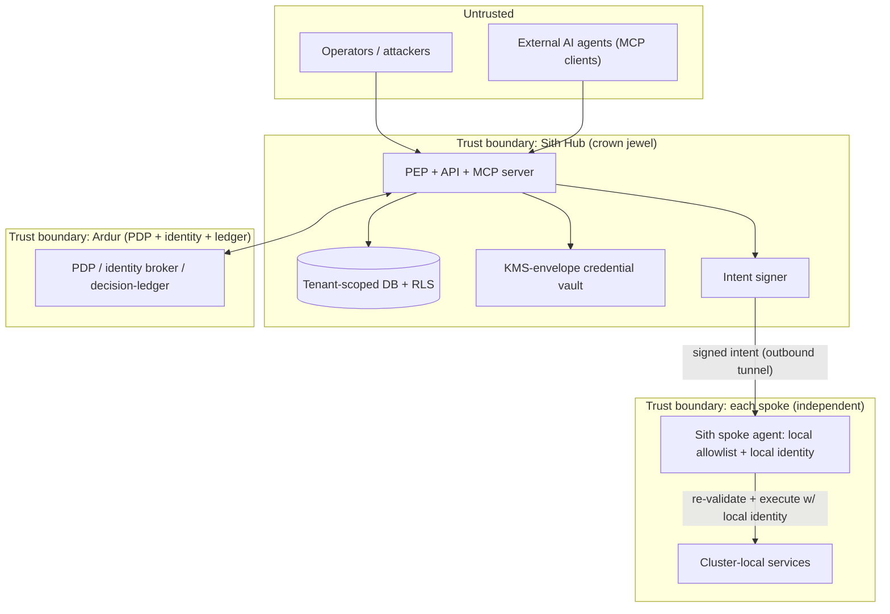

# Sith — Threat Model

**Status:** planning · **Date:** 2026-07-08

Sith's whole value is *acting across a fleet*. That same property makes it the
highest-value target and largest potential blast radius in the estate. This threat model is
therefore not an afterthought — it is a **design input**. Where a control is a design
decision, the ADR is linked and authoritative.

Method: asset + trust-boundary enumeration, attacker scenarios, and controls, with an
explicit section on **anti-patterns to avoid** (drawn, vendor-neutrally, from a prior
control-plane prototype's real failures).

---

## 1. Assets (what an attacker wants)

| Asset | Why it matters | Where it lives |
|---|---|---|
| **The hub's dispatch path** | Whoever controls it can issue intents fleet-wide | Sith control plane (the crown jewel) |
| **Cross-tenant fleet data** | Confidential inventory/health/CVE of many tenants | Fleet model / control-plane DB |
| **Any secret the hub holds** (e.g. Git creds for `gitops.open-pr`) | Direct access to targets | Credential vault (KMS envelope) |
| **Scoped spoke tokens / brokered identities** | Cluster reach/action | OCM MSA store; Ardur identity broker |
| **The audit-log + decision-ledger** | Forensics; tampering hides an attack | Control-plane stores |
| **The signing key for intents** | Forge an intent a spoke will trust | Hub signer (see §5) |

## 2. Trust boundaries

Two properties make the boundaries defensible:
1. **The spoke does not trust the hub blindly.** It independently verifies the intent
   signature *and* re-checks the intent against its **own local allowlist**, executing with
   its **own scoped identity**. Compromising the hub is not automatically "execute anything
   on every spoke".
2. **The hub does not hold deep cluster access.** No cluster-admin kubeconfigs in the
   center; reach is via scoped MSA tokens and per-action brokered identity whose ceiling is
   below the human's.

## 3. Primary attacker scenarios & controls

### S1 — Hub compromise (the crown-jewel scenario)
*Attacker gains code-exec or credential access on the control plane.*
- **Controls:** intents are **signed**; each spoke **independently enforces a local
  allowlist** and uses its **own identity** (defense-in-depth — a forged/blind dispatch is
  re-validated at the spoke and bounded by local RBAC). The write vocabulary is **closed**
  (no `exec`, no arbitrary `apply`), so even full hub control cannot get a shell on a
  spoke. `prod` still requires **multi-approver** and **wave gates** that a single
  compromised component cannot satisfy alone. Audit + decision ledgers are **append-only**.
- **Residual risk:** the signer key is the highest-value secret — protect in KMS/HSM,
  rotate, and consider spoke-side allowlists tight enough that a forged intent's damage is
  bounded to already-permitted verbs/targets.

### S2 — Cross-tenant access (isolation break)
*A member of workspace A tries to see/act on workspace B.*
- **Controls:** authz derives tenant + role from **signed token claims, never request
  headers**; a **DB-level RLS backstop** enforces workspace scoping *independently of
  application code*; `targetSelector` is resolved **only** within the actor's workspace.
  ([ADR-0003](adr/0003-tenancy-isolation.md).)
- **This directly closes the predecessor's header-trust IDOR** (see §7).

### S3 — Malicious / buggy intent from an AI agent
*An agent (own or external via MCP) proposes a dangerous action.*
- **Controls:** the agent is a **client of the same PEP** — no privileged path. Writes
  require **Elicitation approval bound to a hash of the resolved args** (agent cannot
  approve-then-swap). The agent identity ceiling is **strictly below** the human's. The
  agent **never holds a cluster credential**. **Ground-or-abstain**: action proposals must
  cite evidence; low-confidence → no write proposal. ([ADR-0005](adr/0005-ai-mcp-ardur-pdp.md).)

### S4 — Compromised or malicious spoke
*A spoke agent is subverted or a spoke lies in its reports.*
- **Controls:** blast radius is bounded to that spoke's own RBAC (the hub never granted it
  more). False reports degrade *that* cluster's data; **freshness + source stamping** and
  **abstention** prevent one bad spoke from triggering unsafe fleet-wide action. The hub
  authenticates spokes via OCM identity.

### S5 — Fan-out gone wrong (the federation-specific risk)
*One intent hits N clusters; partial failure or stale view causes damage.*
- **Controls:** **wave/canary ordering** with a **gate per wave**; **stop-on-failure +
  auto-rollback**; **idempotency/dedupe** so retries can't double-apply;
  **max-clusters-per-intent** ceiling; **abstention** when the targeted set is
  incomplete/stale ("37/40 visible, 3 stale >10m — refuse"). ([ADR-0004](adr/0004-typed-intent-action-model.md).)

### S6 — Secret / key compromise
*An attacker reads a hub-held secret.*
- **Controls:** **envelope encryption via KMS with per-tenant data keys** — one leak does
  **not** decrypt every tenant. No single process-wide key. Entropy floor + boot check;
  secrets never rendered to logs/git. ([ADR-0006](adr/0006-credential-key-custody.md).)
- **This directly closes the predecessor's single-env-key blast radius** (see §7).

### S7 — MCP write surface abuse
*The MCP server is the shortest path from "prompt" to "fleet action".*
- **Controls:** it is the **most-hardened** surface: server-side enforcement (annotations
  are *hints*, not gates); Elicitation approval on every write; same PEP, same PDP, same
  audit; separate, tighter rate limits for write proposals vs reads; `gitops.open-pr` is
  the only write enabled first.

### S8 — Supply-chain / addon trust
*OCM addons or Sith images are tampered.*
- **Controls:** pin addon versions (cluster-proxy v0.10.0, managed-serviceaccount v0.10.0);
  verify images (signing/SBOM) in later phases; treat the addon surface as a dependency
  with a documented update policy (an ADR gates version bumps).

## 4. Blast-radius controls (summary)

- **Closed verb vocabulary** (hub) **+** **spoke local allowlist** (independent) = two
  bounds on every write.
- **No shell, no free-form apply, no secret/RBAC writes** — ever.
- **`prod` never auto-acts**; multi-approver + per-wave gates for fan-out.
- **Per-action, non-reusable approvals** bound to arg hashes.
- **Scoped, short-lived, below-human identity** for every execution.
- **Per-tenant key custody**; **DB-level tenant backstop**.
- **Abstention** as a first-class, logged outcome.
- **Everything audited** (what-happened) **+ decision-ledgered** (why-allowed).

## 5. On signed intents

- The hub **signs** every dispatched intent; each spoke **verifies** before acting. This is
  the integrity anchor of action federation.
- The signer key lives in KMS/HSM, is rotated, and is the single most sensitive secret in
  the system. Spoke allowlists are the compensating control if it is ever compromised.
- Approvals are separately bound (arg-hash) so a valid signature is *necessary but not
  sufficient* for a gated action.

## 6. On abstention (a safety feature, not a failure)

An operations control plane that *guesses* is more dangerous than one that says "I don't
know." Sith treats **"I won't act"** as a first-class, logged outcome whenever:
- the targeted fleet set is **incomplete or stale**,
- evidence for an AI-proposed action is **insufficient**,
- a required **approval** is missing, or
- an arg fails schema / a verb is unknown.

Abstention is unique to a *federated* world (a single-cluster tool cannot express "3 of my
40 clusters are dark") and is safety-critical here.

## 7. Anti-patterns to avoid (lessons carried in, vendor-neutrally)

A prior control-plane prototype failed multi-tenant security in specific, instructive ways.
Sith is designed to make each failure **structurally impossible**:

| Prior anti-pattern | Consequence there | Sith's structural fix |
|---|---|---|
| **Authz from spoofable request headers** (`x-user-role` / `x-organization-id`) trusted with no re-check | Any authenticated user could read/write another tenant's config (IDOR + priv-esc) | Authz from **signed token claims only**; membership re-verified server-side ([ADR-0003](adr/0003-tenancy-isolation.md)) |
| **Advertised RLS was inert** (dead code; app connected as table owner) | No DB backstop behind app-layer scoping | **Real RLS**: non-owner role, `FORCE ROW LEVEL SECURITY`, per-request scope in a transaction — present from day one |
| **Single env master key** decrypting *every* tenant's secrets | One leak = unbounded, all-tenant compromise | **KMS envelope + per-tenant data keys** ([ADR-0006](adr/0006-credential-key-custody.md)) |
| **Shared, admin-by-default cluster credential** in the center | Confused-deputy; center compromise = cluster-admin everywhere | **No admin kubeconfig in center**; scoped MSA tokens + per-action brokered identity, re-validated locally |
| **Command injection via `sh -lc` string interpolation** | Non-admin → in-cluster RCE | **No shell path exists.** Typed verbs only; args schema-validated; execution is structured, never a shell string |
| **Fail-open "denylist of one"** for destructive tools | A forgotten classification became auto-executable | **Fail-safe allowlist**; CI test asserts every write handler is classified; unknown = refuse |
| **The danger surface was untested** (routes/exec/auth) | High-blast-radius code had ~no coverage | Governance surfaces (PEP, tenant boundary, signing, abstention) are the **primary** test targets |

## 8. Out-of-scope threats (declared)

- Physical security of clusters; the security of the spokes' *own* workloads; the
  correctness of Argo CD/Grafana themselves — Sith federates them, it does not secure their
  internals.
- DoS against a single spoke's local services (bounded to that cluster).
- Full formal verification of policy — Ardur is the policy engine; Sith enforces its
  decisions.

*Every external claim about OCM/MCP/competitors referenced here is verified and cited in
[`../COMPETITIVE.md`](../COMPETITIVE.md) and the ADRs.*
