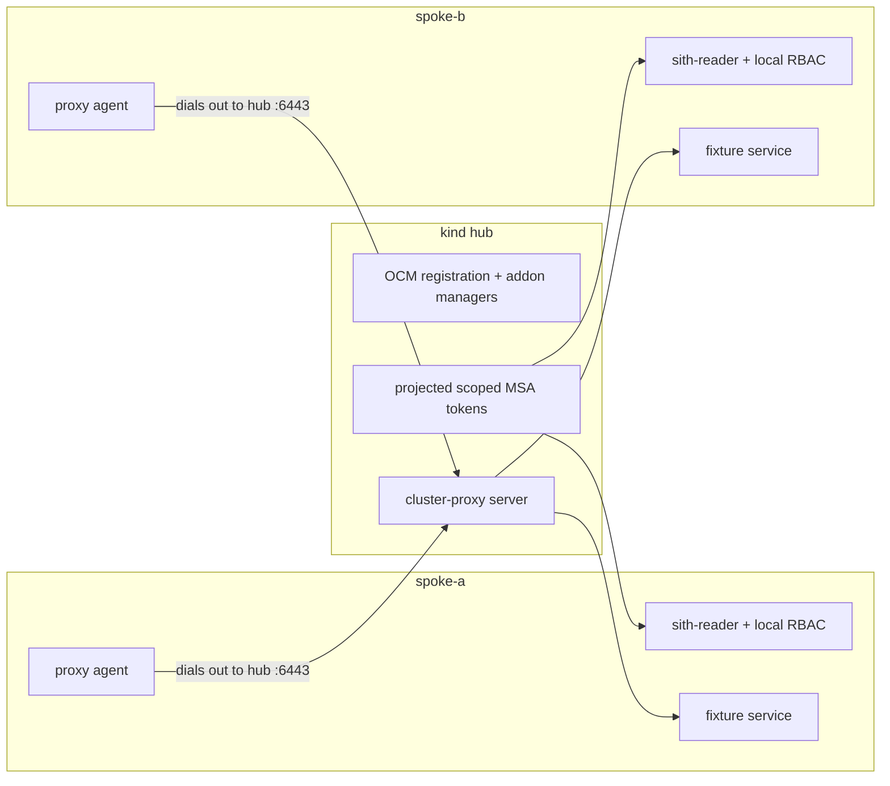

# Milestone-0 — OCM falsification test

**Status:** ✅ **PASS** · **Original run:** 2026-07-08 · **Two-spoke revalidation:**
2026-07-11 · **Issues:** #2, #3, #4, #5, #6

## Verdict

Open Cluster Management (OCM) supplies the transport and scoped identity Sith needs:

- one hub registered **two** managed spokes;
- both spokes established healthy `cluster-proxy` reverse tunnels;
- `managed-serviceaccount` projected a distinct `sith-reader` token for each spoke;
- each projected token reached only its spoke-local fixture and was denied cluster-wide
  `secrets` and `nodes`; and
- each spoke node enforced hub-node and external hub-pod source denies, an active hub → spoke
  API probe failed against a known-live listener while incrementing the exact reject counter,
  and live conntrack original-direction tuples still showed spoke-pod → hub `:6443`
  connections with **zero** hub-node-originated connections into either spoke.

The falsification premise therefore holds. Sith adopts OCM as its connectivity and scoped-
identity substrate and does **not** build a bespoke tunnel or transport agent. The product
work begins above that seam: read federation, governance, and typed-intent action federation.

The hardened automated clean-room run completed in **151 seconds** on a warm kind-node image cache,
well inside the `≤ ~1 day` decision gate.

## Durable proof

- Executable runbook:
  [`hack/experiments/m0-ocm-falsification.sh`](../../hack/experiments/m0-ocm-falsification.sh)
- Redacted terminal capture:
  [`M0-ocm-falsification.cast`](M0-ocm-falsification.cast)
- Decision:
  [`ADR-0001`](../adr/0001-adopt-ocm-vs-bespoke-tunnel.md)

The runner is the evidence contract. It fails unless every positive and negative assertion
passes, rejects unowned/noncanonical scratch paths and nonlocal Docker endpoints, redacts
registration tokens from subprocess output, invalidates the bootstrap ServiceAccount after
both joins, and deletes the disposable lab by default. Retention fails closed: an unproven
bootstrap rotation forces teardown even when keep mode was requested.

## Acceptance evidence

| Filed requirement | Executable assertion | 2026-07-11 result |
|---|---|---|
| #2: hub + two spokes | `spoke-a` and `spoke-b` each have `ManagedClusterConditionAvailable=True` | PASS |
| #3: both pinned addons | `cluster-proxy` and `managed-serviceaccount` are `Available=True` on both spokes | PASS |
| #4: reach each spoke-local service | projected `sith-reader` token returns the fixture identity for each spoke | PASS |
| #4/#3: identity is scoped | the same real tokens receive `Forbidden` for `secrets -A` and `nodes` | PASS |
| #5: outbound-only | each spoke enforces hub-source INPUT/FORWARD denies; an active hub → live spoke API probe fails; each spoke has ≥1 original-direction pod flow to hub `:6443`; hub-originated count is 0 | PASS |
| #6: durable verdict | runner, terminal capture, this runbook, and ADR evidence are committed | PASS |

The observed control-plane state was:

```text
NAME      HUB ACCEPTED   MANAGED CLUSTER URLS                         JOINED   AVAILABLE
spoke-a   true           https://sith-m0-spoke-a-control-plane:6443   True     True
spoke-b   true           https://sith-m0-spoke-b-control-plane:6443   True     True

NAMESPACE   NAME                     AVAILABLE   DEGRADED   PROGRESSING
spoke-a     cluster-proxy            True                   False
spoke-a     managed-serviceaccount   True                   False
spoke-b     cluster-proxy            True                   False
spoke-b     managed-serviceaccount   True                   False
```

The clean-room runner ended with:

```text
[m0] spoke-a: scoped reach PASS; secrets/nodes denied
[m0] spoke-b: scoped reach PASS; secrets/nodes denied
[m0] spoke-a: active hub-to-node probe denied; hub-to-pod FORWARD deny present
[m0] spoke-b: active hub-to-node probe denied; hub-to-pod FORWARD deny present
[m0] spoke-a: outbound flows to hub:6443=6; hub-initiated flows=0
[m0] spoke-b: outbound flows to hub:6443=8; hub-initiated flows=0
[m0] M0_RESULT=PASS topology=hub+2-spokes identity=scoped-msa transport=outbound-only boundary=active-deny
[m0] elapsed_seconds=151
```

Connection counts are expected to vary as controllers reconnect. The invariant is an enforced
deny for new hub-originated node/pod-forwarding traffic, a failed active hub → spoke-node probe,
at least one spoke-originated hub connection, and zero observed hub-originated original-direction
connections.

## Topology tested



The host-side lab harness necessarily owns the disposable clusters' admin contexts so it can
create and tear down the experiment. The **hub access path under test** holds no spoke admin
kubeconfig: its only per-spoke credentials are the projected `sith-reader` token and CA.

## Pinned inputs

| Component | Pin |
|---|---|
| kind | `v0.32.0` |
| kind node | Kubernetes `v1.36.1`, image digest `sha256:3489c767…f7ebd5` |
| clusteradm / OCM core | `v1.3.1-0-g90bdc31` / `1.3.1` |
| cluster-proxy chart | `0.10.0`, SHA-256 `30128f5f…481c75d` |
| managed-serviceaccount chart | `0.10.0`, SHA-256 `ddd8b7da…0b06dbf` |
| Helm | `v4.1.4` |
| Go fixture toolchain | `go1.26.5` |

The addon releases and their publication dates are available from the upstream
[`cluster-proxy` v0.10.0 release](https://github.com/open-cluster-management-io/cluster-proxy/releases/tag/v0.10.0)
and
[`managed-serviceaccount` v0.10.0 release](https://github.com/open-cluster-management-io/managed-serviceaccount/releases/tag/v0.10.0).
The OCM registration procedure follows the official
[`clusteradm` registration guidance](https://open-cluster-management.io/docs/getting-started/installation/register-a-cluster/),
including `--force-internal-endpoint-lookup` for local kind clusters.

## Reproduce

The default scratch root is a private canonical `${TMPDIR:-/tmp}/sith-m0-<uid>/lab`; the runner
creates its parent with mode `0700`. Another non-EXTENDED path requires the operator to set
`SITH_M0_ALLOW_NON_EXTENDED=1` deliberately. The path must be canonical, must not already exist
for a fresh run, and is deleted only when its regular ownership marker belongs to the current
user. The runner verifies the entered parent's device/inode against the validated path, enters it
once, and uses relative child paths from that held working directory, so racing or later renaming a
writable ancestor cannot redirect creation or cleanup.
It uses a dedicated kubeconfig and isolated Helm state, requires a local Unix-socket Docker
endpoint, gives the image builder only a fixture-only context, and never reads or modifies the
user's kubeconfig.

```bash
# This machine keeps the project-pinned kind binary outside PATH.
KIND_BIN=/Volumes/EXTENDED/MacData/tools/bin/kind \
  hack/experiments/m0-ocm-falsification.sh run
```

The default run cleans up all three clusters and removes the isolated kubeconfig on exit. To
retain a passing lab for inspection and replay the assertions:

```bash
KIND_BIN=/Volumes/EXTENDED/MacData/tools/bin/kind \
SITH_M0_KEEP_CLUSTERS=1 \
  hack/experiments/m0-ocm-falsification.sh run

KIND_BIN=/Volumes/EXTENDED/MacData/tools/bin/kind \
  hack/experiments/m0-ocm-falsification.sh verify

KIND_BIN=/Volumes/EXTENDED/MacData/tools/bin/kind \
  hack/experiments/m0-ocm-falsification.sh cleanup
```

Replay the committed terminal capture locally:

```bash
asciinema play docs/experiments/M0-ocm-falsification.cast
```

### Direct ClusterProxy adapter gate

The Phase-1 direct adapter is tested by the following target. It creates the same pinned M0 lab,
retains it only long enough for the direct Go test, and always invokes the owned-scratch cleanup
path on exit:

```bash
KIND=/Volumes/EXTENDED/MacData/tools/bin/kind \
  make e2e-ocm
```

The test uses a loopback-only temporary port-forward to the hub's `proxy-entrypoint` only because
it runs from the developer host. It loads the hub proxy CA/client certificate fixture only to model
the read-only deployment mount; its actual per-spoke path reads the exact `sith-reader` projection
through the narrow `get` reader. It requires direct TLS-verified snapshots from both spokes, an
MSA-token `Forbidden` for a cluster-wide Secrets list, and a replacement projection with a changed
token before a subsequent snapshot. No token, CA, response body, or port-forward output is printed.

To support that product read boundary, each M0 `sith-reader` gets cluster-wide `list` on Pods,
Deployments, and Rollouts plus namespaced `get/list` on Pods, Services, and `services/proxy` in
`sith-demo`. Those are the complete combined grants; there is still no grant for Secrets, Nodes,
writes, watches, or hub API access.

## What the runner proves

### Registration and addon health

The script creates one hub and two spokes from the same digest-pinned kind image, initializes
OCM on the hub, starts both joins without the CLI's long-running `--wait`, clears the ephemeral
bootstrap value after those commands return, accepts both spokes, and immediately rotates the
bootstrap ServiceAccount UID before waiting for availability. This minimizes the unavoidable
argv exposure imposed by `clusteradm` 1.3.1 and makes a captured registration token invalid
before the reach tests begin.

It downloads both 0.10.0 charts into isolated scratch, verifies their exact archive hashes,
installs them, and waits for all four `ManagedClusterAddOn` conditions.

### Scoped reach and negative controls

The existing deterministic Sith e2e fixture is built as a scratch container and loaded into
both spoke nodes. Each instance returns its own cluster identity. A `ManagedServiceAccount`
named `sith-reader` is projected for each spoke and bound only to `get/list` on `pods`,
`services`, and `services/proxy` in `sith-demo`.

The runner uses `clusteradm proxy kubectl --sa=sith-reader` to reach both services. It then
uses the **same projected token path** for `get secrets -A` and `get nodes`, requiring an
RBAC `Forbidden` response that names the expected ServiceAccount identity.

### Outbound-only directionality and active denial

Before OCM initialization, each spoke node receives INPUT and FORWARD rules that reject new
connections from the hub node while allowing replies to spoke-originated connections. During
verification, the runner requires both rules to remain installed and actively attempts a hub →
spoke kube-apiserver connection after first proving the same listener is live from its own node.
The hub probe must fail.

For each spoke node, the runner also parses `/proc/net/nf_conntrack` and considers only the first
tuple—the connection's original direction. It requires:

- at least one `10.244.x.y → hub:6443` connection; and
- zero original-direction connections from the hub node IP into either the spoke node or pod CIDR.

This is more precise than grepping the full conntrack line, because the second tuple is the
reply direction and naturally contains the hub as a source. The active probe and explicit rules
close the earlier evidence gap where an idle-but-reachable inbound path could have passed a
purely passive sample.

## Upstream caveats retained in the decision

1. **CRD/schema skew in `cluster-proxy` 0.10.0.** The chart emits
   `spec.proxyAgent.additionalValues.enableImpersonation`, but its bundled
   `ManagedProxyConfiguration` CRD does not declare `additionalValues`. The runner applies
   the bundled CRDs, adds `x-kubernetes-preserve-unknown-fields` at `proxyAgent`, and installs
   the pinned chart with `--skip-crds`.
2. **Same-namespace Helm ownership collision.** Both 0.10.0 charts render
   `ManagedClusterSetBinding/global`. Installing both releases into
   `open-cluster-management-addon` makes the second release fail ownership validation. The
   runner keeps `cluster-proxy` in that CLI-expected namespace and installs
   `managed-serviceaccount` in `open-cluster-management-managed-serviceaccount`, giving each
   release independent lifecycle ownership.
3. **`clusteradm` masks inner kubectl failures.** In clusteradm 1.3.1,
   `proxy kubectl` prints an RBAC `Forbidden` error but returns status 0. The runner therefore
   matches the denial text and authenticated identity; it never treats wrapper status alone
   as proof.
4. **Local topology is not a physical VPC boundary.** The kind nodes share one Docker network.
   The harness adds and verifies spoke-node firewall rules, actively denies hub → spoke-node
   reach, and proves reverse-tunnel reach remains healthy. Single-node kind clusters reuse the
   same pod CIDR, so a hub-side direct pod-IP probe would address a colliding hub-local pod; the
   FORWARD rule for hub-node and externally arriving pod-CIDR sources is asserted, but that
   ambiguous direct pod probe is intentionally not claimed. The `hub-initiated flows=0`
   conntrack counter keys on the hub node IP; it does not pretend to classify colliding pod
   addresses. A later preproduction environment must repeat the test with non-overlapping pod
   CIDRs and real firewall/VPC controls.

These are real operational costs, not reasons to reverse the falsification verdict. They are
documented inputs to the addon upgrade policy and hub packaging work rather than hidden behind
a blanket “PASS”.

## Conclusion

The current, executable evidence satisfies every filed M0 criterion on the required hub-plus-
two-spoke topology. OCM provides the outbound-only transport and scoped identity substrate;
Sith should spend its engineering budget on the differentiated federation and governance layer.
