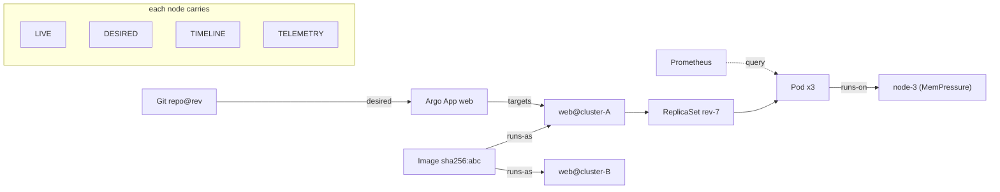

# Spec — Read Federation, the Investigation Brain, and the Integration Waves

**Status:** design / spec (ready to slice) · **Date:** 2026-07-10
**Author role:** Architect C (design/spec only — no product Go code; a builder session implements)
**Epic:** E2 — Read federation ([#20](https://github.com/ArdurAI/sith/issues/20)) · introduces a proposed
new epic **E14 — Investigation Brain** (see §3.7)
**Branch:** `docs/e2-readfed-brain-integrations` off `dev` · **PR target:** `dev` (do **not** merge)

**Prereqs to read:** [`../SITH-NOTION.md`](../SITH-NOTION.md) (E2, E11, E12, and the roadmap
sections), [`../research/USE-CASE-AND-SHAPE.md`](../research/USE-CASE-AND-SHAPE.md) (the two-wedge
thesis; the connector taxonomy), [`../ARCHITECTURE.md`](../ARCHITECTURE.md) (source-abstract fleet
model; three run-modes).

**Sits above / beside:**
- **Above** `specs/SLICE-0-foundation.md` — reuses its `fleet.Source`, `FleetResult`, `Cluster`,
  `Coverage` types as the load-bearing seam. (That spec and `CONVENTIONS.md` / `BUILD-SEQUENCE.md`
  land on `dev` via the parallel lead session's build-plan PR; the cross-references below resolve
  once both PRs are on `dev`.)
- **Beside** the **7-verb connector contract** (`discover / read / query / diff / plan / execute /
  verify`) that a parallel **Architect A** session specs. This document treats that contract as the
  connector seam and *consumes* it; it does **not** redefine it. Where a verb signature is named
  here it is a reference to A's seam, and A's spec is authoritative on the wire shape.

> **Design/spec only.** Every Go snippet below is a **reference shape (design contract)** — types,
> enums, and interface signatures that pin the seam — not implementation. The builder writes idiomatic
> bodies and tests. No function bodies, no product logic here.

---

## 0. TL;DR — the model in five sentences

1. The normalized fleet model (E2) grows from a flat list of facts into a **four-lens operational
   graph**: every entity carries **live** (what is running), **desired** (what should run),
   **timeline** (what changed, when), and **telemetry** (how it behaves), correlated by
   **OTel-style identity keys** into one graph spanning the whole fleet.
2. Single-cluster tools (k9s / Lens) show **one lens on one cluster**; Sith's differentiator is
   **four lenses correlated across the fleet** — which is the substrate root-cause needs.
3. The **Investigation Brain** is a **rule-based, transparent** reasoner over that graph:
   `symptom → scope → evidence → hypotheses → validation → plan`, for the failures GR actually hits
   (bad deploy, OOMKill, CrashLoopBackOff, config drift, cert expiry, node pressure).
4. The brain **proposes, never executes**: in the **local wedge** its plan is *advisory* (a suggested
   command); in the **hub** the same plan becomes a *governed typed intent* through the PEP (E4/E5) —
   one brain, two modes, mirroring "one engine, two modes."
5. Integrations arrive in **four waves**; each connector is scored by **which of the 7 verbs it
   implements, which lenses it feeds, and an effort tier** — and every brain rule declares the
   connectors/lenses it needs, so missing coverage yields honest **abstention** (F2.5), never a
   false-confident answer.

---

## 1. Where this fits

```
             ┌───────────────────────────────────────────────────────────┐
             │  Investigation Brain (E14, proposed)  — reasons, proposes   │
             │  symptom → scope → evidence → hypotheses → validation → plan │
             └───────────────▲───────────────────────────┬────────────────┘
                             │ reads graph               │ emits plan
                             │                            ▼
             ┌───────────────┴───────────────┐   advisory (local) │ governed intent (hub, E4/E5)
             │  Four-lens Operational Graph   │
             │  (E2 extended: live/desired/   │
             │   timeline/telemetry + keys)   │
             └───────────────▲───────────────┘
                             │ facts (read/query/diff)
             ┌───────────────┴───────────────┐
             │  Connectors — 7-verb contract  │  ← Architect A's seam
             │  (Kubernetes, Argo, Prom, …)   │     waves W1–W4 (§4)
             └───────────────▲───────────────┘
                             │ Source.Fleet(ctx)
             ┌───────────────┴───────────────┐
             │  fleet.Source seam (Slice 0)   │  local-kubeconfig | ocm-spoke
             └────────────────────────────────┘
```

This spec is the **read/reasoning altitude** above Slice-0's foundation and above the connector
verbs. It changes nothing about the write path (E4/E5) except to define the **hand-off point**: the
brain's `plan` output is exactly a typed-intent proposal the existing PEP already knows how to gate.

---

## 2. The model — normalized fleet → four-lens operational graph

### 2.1 The four evidence lenses

A "lens" is a way of looking at the same entity. The four are orthogonal and, together, complete
enough to explain the failure modes in §3. Each lens maps to existing fleet-fact kinds plus a small
extension, and to specific connector verbs (§2.5).

| Lens | Question it answers | Canonical sources | Fleet-fact kind | Retention |
|---|---|---|---|---|
| **LIVE** | *What is running right now?* | K8s API objects + status/conditions, Node conditions, Rollout/Argo live state | `inventory`, `health` | cached current snapshot |
| **DESIRED** | *What is supposed to be running?* | Git manifests, Argo `Application.spec` target, Helm release values, Kustomize render | `desired` (new), `drift` (= live⊖desired) | cached current snapshot |
| **TIMELINE** | *What changed, and when?* | K8s Events, ReplicaSet/Rollout history, Argo sync history, Git commits/PR merges, HPA/autoscaler events, cordon/drain | `change` (new) | **bounded ring** of recent discrete change records |
| **TELEMETRY** | *How is it behaving?* | Prometheus/PromQL, Loki/ES/OpenSearch/Splunk logs, OTel traces, Alertmanager, cert-expiry metrics | `alert` + small derived signals; series stay at source | **query-through** — pulled on demand, not retained |

**The retention guardrail is load-bearing (SITH-NOTION F2.2).** Sith is *not* a telemetry lake. So:

- LIVE and DESIRED are bounded **current-state caches** (as today).
- TIMELINE is a **bounded ring of discrete change events** (deploys, syncs, scales, rollouts, drains)
  — low-cardinality, event-shaped, aged out — **not** a metric time series.
- TELEMETRY is predominantly **query-through**: the brain queries Prometheus/Loki/etc. *at
  investigation time* via the connector `query` verb and retains only the **derived answer** it needs
  (e.g. "OOMKilled ×7 in 15m", "p99 rose at 14:03", current alert state). No raw series is stored. A
  query-through call may be a **range** query against the *backend's own* retention (that is how R1/R2
  compare before-vs-after a change) — the history lives in Prometheus/Loki, Sith keeps only the
  computed verdict.

This is the single design decision that lets Sith add a telemetry lens **without** becoming the
telemetry store §SCOPE forbids.

### 2.2 The operational graph

The graph is the join of the four lenses over a shared entity model.

- **Nodes** are entities: `Cluster · Namespace · Workload (Deployment/StatefulSet/DaemonSet/Rollout)
  · ReplicaSet/Revision · Pod · Container · Node · Image · Service · Ingress · Certificate · PVC ·
  Application (Argo) · HelmRelease · MeshService`.
- **Edges** are relationships: `runs-on (pod→node) · owned-by (pod→rs→workload) · targets
  (Application→workload) · renders-to (HelmRelease/Kustomize→objects) · exposes (Service/Ingress→
  workload) · mounts (pod→PVC) · secured-by (Ingress/MeshService→Certificate) · depends-on
  (workload→workload, from mesh/traces) · scheduled-on / deployed-by`.
- Every node carries a **per-lens fact bundle** (some lenses may be empty → coverage gap, §2.6).

The graph is **fleet-wide**: the same `Image` node can be referenced by workloads in five clusters,
which is exactly how the brain says "this OOMKill is the *same image* on 4 clusters" — a correlation
a single-cluster tool structurally cannot make.



### 2.3 Correlation keys — the join (OTel-style)

Correlation is the hard part: a Prometheus series, a Deployment object, an Argo Application, and a
deploy event must resolve to the **same** logical entity. Sith standardizes on an **`EntityRef`**
built from **OpenTelemetry Kubernetes semantic-convention** attributes, so every connector emits
facts keyed the same way and the graph joins without heuristics.

| Identity dimension | Key attributes (OTel semconv) | Emitted by |
|---|---|---|
| Cluster | `k8s.cluster.name` (+ Sith `source_kind`, `source_cluster`) | every connector |
| Namespace | `k8s.namespace.name` | K8s, Argo, mesh |
| Workload | `k8s.{deployment,statefulset,daemonset}.name` + `k8s.pod.name` | K8s, Prom, logs, mesh |
| Node | `k8s.node.name` | K8s, Prom, cloud |
| Image | `container.image.name` + stable **`container.image.repo_digests`** (normalize exactly one `sha256:…` value) | K8s, registry, Docker |
| Service (telemetry) | `service.name`, `service.namespace` | OTel traces, mesh, Prom |
| Desired unit | Argo `Application` name / Git `repo@path@revision` | Argo, GitHub, Helm |

Two rules make correlation safe — mis-attribution is worse than a gap, because it would let the
brain blame the wrong entity:

1. **A fact without a resolvable `EntityRef` is dropped to an "unattached" bucket, never
   mis-joined.**
2. **Joins are cluster+namespace-scoped by default.** User-controlled keys (`service.name`,
   workload names) collide across teams and clusters — two namespaces can both run a `service.name =
   api`. So every join is qualified by `k8s.cluster.name` (+ `k8s.namespace.name`) *first*; a bare
   name never joins across that boundary. The **only** genuinely global key is an immutable
   `sha256:…` digest normalized from stable **`container.image.repo_digests`** — it is safe to join
   fleet-wide, and it is exactly the
   key behind "the same image on 4 clusters." Any other cross-cluster correlation must be an explicit,
   named query (e.g. "same Argo `Application` name across clusters"), never an implicit key collision.
   A Kubernetes runtime `imageID` is display-only unless it already contains one exact
   `repository@sha256:…` reference after a recognized runtime prefix; Sith never pairs a bare runtime
   digest with a mutable Pod-spec image to manufacture a join.

### 2.4 Reference shapes (design contracts)

These extend Slice-0's `fleet` package. **Reference only** — the builder implements bodies/tests.

```go
// package fleet — extends SLICE-0-foundation §3.4.

// Lens is the evidence dimension a fact belongs to.
type Lens string
const (
    LensLive      Lens = "live"
    LensDesired   Lens = "desired"
    LensTimeline  Lens = "timeline"
    LensTelemetry Lens = "telemetry"
)

// FactKind stays the taxonomy from F2.1, widened for the four lenses.
// inventory|health  -> live ;  desired|drift -> desired ;
// change            -> timeline ;  alert (+derived) -> telemetry ;  cve -> telemetry/live.
type FactKind string

// EntityRef is the OTel-semconv correlation key. Zero fields that don't apply.
type EntityRef struct {
    Cluster   string `json:"k8s.cluster.name"`
    Namespace string `json:"k8s.namespace.name,omitempty"`
    Kind      string `json:"kind,omitempty"`          // Deployment, Node, Certificate, ...
    Name      string `json:"name,omitempty"`
    Pod       string `json:"k8s.pod.name,omitempty"`
    Node      string `json:"k8s.node.name,omitempty"`
    // ImageDigest is normalized from stable container.image.repo_digests; mutable tags never join.
    ImageDigest string `json:"image_digest,omitempty"` // sha256:...
    Service   string `json:"service.name,omitempty"`
    App       string `json:"argocd.application,omitempty"`
}

// Fact is one observation on one lens about one entity — freshness/source stamped (F2.2).
type Fact struct {
    Ref        EntityRef      `json:"ref"`
    Lens       Lens           `json:"lens"`
    Kind       FactKind       `json:"kind"`
    Payload    map[string]any `json:"payload"`      // normalized per kind
    ObservedAt time.Time      `json:"observed_at"`
    SourceKind string         `json:"source_kind"`  // Source.Kind() that produced it
}

// Graph is the correlated view the brain reads. It never widens Coverage's contract:
// a lens with no fact for an entity is an explicit gap, surfaced (F2.5), never silent.
type Graph interface {
    Node(ref EntityRef) (Node, bool)
    Neighbors(ref EntityRef, edge EdgeKind) []Node
    // Lens returns facts for one lens; ok=false means "not covered" (abstention input).
    Lens(ref EntityRef, l Lens) (facts []Fact, ok bool)
    Coverage() Coverage // reuses SLICE-0 Coverage, per-lens extended
}
```

### 2.5 Lenses ↔ the 7 connector verbs

The four-lens graph is populated and interrogated through **Architect A's 7-verb contract**. The
mapping is exact and is the contract boundary between this spec and A's:

| Verb | Purpose | Feeds / uses | Read side or action side |
|---|---|---|---|
| `discover` | enumerate the entities a connector knows | **graph nodes** (all lenses) | read |
| `read` | pull current facts | **LIVE**, **DESIRED** snapshots (cached) | read |
| `query` | on-demand parametric query | **TELEMETRY** (metrics/logs/traces, *not retained*) | read |
| `diff` | live vs desired delta | **DESIRED**/drift lens | read |
| `plan` | propose a change (dry-run/preview) | brain's **plan** output; PEP preview | action (E4/E5) |
| `execute` | apply a change | governed dispatch only | action (E4/E5) |
| `verify` | confirm post-change health | feeds **LIVE/TELEMETRY** back; closes the loop | action (E4/E5) |

**The brain consumes `discover/read/query/diff`** (the four read verbs) and **emits a `plan`**. It
never calls `execute`. `plan/execute/verify` remain wholly owned by the PEP (E4/E5). This keeps the
"boundaries not instructions" invariant: the reasoner cannot act, only propose.

### 2.6 Coverage, freshness, abstention (reuse F2.5, do not reinvent)

Every lens inherits F2.2 freshness stamping and F2.5 staleness → abstention. The extension: coverage
is now **per-lens per-entity**. A brain verdict declares the lenses it required; if a required lens is
stale or absent, the verdict is **downgraded to abstention** with an honest message
("cannot confirm *bad deploy* — timeline lens unavailable for cluster-B"). This is the trust
differentiator over autonomy-first "AI SRE" tools: Sith would rather say *I don't know* than guess.

---

## 3. The Investigation Brain (proposed epic E14)

### 3.1 What it is, and the stances that define it

The Brain is a **deterministic, rule-based** reasoner over the four-lens graph that turns a symptom
into a **ranked, evidence-cited set of root-cause hypotheses and a suggested remediation plan**. It is
Sith's differentiator: it is what makes Sith *more than a fleet viewer*.

Four stances, each a hard requirement:

1. **Rule-based and transparent, not a black box.** Every hypothesis names the exact signals that
   raised it and the evidence that validated it. A reviewer can read *why*. (Contrast HolmesGPT /
   Komodor "Liz" LLM-diagnosis — see USE-CASE §1.)
2. **Proposes, never executes.** Output is a *plan*, gated downstream. No autonomy. (The Replit
   database-deletion lesson, USE-CASE §6.)
3. **Reads the graph; adds no data source.** The Brain is a reasoning layer; all evidence comes
   through the same connector verbs and the same freshness/coverage rules.
4. **Honest about coverage.** Missing lens ⇒ abstain on the dependent hypothesis (§2.6), never a
   false-confident verdict.

### 3.2 The pipeline

```
symptom ─▶ scope ─▶ evidence ─▶ hypotheses ─▶ validation ─▶ plan
   │         │          │            │             │           │
 trigger   walk the   gather 4-lens  run the      confirm/    typed-intent
 (alert/   graph from evidence for   rule catalog refute each  proposal
 degraded/ the symptom the scoped    (§3.4) →      hypothesis   (advisory local /
 question) node        entities      candidates    w/ targeted  governed hub)
                       (read/query/  ranked by     query/diff
                        diff)        weight
```

| Stage | Input | Action | Output |
|---|---|---|---|
| **Symptom** | alert / Degraded workload / user question | normalize to `{EntityRef, observed-bad-condition, onset_t}` | `Symptom` |
| **Scope** | `Symptom` | walk graph edges (owned-by, runs-on, targets, depends-on, same-image) to bound the implicated set; detect fleet-wide correlation (same image/config across clusters) | `ScopeSet` (+ `is_correlated`) |
| **Evidence** | `ScopeSet` | pull the four lenses for each entity via `read/query/diff`; stamp freshness; record gaps | `EvidenceBundle` |
| **Hypotheses** | `EvidenceBundle` | evaluate every catalog rule; each matched rule emits a candidate with weight + cited signals | `[]Hypothesis` (ranked) |
| **Validation** | `[]Hypothesis` | for each, gather targeted confirming/refuting evidence; promote/demote; apply coverage gate | `[]Hypothesis` (scored, abstentions marked) |
| **Plan** | top hypothesis | map root cause → suggested remediation as a **typed-intent proposal**; advisory in local, governed in hub | `Plan` |

### 3.3 Rule schema (reference shape)

```go
// package brain — reference shape only.

type RuleID string

type Signal struct {
    Lens   fleet.Lens // which lens this evidence lives on
    Match  string     // human-readable predicate, e.g. "container.lastState.reason==OOMKilled"
    Weight int        // contribution to confidence (+ raises, − refutes)
}

type Rule struct {
    ID          RuleID
    FailureMode string
    Symptom     string          // the observed-bad condition that makes this rule a candidate
    Signals     []Signal        // evidence patterns (positive and negative)
    NeedsLenses []fleet.Lens    // coverage gate — absent ⇒ abstain (§2.6)
    NeedsVerbs  []string        // connector verbs required to evaluate (discover/read/query/diff)
    RootCause   string          // the hypothesis statement, templated with entity refs
    Plan        PlanTemplate    // suggested typed intent(s); advisory-rendered in local mode
    CauseOf     []RuleID        // this rule can be the underlying cause of these proximate rules (§3.5)
}

// PlanTemplate names typed intents from the closed vocabulary (ADR-0004). It is a *proposal*.
type PlanTemplate struct {
    Intents  []string // e.g. "rollout.undo", "argocd.rollback", "gitops.open-pr", "deployment.scale"
    Advisory string   // local-mode human command, e.g. "kubectl rollout undo deploy/web -n prod"
    Sensitive bool    // node/cert/drain actions → always human-approved, never auto-planned
}
```

### 3.4 The hypothesis-rule catalog

The canonical six — the failures GR actually hits. Each is one row expanded. **Signals** are grouped
by lens; **Evidence needed** names the verbs/lenses; **Plan** is a proposal (advisory local / governed
hub). Weights are indicative, to be tuned against real incidents.

---

#### R1 — Bad deploy (regression from a recent change)

- **Symptom.** Workload Degraded / new pods failing readiness or crashing **shortly after** a change.
- **Signals.**
  - *TIMELINE (+3):* a deploy / Argo sync / image-tag change for this workload within ~N min before
    `onset_t`.
  - *LIVE (+2):* the **new** ReplicaSet/revision is the unhealthy one; the prior revision was healthy.
  - *DESIRED (+1):* desired image/tag/manifest changed (Git commit / Argo target advanced).
  - *TELEMETRY (+2):* error rate / crash count rose at/after the change timestamp.
  - *Refuters (−):* no change in the window; the old revision was already unhealthy; a fleet-wide
    infra event coincides (→ R6/node, not deploy).
- **Evidence needed.** rollout history (`read`/LIVE), Argo sync history + Git log (`query`/TIMELINE +
  DESIRED), new-RS pod status (`read`/LIVE), error metric before/after (`query`/TELEMETRY).
- **Likely root cause.** The recent change introduced a regression.
- **Suggested plan.** `rollout.undo` **or** `argocd.rollback` to the last-healthy revision. *Local
  advisory:* `kubectl rollout undo deploy/<w> -n <ns>`.
- **Coverage gate.** TIMELINE + LIVE mandatory; TELEMETRY strengthens.

#### R2 — OOMKilled (memory limit / leak / spike)

- **Symptom.** Container `lastState.terminated.reason == OOMKilled`; restart count climbing.
- **Signals.**
  - *LIVE (+3):* `OOMKilled` termination reason; restarts increasing.
  - *TELEMETRY (+2):* `container_memory_working_set_bytes` at/near `limits.memory`.
  - *TIMELINE (+1):* a recent deploy raised baseline usage, or a limit was lowered — or **none**
    (steady leak).
  - *DESIRED (context):* the `limits.memory` value in the manifest.
  - *Refuters (−):* memory well **below** limit ⇒ node-level OOM/eviction (→ R6), not this rule.
- **Evidence needed.** pod `lastState` (`read`/LIVE), memory-vs-limit series (`query`/TELEMETRY),
  limit history + correlated deploy (`query`/TIMELINE, `read`/DESIRED).
- **Likely root cause (disambiguated by telemetry shape).** (a) limit too low for real usage; (b)
  **leak** — usage monotonically rises to the limit; (c) **load spike** — usage tracks request rate;
  (d) a deploy raised baseline.
- **Suggested plan.** (a/d) bump `limits.memory` via **`gitops.open-pr`** (a *desired-state* change →
  PR, **never** a live patch) and/or `deployment.scale` for headroom; (b) flag owner (code fix) +
  `rollout.restart` as mitigation; (c) `deployment.scale` / HPA review. *Local advisory:* the same as
  a suggested PR diff or `kubectl scale`.
- **Coverage gate.** LIVE confirms the kill; TELEMETRY distinguishes the variant (abstain on the
  variant if telemetry absent — still report the OOMKill).

#### R3 — CrashLoopBackOff

- **Symptom.** Container waiting reason `CrashLoopBackOff`; ready=false; restarts climbing.
- **Signals.**
  - *LIVE (+3):* `CrashLoopBackOff`; container exit code; restart count.
  - *TELEMETRY/logs (+3):* last container logs — panic/stack trace, missing config/env, failed
    dependency connection, migration failure.
  - *DESIRED (+1):* recent config/secret/env change in desired state.
  - *TIMELINE (+2):* config change / secret rotation / dependency deploy just before onset.
  - *GRAPH (+2):* a `depends-on` neighbour (DB, upstream) is itself unhealthy (→ variant c).
  - *Refuters (−):* exit 0 / Completed (Job, not a crash); `ImagePullBackOff` (→ registry/image rule,
    §3.5 adjacency).
- **Evidence needed.** waiting reason + exit code (`read`/LIVE), container logs (`query`/TELEMETRY),
  config/secret `diff` (DESIRED), dependency health via graph edge (`read`/LIVE + `query`/TELEMETRY).
- **Likely root cause (variants).** (a) app bug from a bad deploy (**cause-of → R1**); (b)
  missing/rotated config or secret; (c) failing dependency; (d) mis-set liveness probe killing a
  healthy app; (e) bad image/command.
- **Suggested plan.** (a) rollback via R1; (b) fix config via `gitops.open-pr`; (c) **no fleet
  action** — point at the failing dependency node; (d) probe fix via `gitops.open-pr`. *Local
  advisory* accordingly.
- **Coverage gate.** LIVE + logs(TELEMETRY) are the crux; DESIRED/TIMELINE disambiguate.

**Implemented Elasticsearch graph seam (#280).** The bounded `search/ecs-v1` projector described
in #214 can feed this existing signal without exposing raw logs to the brain. `FromGraphFacts`
accepts only an attached Pod TELEMETRY `FactDerived` whose source kind and provenance adapter are
both `elasticsearch`, protocol is exact, source/scope/namespace agree, and the SHA-256
native/resource identity recomputes from the retained workspace, Pod, aggregate, and collection
fields. The payload contains only `key`, `value`, `count`,
`first_event_at`, `last_event_at`, and optional `container`. The key must be `logs.cause`; the value
must be `panic`, `missing-config`, or `dependency-failure`; source projector count, time-window,
clock-skew, and optional-container bounds are revalidated. Only the Pod identity, cause, last event
time, source, and stale flag survive as an observation. Count and container metadata are discarded.
Caller-declared coverage is copied exactly and never inferred from fact presence. Different Pods
remain different evaluator entities, so log evidence for one Pod cannot strengthen another Pod's
CrashLoop. This is an in-memory graph bridge, not an Elasticsearch reader or freshness claim.

#### R4 — Config drift (live diverged from desired)

- **Symptom.** Live ≠ desired for a workload/Application (Argo `OutOfSync`, or `diff` verb shows a
  delta).
- **Signals.**
  - *DESIRED/DIFF (+3):* non-empty `diff` between rendered desired and live; Argo `syncStatus =
    OutOfSync`.
  - *TIMELINE (+2):* an out-of-band `kubectl edit/scale/patch` event with no matching Git commit
    (the drift source); **or** desired advanced but sync disabled/failing.
  - *LIVE (context):* the diverging field values.
  - *Refuters (−):* diff only in controller-managed/defaulted/status fields ⇒ benign; namespace
    excluded from GitOps.
- **Evidence needed.** `diff` verb (DESIRED), Argo sync status + history (`read`/LIVE + `query`/
  TIMELINE), change events (`query`/TIMELINE).
- **Likely root cause (variants).** (a) out-of-band manual mutation; (b) desired advanced but sync is
  disabled/failing; (c) a mutating webhook/controller rewrites the field (expected drift).
- **Suggested plan.** (a) `argocd.sync` to reconcile **or** `gitops.open-pr` to capture the live
  change into Git if it is the intended one — **abstain** if which state is "true" is ambiguous, and
  say so; (b) enable/fix sync then `argocd.sync`; (c) annotate as expected. **Never silently
  overwrite.**
- **Coverage gate.** DESIRED + LIVE mandatory (this rule *is* the live-vs-desired join); TIMELINE
  attributes the cause.

#### R5 — Certificate expiry (imminent or expired)

- **Symptom.** A TLS cert at/near expiry (ingress, webhook, serving, mTLS), or TLS handshake failures.
- **Signals.**
  - *LIVE (+3):* cert-manager `Certificate.status.notAfter` within threshold, or not-Ready /
    renewal failing; Secret `tls.crt` notAfter near now.
  - *TELEMETRY (+2):* `certmanager_certificate_expiration_timestamp_seconds` near now; TLS handshake
    errors in logs/metrics; probe failures.
  - *TIMELINE (+1):* last renewal event; ACME/issuer order failures.
  - *DESIRED (context):* issuer config, `Certificate` spec.
  - *Refuters (−):* long validity remaining; TLS errors are SNI/hostname mismatch, not expiry.
- **Evidence needed.** `Certificate`/Secret notAfter (`read`/LIVE), expiration metric (`query`/
  TELEMETRY), renewal/order events (`query`/TIMELINE), issuer health (`read`/LIVE).
- **Likely root cause (variants).** (a) renewal pipeline broken (ACME/DNS/issuer) and cert expiring;
  (b) manual cert never automated; (c) clock/issuer misconfig.
- **Suggested plan.** Mostly **advisory / escalation** (sensitive): trigger renewal (e.g. reissue via
  cert-manager) or fix issuer config via `gitops.open-pr` — human-approved. High value because it is
  **predictable and fleet-wide**: "certs expiring < 7d on N clusters" surfaced *before* the outage.
- **Coverage gate.** LIVE (Certificate/Secret) suffices to **detect**; TELEMETRY confirms impact.

#### R6 — Node pressure (resource exhaustion / eviction / not-ready)

- **Symptom.** Pods Pending (unschedulable) or Evicted; Node `MemoryPressure` / `DiskPressure` /
  `PIDPressure` / `NotReady`.
- **Signals.**
  - *LIVE (+3):* Node conditions True; pod `Evicted`; `FailedScheduling` (Insufficient cpu/memory).
  - *TELEMETRY (+2):* node allocatable vs requested; `node_memory_MemAvailable`; disk usage.
  - *TIMELINE (+2):* a large deploy/scale-up overcommitted the node; cordon/drain; autoscaler events
    (or their **absence** — cluster-autoscaler stuck).
  - *GRAPH (+2):* which workloads land on the pressured node (`runs-on` edges) — the blast radius.
  - *Refuters (−):* node healthy and Pending is due to affinity/taint/PVC-binding, not capacity (→
    scheduling sub-rule).
- **Evidence needed.** node conditions + allocatable (`read`/LIVE), per-node/pod usage (`query`/
  TELEMETRY), scheduling events (`query`/TIMELINE), autoscaler status (`read`/LIVE).
- **Likely root cause (variants).** (a) genuine capacity shortfall / autoscaler stuck; (b) noisy
  neighbour / runaway workload; (c) disk filling (logs/images/PVC); (d) node/kubelet failure
  (NotReady).
- **Suggested plan.** (a) scale nodegroup / fix autoscaler — **advisory + escalate** (outside the v1
  verb set; a cloud action later); (b) `deployment.scale` down or `rollout.restart` the noisy
  workload; (c) cleanup / PVC expansion — advisory; (d) cordon+drain — **sensitive, human-approved**.
  The Brain's value here is **pinpointing cause + blast radius**, not auto-fixing.
- **Coverage gate.** LIVE node conditions mandatory; TELEMETRY quantifies; GRAPH attributes.

---

**Future adjacent rules (same pattern, add as coverage lands):** `FailingDependency`
(mesh/trace-driven), `HPA-thrash`, and `PVC-full / volume-bind`.
The schema in §3.3 admits them without change.

**Implemented adjacent rule R7 (2026-07-18):** R7 consumes only the existing sanitized LIVE
`pod.reason` projection and matches exact, case-insensitive `ImagePullBackOff` or `ErrImagePull`.
Those reasons establish the image-pull symptom, not its underlying cause; R7 does not claim
registry authentication, bad reference, reachability, rate-limit, platform, or another variant.
It cites the single Pod observation and emits only a sensitive-marked, read-only
`kubectl describe pod` advisory. It retains no image reference, registry credential, Secret,
Event message, or raw payload and performs no probe, connector call, write, governed-plan handoff,
or fleet-wide correlation. Stale or unavailable LIVE evidence produces an `unconfirmed` verdict
with the LIVE gap named.

**Implemented adjacent rule R8 (2026-07-18):** R8 completes only the Argo half of the earlier
`Pipeline/SyncFailure` candidate. It consumes an attached, workspace-valid TIMELINE `FactChange`
from the bounded Argo CD `1.0.0` projector when `change_kind=sync-failed`, operation phase is
`Failed` or `Error`, source/provenance/entity identity agrees, and payload event time equals the
fact observation time. The bridge emits only canonical `change.kind=sync-failed`; it discards the
revision and all raw payload fields and copies explicit caller coverage without inferring it.
`OutOfSync`, degraded health, successful/running operations, arbitrary strings, malformed or
ambiguous facts, and unrelated connector changes do not prove R8. The hypothesis states only that
Argo reported a failed operation, remains uncertain among rendering, validation, authorization,
hook, network, Kubernetes API, resource, and other causes, and offers only a sensitive-marked,
read-only `kubectl describe application.argoproj.io` advisory. R8 performs no Argo fetch, client
call, storage, alert, SLO, typed intent, PEP handoff, dispatch, mutation, execution, or fleet
correlation. The cache-backed local CLI cannot produce R8 until a future reader supplies validated
Argo graph facts and explicit TIMELINE coverage.

**Implemented adjacent rule R9 (2026-07-18):** R9 completes the GitHub Actions half of the earlier
`Pipeline/SyncFailure` candidate. A bounded `workflow-runs/2026-03-10` projector consumes one
already-authorized GitHub REST `Get a workflow run` response and emits one unattached TIMELINE fact
only when trusted host/owner/repository/run identity agrees with the response, IDs and event time are
valid, status is exact `completed`, and conclusion is `failure`, `timed_out`, or `startup_failure`.
Incomplete and completed non-failure runs abstain; unknown states, duplicate JSON members,
identity/time inconsistencies, malformed input, and ambiguous graph facts fail closed. The bridge
requires exact `github` source/provenance, protocol, WorkflowRun identity, a closed payload,
consistent run/attempt/native identity, matching event time, and explicit caller-declared TIMELINE
coverage. It emits only canonical `change.kind=workflow-run-failed`, so workflow ID, conclusion,
jobs, steps, logs, actors, branches, commits, URLs, unknown source fields, and raw response data are
discarded before evaluation and output. R9 states only that GitHub reported a completed failed run,
does not diagnose code/configuration/credential/permission/capacity/dependency or another cause,
and offers only sensitive human guidance to inspect failed jobs and logs before considering a
rerun. It performs no client call, token loading, fetch, retention, alerting, SLO evaluation,
repository-to-workload or fleet correlation, typed intent, PEP handoff, dispatch, mutation, or
execution. The cache-backed local CLI cannot produce R9 until a future reader supplies validated
workflow-run graph facts and explicit TIMELINE coverage.

### 3.5 Rule composition and arbitration

Real incidents fire several rules at once. The Brain resolves them via the graph and the timeline:

- **Cause-of chaining.** `CauseOf` links a *proximate* symptom to an *underlying* cause. Example:
  R3 (CrashLoopBackOff) fires on the pod; R1 (bad deploy) fires on the workload with a config change
  at `T0` = the crash onset. The Brain reports **"R3 CrashLoopBackOff — root cause: R1 bad deploy
  (config change at 14:02)"** and attaches R1's plan, not R3's generic one.
- **Ranking.** Candidates are ordered by summed signal weight, then by **temporal proximity** to
  `onset_t` (a change 30s before beats one 40m before), then by **specificity** (a rule needing more
  matched lenses outranks a broad one).
- **Fleet correlation dominates.** If `is_correlated` (same image/config across clusters), the
  fleet-wide cause outranks any per-cluster explanation — this is the answer no single-cluster tool
  can produce, and the Brain leads with it.
- **Abstention beats a guess.** If the top candidate fails its coverage gate, the Brain reports the
  candidate **as unconfirmed** with the missing lens named, and offers the next fully-covered
  hypothesis (if any).

### 3.6 Local advisory brain vs hub governed-plan brain — one brain, two modes

| | **Local wedge (Phase L)** | **Hub / federation (P1+)** |
|---|---|---|
| Graph source | kubeconfig contexts (client-side fan-out) | OCM spokes (multi-tenant, RLS) |
| Telemetry lens | query-through to **reachable** in-cluster Prom/Loki (port-forward / API proxy); else abstain | connectors run server-side with KMS-enveloped creds |
| Brain output | **advisory** — a suggested command / PR diff the user runs themselves | **governed typed-intent proposal** through the PEP |
| Gating | none (it's the user's own kubeconfig identity) | Ardur PDP + elicited approval + waves + abstention (E4/E5) |
| Execution | the **user** acts (their `kubectl`) | spoke re-validates + executes; `verify` closes the loop |

The rules, the schema, the pipeline, and the graph are **identical** across modes — only the *plan
rendering* and the *gating* differ. This is the "one engine, two modes" thesis applied to reasoning:
the local wedge ships "k9s for your whole fleet **that also tells you why payments is down**," and the
same brain, in the hub, proposes a governed remediation.

### 3.7 Where the Brain lives (open decision)

Two placements, both viable:

- **(A, recommended) A new epic `E14 — Investigation Brain`**, depending on E2 (graph), E12
  (connectors for coverage), and E4/E5 (the governed-plan hand-off in hub mode). A **local advisory
  subset** ships in **Phase L** (rules over the locally-reachable lenses); the **governed-plan**
  behaviour lands with the write path. Rationale: the Brain is a distinct capability with its own
  acceptance surface and roadmap payoff; an epic makes it a first-class deliverable rather than a
  footnote on read-federation.
- **(B) Features `F2.6`+ under E2.** Lighter-weight; keeps "reads + reasoning over reads" together.
  Risk: buries the differentiator inside a read epic and muddies E2's tight exit criteria.

**Recommendation:** open **E14** and add the four-lens graph as **E2 features F2.6 (four-lens
operational graph) + F2.7 (correlation keys / EntityRef)**, so E2 owns the *substrate* and E14 owns
the *reasoning*. Decision deferred to the owner (see §7).

---

## 4. The integration-wave matrix

### 4.1 Legend

- **Verbs** — the subset of the 7-verb contract a connector implements (`di`=discover, `rd`=read,
  `qy`=query, `df`=diff, `pl`=plan, `ex`=execute, `vf`=verify).
- **Lenses** — which of LIVE / DESIRED / TIMELINE / TELEMETRY it feeds (+ `GRAPH` when it contributes
  edges).
- **Kind** — E12/F12.2 taxonomy: **RA** read adapter · **BR** brokered read-through (deep-link, never
  re-skin) · **TA** typed-action adapter.
- **Tier** — build effort/complexity: **T0** foundational (core) · **T1** high-value, well-understood
  · **T2** moderate (auth/variance) · **T3** specialized / long-tail.
- **Mode** — `local` reachable in the wedge · `hub` server-mode · `both`.

### 4.2 The matrix

#### Wave 1 — the daily core (ships with / right behind Phase L)

| Connector | Kind | Verbs | Lenses | Tier | Mode | Notes |
|---|---|---|---|---|---|---|
| **Kubernetes** (core) | RA + TA | di, rd, qy, df, (pl/ex/vf via actions) | LIVE, TIMELINE (Events/RS history), DESIRED (last-applied), GRAPH | **T0** | both | The substrate — this *is* F2.1/F11.1. Feeds every rule. |
| **GitHub** | RA + TA | di, rd, qy, df, **pl/ex** (`gitops.open-pr`), vf | DESIRED (manifests), TIMELINE (commits/PR/deploys) | **T1** | read=local, write=hub | Bounded pure projectors now normalize caller-fetched merged-PR and completed workflow-run failure evidence; the HTTP/token reader remains future. `gitops.open-pr` is the first governed write (P2). |
| **ArgoCD** | RA + BR + TA | di, rd, qy, **df**, pl/ex (`argocd.sync`,`argocd.rollback`), vf | DESIRED, LIVE, TIMELINE (sync history), drift | **T1** | read=local, sync=hub | Richest single connector — 3 lenses + the exemplar of the `diff` verb. Central to R1, R4. Application CRDs read via kubeconfig. |
| **Prometheus** | RA + query-through | di, **qy**, rd (alerts) | TELEMETRY | **T1** | local-if-reachable / hub | Query-through, not retained. Central to R2, R5, R6 and R1 validation. |
| **Elasticsearch** | RA + query-through | di, **qy** | TELEMETRY (logs) | **T2** | hub (local if creds) | Bounded sanitized `search/ecs-v1` cause facts now bridge into R3; HTTP/auth/index/query execution remains future. Auth/index-mapping variance → T2. |
| **AWS** | RA (enum/cred) | di, rd, (qy CloudWatch later) | LIVE (nodes/infra), TIMELINE (CloudTrail later) | **T2** | cluster-enum local; deep facts hub | Enumeration + short-lived token minting (no long-lived keys). Feeds R6 (nodegroup/autoscaler). |

#### Wave 2 — the desired-state / diff pipeline

| Connector | Kind | Verbs | Lenses | Tier | Mode | Notes |
|---|---|---|---|---|---|---|
| **Helm** | RA | di, rd, **df**, qy (release history) | DESIRED (rendered), TIMELINE (revisions) | **T2** | local | Release data is in-cluster Secrets → readable via kubeconfig. **Not** an action target in v1 (SCOPE §10). |
| **Kustomize** | RA | rd (render), **df** | DESIRED | **T2** | local | Pure local render of overlays; a desired-state producer, not a live source. Not an action target in v1. |
| **kubectl-diff** | RA (diff helper) | **df** | DESIRED / drift | **T1** | local | The generic `diff` verb (server-side dry-run) for the R4 rule when there is no Argo. Thin. |

#### Wave 3 — visualization, tracing, more clouds

| Connector | Kind | Verbs | Lenses | Tier | Mode | Notes |
|---|---|---|---|---|---|---|
| **Grafana** | **BR** | di, (deep-link) | TELEMETRY (via deep-link) | **T2** | hub | Brokered read-through **only** — deep-links to Grafana's own UI, never re-skins (E12/F12.2). Underlying series come from Prom/Loki. |
| **OTel** | RA + key backbone | rd (resource attrs), **qy** (traces) | TELEMETRY (traces), **+ correlation-key reference** (§2.3) | **T3** | hub | Special: the semconv backbone for `EntityRef`. Trace query feeds R3 dependency edges. |
| **OpenShift** | RA + TA | di, rd, qy, df | LIVE, TIMELINE, DESIRED (+ Routes/DC/SCC) | **T2** | both | K8s superset; conformant API works day-1, OpenShift objects add surface. |
| **Azure** | RA (enum/cred) | di, rd | LIVE (AKS/infra), TELEMETRY (Azure Monitor later) | **T2** | cluster-enum local; deep facts hub | AKS enum + Entra/kubelogin token minting. |
| **GCP** | RA (enum/cred) | di, rd | LIVE (GKE/infra), TELEMETRY (Cloud Monitoring later) | **T2** | cluster-enum local; deep facts hub | GKE enum + gke-gcloud-auth-plugin. |

#### Wave 4 — long-tail logs, mesh, containers

| Connector | Kind | Verbs | Lenses | Tier | Mode | Notes |
|---|---|---|---|---|---|---|
| **OpenSearch** | RA + query-through | di, **qy** | TELEMETRY (logs) | **T3** | hub | ES-fork parity; mostly reuses the ES connector shape. Feeds R3. |
| **Splunk** | RA + query-through | di, **qy** | TELEMETRY (logs/events) | **T3** | hub | SPL query; auth complexity → T3. Feeds R3, some TIMELINE via events. |
| **Fluentd / FluentBit** | RA (**health only**) | di, rd | **LIVE** (pipeline health) — **not** a telemetry source | **T3** | both | **Scope discipline:** Sith reads the log **sinks** (ES/OpenSearch/Splunk/Loki), and treats the shippers only as monitored workloads. Never ingests through them (SCOPE §10). |
| **Istio / Linkerd** | RA | di (mesh services → **GRAPH edges**), rd (mTLS/proxy status), qy (golden metrics) | TELEMETRY (mesh), LIVE (mTLS), **GRAPH (depends-on edges)**, feeds R5 (mTLS certs) | **T3** | hub (local if reachable) | The `depends-on` edges power R3 dependency-walk and scope correlation. |
| **Docker** | RA | di, rd, qy | LIVE (local containers), **image-digest keys** | **T3** | local | Peripheral to the fleet story: local-dev container view + image-digest correlation keys. |

### 4.3 Connector → brain-rule coverage map

The Brain's honesty depends on this: a rule can only reach a **confident** verdict when its required
lenses are covered by an installed connector. Otherwise it **abstains** (§2.6, §3.5).

| Rule | LIVE | DESIRED | TIMELINE | TELEMETRY | Minimum connectors for a confident verdict |
|---|---|---|---|---|---|
| R1 bad deploy | K8s | Argo/GitHub/Helm | K8s Events + Argo/GitHub | Prom (validation) | **Kubernetes + (Argo or GitHub)**; Prom strengthens |
| R2 OOMKilled | K8s | K8s/Helm | K8s/Argo | **Prometheus** (variant) | **Kubernetes** (detect) **+ Prometheus** (variant) |
| R3 CrashLoop | K8s | Argo/GitHub | K8s/Argo | **logs** (ES/OpenSearch/Splunk/Loki) | **Kubernetes + a log connector**; mesh for dependency variant |
| R4 config drift | K8s | **Argo or kubectl-diff/Helm/Kustomize** | K8s Events | — | **Kubernetes + (Argo or kubectl-diff)** |
| R5 cert expiry | K8s (cert-manager) | Argo/GitHub | K8s Events | Prom (impact) | **Kubernetes/cert-manager**; Prom confirms impact |
| R6 node pressure | K8s (Node) | — | K8s Events + cloud autoscaler | **Prometheus** (quantify) | **Kubernetes** (detect) **+ Prometheus** (quantify) + cloud (autoscaler) |

**Reading the map:** with only the **Wave-1 core (Kubernetes + Argo + GitHub + Prometheus + a log
store)**, all six rules reach at least a *detect* verdict, and R1/R2/R4/R5/R6 reach *confident*. R3's
confidence needs a log connector. This is why W1 is the daily core — it is precisely the coverage the
six rules need.

### 4.4 Scope-discipline call-outs (anti-drift, from SCOPE §10)

- **Fluentd/FluentBit are not data sources** — read the sinks; treat shippers as health-only.
- **Grafana is deep-link only** — brokered read-through, never re-skinned (no iframe-Grafana trap).
- **Helm/Kustomize are not action targets in v1** — desired-state *readers*, not mutation surfaces.
- **No telemetry retention** — TELEMETRY is query-through; only derived answers are kept (§2.1).
- **No `exec` / free-form apply** in any plan — the closed vocabulary (ADR-0004) bounds every
  `plan`; node/cert/drain remediations are `Sensitive` → always human-approved.

---

## 5. The local wedge / hub line (consolidated)

| Capability | **Local wedge (Phase L, day-0)** | **Hub / federation (P1 → P3)** |
|---|---|---|
| Fleet source | kubeconfig contexts (client-side fan-out) | OCM spokes, cross-VPC/NAT, multi-tenant + RLS |
| LIVE lens | ✅ kubeconfig | ✅ OCM-brokered read |
| DESIRED lens | ✅ in-cluster CRDs (Argo Application, Helm Secrets), Kustomize/kubectl-diff render, Git read (user token) | ✅ same, server-side |
| TIMELINE lens | ✅ K8s Events + RS/rollout history + Argo sync history + Git log | ✅ same + federated |
| TELEMETRY lens | ⚠️ query-through to **reachable** in-cluster Prom/Loki; else abstain | ✅ server-side connectors, KMS-enveloped creds |
| Correlation / cross-cluster query | ✅ across all local contexts (F11.4) | ✅ across the workspace's spokes (F2.3) |
| **Investigation Brain** | ✅ **advisory** — hypotheses + suggested command/PR (E14 local subset) | ✅ **governed** — plan → PEP → approval → dispatch → `verify` |
| Governance | none — user's own identity | Ardur PDP, elicited approval, waves, abstention, audit + decision-ledger |
| Trust posture | no account, no telemetry-egress, nothing leaves the machine | shared audit, multi-approver prod, tenant isolation |

**The one seam that makes this work:** the four-lens graph and the Brain are **source-abstract and
mode-abstract**. Local mode is the graph with a kubeconfig source and an advisory plan renderer; hub
mode is the same graph with an OCM source and a governed plan renderer. Nothing above the source and
the plan-renderer forks.

---

## 6. Acceptance criteria

### 6.1 Four-lens operational graph (E2 F2.6/F2.7)

- [ ] Facts carry a `Lens` and a resolvable `EntityRef` (OTel semconv keys); a fact with no resolvable
      ref goes to an explicit *unattached* bucket, never mis-joined.
- [ ] For one workload, the graph returns non-empty **LIVE** and **DESIRED** bundles and a **`diff`**
      (live⊖desired) that matches an independent `kubectl diff` / Argo `OutOfSync`.
- [ ] The **TIMELINE** lens returns the recent change events for a workload in order, as a **bounded
      ring** (old events aged out) — verified to hold **no** metric time series.
- [ ] The **TELEMETRY** lens answers a bounded query (e.g. memory-vs-limit) **query-through** and
      retains only the derived answer — verified that no raw series is persisted.
- [ ] Per-lens **coverage** is reported; a stale or absent lens is surfaced (F2.5), never silent.
- [ ] The **same** `Graph` interface is satisfied by a local-kubeconfig source and by a second
      in-memory/OCM-shaped source (the source-abstraction guarantee), proven in tests.
- [ ] A fleet-wide correlation (same `image.digest` across ≥ 2 clusters) is expressible as one query
      and returns the matching clusters with staleness flagged.

### 6.2 Investigation Brain (E14)

- [ ] The pipeline `symptom → scope → evidence → hypotheses → validation → plan` runs end-to-end over
      the graph for at least the six catalog rules (R1–R6).
- [ ] Each of R1–R6 produces, on a seeded fixture, the **correct top hypothesis** with its **cited
      signals** and a **suggested plan** naming only closed-vocabulary intents (or an advisory
      command in local mode).
- [ ] **Cause-of chaining** works: a CrashLoop caused by a bad deploy reports R1 as the root cause of
      R3 and attaches R1's plan.
- [ ] **Coverage gate / abstention:** with a required lens made stale/absent, the dependent hypothesis
      is reported **unconfirmed** with the missing lens named — never a false-confident verdict.
- [ ] **Fleet correlation dominates:** when the same cause spans ≥ 2 clusters, the fleet-wide
      hypothesis outranks any per-cluster explanation.
- [ ] The Brain **never** calls `execute` — its only output is a `plan` (advisory or governed);
      verified by the seam (no execute code path in `brain`).
- [ ] **Local vs hub:** the identical rule set yields an *advisory command* in local mode and a
      *typed-intent proposal routed to the PEP* in hub mode — same hypotheses, different plan renderer.

### 6.3 Integration-wave matrix

- [ ] Every connector in §4.2 declares its **kind** (RA/BR/TA), its **verb subset**, and the
      **lenses** it feeds; the framework rejects an out-of-taxonomy connector (E12/F12.2).
- [ ] With **only the Wave-1 core** installed, R1/R2/R4/R5/R6 reach a *confident* verdict and R3
      reaches at least *detect* — matching the coverage map (§4.3).
- [ ] **Scope discipline holds:** Fluentd/FluentBit expose LIVE health only (no log ingestion through
      them); Grafana is deep-link only; Helm/Kustomize expose no action verbs in v1.
- [ ] Each connector's **mode** (local / hub / both) is honored — a local-only run uses no
      server-side connector and no stored credential.
- [ ] Effort tiers are recorded so the build order (T0 → T1 → …) is unambiguous.

---

## 7. Dependencies, open decisions, references

### 7.1 Dependencies

- **Slice-0 foundation** (`specs/SLICE-0-foundation.md`, arriving on `dev` via the build-plan PR) —
  provides `fleet.Source`, `FleetResult`, `Cluster`, `Coverage`. This spec extends that package.
- **Architect A's 7-verb connector contract** — authoritative on the wire shape of
  `discover/read/query/diff/plan/execute/verify`. §2.5 and §4 consume it; if A's verb names/signatures
  differ, A's spec wins and this doc is reconciled.
- **E4/E5 (action + policy federation)** — own `plan/execute/verify` and the PEP. The Brain's hub-mode
  plan is a typed-intent proposal handed to that pipeline; this spec adds no new write surface.
- **E12 (connector framework)** — the RA/BR/TA taxonomy and one-canonical-connector rule that §4
  scores against.
- **F2.5 (staleness/abstention)** — reused wholesale for per-lens coverage and Brain abstention.

### 7.2 Open decisions (for the owner)

1. **Brain placement — E14 epic vs E2 features.** Recommendation: **E14** for the reasoner + **E2
   F2.6/F2.7** for the graph substrate (§3.7). Needs an owner call and, if accepted, a new GitHub
   issue for E14 and two feature issues under E2 (#20).
2. **Local telemetry reachability.** How aggressively should the local wedge auto-port-forward to
   in-cluster Prometheus/Loki vs. requiring an explicit endpoint? Affects how often R2/R6 can reach a
   *confident* (not just *detect*) verdict locally. Recommendation: opt-in endpoint + best-effort
   API-proxy discovery; abstain cleanly when absent.
3. **Timeline ring size / retention window.** The bounded-ring depth (events and age) that keeps
   "what changed recently" useful without drifting toward a store. Recommendation: a small fixed
   window (e.g. last N events / last 24–72h), tuned against real incidents; explicitly *not* a series.
4. **Rule weights and thresholds.** The §3.4 weights are indicative. A versioned, synthetic replay
   harness in `internal/brain/testdata/replays` now guards the six canonical rules, adjacent R7-R9,
   coverage abstention, cause chaining, and safe fleet correlation. Future tuning should add
   sanitized incident shapes to that corpus and preserve its exact expected verdict contract.
5. **Cross-cluster remediation surface for node/cluster-level causes (R6).** Node/nodegroup/autoscaler
   actions are outside the v1 closed vocabulary — kept advisory now. Whether/when to add a
   cloud-scoped typed verb is a later E4 decision.
6. **`EntityRef` canonicalization.** Confirm OTel semconv attribute names as the canonical keys (vs a
   Sith-internal scheme). Recommendation: OTel semconv, so connectors and traces align for free.

### 7.3 References

- Epics & features: `SITH-NOTION.md` — E2 (read federation), E11 (local wedge), E12 (connector
  framework), E13 (cost overlay), E4/E5 (action/policy), F2.1–F2.5.
- Roadmap: `ROADMAP.md` — Milestone-0, Phase L, P1–P3.
- Thesis & taxonomy: `research/USE-CASE-AND-SHAPE.md` — two wedges; three connector kinds; the day-1
  six; the "boundaries not instructions" lesson.
- Architecture: `ARCHITECTURE.md` — source-abstract fleet model; three run-modes; the PEP.
- ADRs: `adr/0004-typed-intent-action-model.md` (closed vocabulary), `adr/0005-ai-mcp-ardur-pdp.md`
  (PDP), `adr/0006-credential-key-custody.md` (custody).
- External: OpenTelemetry Kubernetes semantic conventions (correlation keys, §2.3).
